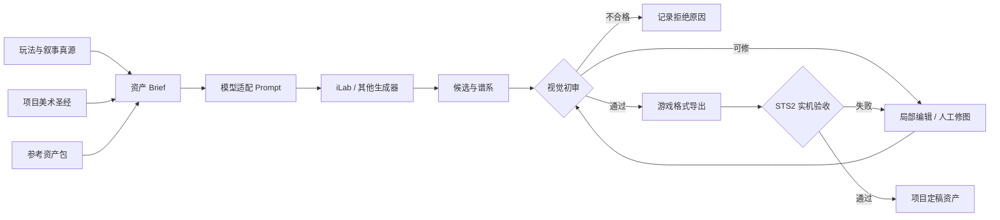
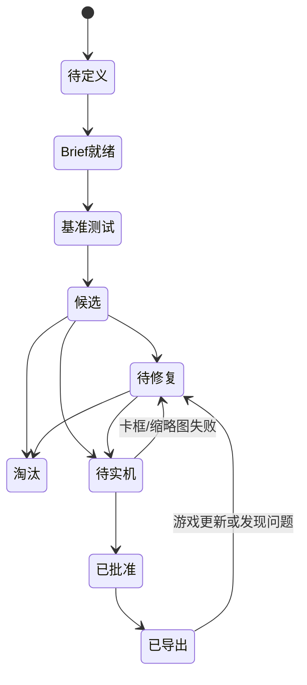

# 次元旅人 · AI 美术工作流草案

> 状态：**待用户评价，未冻结**。
>
> 本文只定义候选生产流程，不是最终工作规范，也不授权开始正式生图。
>
> 研究依据见《AI美术资料研究.md》，玩法依据见《核心设计文档.md》。

## 1. 目标与边界

### 1.1 目标

建立一套能够长期生产次元旅人美术资产的工作流，重点保证：

- 同一角色跨卡图、立绘和 UI 的身份一致性；
- 三种基础原理、三种特殊原理和药剂品质的系列辨识度；
- 卡图在 STS2 实际卡框中的缩略可读性；
- 任意定稿可以追溯到 Brief、参考图、模型、Prompt、父图和修复过程；
- 后续新增卡牌时，不需要重新发明风格。

### 1.2 当前不做

- 不冻结角色性别、年龄、脸型、服装或正式显示名；
- 不冻结模型、供应商、预算和云/本地比例；
- 不建立最终目录、文件命名、版本号或元数据格式；
- 不安装 ComfyUI、Krita 插件或其他新工具；
- 不调用任何生图 API；
- 不生成正式资产。

### 1.3 资产规模风险

“约 45 张卡牌、9 种药剂、10 件遗物”不是完整美术数量。

潜在资产还包括：

- 9 种战斗内药剂卡可能独立于约 45 张普通卡池卡图；
- 初始遗物、后续遗物及各自小图/轮廓/大图；
- 生机、挥发、腐化、催化、扩散、回响的资源或 Buff 图标；
- 角色选择图标、锁定图标、头像、地图标记、能量图标；
- 战斗 idle/hit/attack/cast/dead/relaxed；
- 商店、篝火、角色选择背景和可能的时间线素材；
- 普通、精制、杰作及 `+` 状态是否共享图、改色或独立图。

因此，正式生产前必须从最终内容注册清单生成一份资产清单，不能只按“45 张卡”估算。

---

## 2. 总体架构



职责必须分开：

| 模块 | 职责 | 不负责 |
|---|---|---|
| 核心设计文档 | 玩法语义、卡牌功能、角色叙事 | 具体画面构图 |
| 美术圣经 | 不变身份、风格语法、色板、禁用项 | 单张卡的剧情动作 |
| 资产 Brief | 单张图表达什么、读图重点和构图 | 绑定某个模型语法 |
| 模型适配 Prompt | 把 Brief 翻译成某模型可执行输入 | 成为项目唯一真源 |
| 工作台 | 生成、编辑、历史与参考图复用 | 决定美术方向 |
| 人工审核 | 选择、修复、统一与游戏内验收 | 无限制随机抽图 |

**核心原则：项目真源是 Brief + 美术圣经 + 参考包，不是某条 Prompt。**

---

## 3. 资产状态机



每个状态必须回答：

- 当前图服务于哪个资产？
- 父图是什么？
- 本轮只改变了什么？
- 使用了哪些参考图，各自承担什么职责？
- 为什么通过、待修或淘汰？

最终字段和存储格式在“工作规范阶段”决定，本轮只冻结状态职责。

---

## 4. 阶段 0：技术与内容盘点

### 输入

- 《核心设计文档.md》；
- 最终内容注册清单和本地化条目；
- RitsuLib 角色、卡牌、遗物、药剂和动画资源要求；
- 当前版本 STS2 原始卡框、场景和 UI 截图。

### 已知技术规格

| 资产 | 已知规格 |
|---|---|
| 普通卡图 | 官方常用 `250×190` |
| 先古卡图 | 官方常用 `250×351` |
| 遗物小图/轮廓 | `85×85` |
| 遗物大图 | `256×256` |
| 文本内能量图标 | `24×24` |
| 卡牌/Tooltip 大能量图标 | `74×74` |
| 角色选择背景 | 建议 `2560×1200` |
| 角色动画 | 至少考虑 idle、hit/hurt、attack、cast、dead/die、relaxed |
| 药水/药剂图 | Godot 可加载纹理；本体和轮廓分离，精确尺寸待实机 |

生产时建议保留高分辨率分层母图，最终按游戏规格导出。最终安全区、裁切和缩放方式必须用当前 `SL2_v0.108` 与游戏实机确认。

### 输出

- 按内容 ID 生成的资产清单；
- 每项资产类型、用途、最终规格、优先级和复用关系；
- 明确哪些品质共享图、哪些必须独立图。

### Gate 0

资产清单未覆盖角色、卡图、药剂、遗物、资源图标和动画时，不进入风格设计。

---

## 5. 阶段 1：美术圣经

### 5.1 角色身份

必须先定义不随卡图变化的内容：

- 身形和剪影；
- 脸型、发型、年龄感和体态；
- 主服装结构与层级；
- 次元药剂包的形状、背法和开合结构；
- 主要炼金工具和标志性配饰；
- 固定色与可变化色；
- 禁止变化项。

本地 STS2 教程给出的优先级值得采用：

- 远看先靠高矮、胖瘦、服装和发型识别，而不是面部细节；
- 服装与帽饰可适度夸张，但减少碎小吊坠和过多层叠布料；
- 以色块和轮廓为主，不使用过多硬线；
- 不追求强烈电影光影，避免与 STS2 游戏内风格割裂；
- 角色设计需考虑后续动画拆分和物理模拟成本。

### 5.2 项目风格语法

建议暂定以下方向供基准测试，而不是立刻冻结：

```text
美式奇幻卡通插画
+ 清楚、略夸张的剪影
+ 大色块切分体积
+ 有限的柔性轮廓线
+ 中等明暗对比
+ 少量手绘笔触与纸张颗粒
+ 暗或中性背景衬托主体
+ 不使用写实电影级强光影
+ 不使用精致二次元赛璐璐脸
```

文章中“暗底 + 高饱和亮色点缀 + 居中主体”的建议只作为卡图可读性参考；与本地教程冲突时，以 STS2 实机风格和色块逻辑为准。

### 5.3 炼金原理视觉语法

以下是可测试草案：

| 原理 | 主色候选 | 形状语言 | 运动方向 | 禁止混用 |
|---|---|---|---|---|
| 生机 | 青绿、乳白、暖金 | 圆形液滴、叶脉、保护膜 | 聚合、包覆 | 不用腐蚀裂纹 |
| 挥发 | 琥珀、橙黄、亮青 | 气泡、蒸汽、碎裂瓶口 | 喷发、旋转 | 不用稳定厚重块面 |
| 腐化 | 紫黑、酸绿、暗红 | 尖刺、裂纹、腐蚀结晶 | 下沉、蔓延 | 不用纯净对称光环 |
| 催化 | 金橙、白炽核心 | 几何核心、反应环 | 压缩后爆发 | 不表现全场扩散 |
| 扩散 | 青蓝、虹彩边缘 | 同心波、复制液滴 | 单点向全场扩展 | 不表现时间残影 |
| 回响 | 蓝紫、银白 | 镜面、双轮廓、残影 | 轨迹复现 | 不表现普通范围冲击 |

颜色不是唯一编码。缩小后仍需通过形状和运动辨认，避免色觉差异和卡框染色导致混淆。

### 5.4 品质语法

| 品质 | 视觉复杂度 | 建议变化 |
|---|---|---|
| 普通 | 单一核心效果 | 普通玻璃、单层液体、有限微光 |
| 精制 | 主体不变，结构更稳定 | 多层液体、金属瓶饰、稳定光环 |
| 杰作 | 产生规则级视觉变化 | 悬浮结构、空间异常、环境响应、独特剪影 |
| `+` | 不能像新品质 | 只增强小范围亮点、纯度或局部纹饰 |

### Gate 1

角色剪影、服装、药剂包、六种原理和品质轴未通过用户确认时，不制作正式参考母图。

---

## 6. 阶段 2：参考资产包

参考图必须按职责拆分，不能建立一张“万能参考图”。

| 参考类型 | 内容 | 作用 |
|---|---|---|
| 身份参考 | 正面、3/4、侧面、面部近景 | 锁定人物身份 |
| 服装/器具参考 | 服装展开、背面、药剂包、瓶型、工具 | 锁定结构，不承担构图 |
| 风格参考 | 3～6 张项目自有或授权明确的基准图 | 锁定色块、线条、材质、光影 |
| 色板参考 | 主色、六种原理色、禁用组合 | 防止系列漂色 |
| 构图参考 | 草图、姿势线、3D Blockout、深度/边缘图 | 锁定主体位置与动作 |
| 语义参考 | 卡牌功能、目标和情绪的文字 Brief | 决定“画什么” |

参考包应优先由项目自己生成和修订。社区图只能进入灵感池，不能未经来源核验直接成为稳定生产参考。

### Gate 2

用参考包生成同一角色的正面、侧面、背面、炼药动作和战斗动作。如果身份或服装明显漂移，回到参考包修订，不进入卡图批量测试。

---

## 7. 阶段 3：模型盲测与适配层

### 7.1 为什么盲测

不同模型擅长方向不同：

- 指令遵循和多图编辑；
- 手绘卡图风格；
- 角色一致性；
- 局部修复；
- 图标与透明轮廓；
- 成本和速度。

不能用“某平台热门”代替项目测试。

### 7.2 固定基准 Brief

建议用 8 个基准任务：

1. 角色 3/4 半身身份图；
2. 角色完整正侧背设定图；
3. 炼制药剂动作卡图；
4. 战斗投药动作卡图；
5. 不出现角色的纯炼金效果卡图；
6. 普通药剂图标；
7. 精制药剂图标；
8. 初始遗物图标。

每个模型使用同一份 Brief、同一组参考职责和同一输出要求。只允许做必要的语法适配，不允许为了让某个模型获胜而改变画面语义。

### 7.3 评价维度

每项按 1～5 分记录：

- 身份一致性；
- 服装/器具结构一致性；
- STS2 风格接近度；
- 缩略图可读性；
- Prompt 遵循；
- 局部编辑稳定性；
- 瑕疵率；
- 单张有效候选成本；
- 人工修复时间。

“单张价格”没有决策价值，采用“获得一个可用候选的总成本”。

### 7.4 模型适配 Prompt

项目保存一份模型无关的 Brief：

```text
AssetBrief
├─ identity：谁，哪些特征绝不能变
├─ semantics：卡牌表达什么效果
├─ action：主体正在做什么
├─ composition：视角、主体占比、焦点、安全区
├─ visual_language：色块、线条、材质、光影
├─ alchemy_language：原理、品质、形状和运动
├─ environment：背景与氛围
├─ preserve：编辑时必须保持什么
└─ exclude：文字、水印、多余物体、错误结构等
```

然后按模型生成适配 Prompt：

```text
Canonical Brief
├─ GPT Image adapter
├─ Gemini adapter
├─ FLUX/Kontext adapter
├─ Midjourney adapter
└─ ComfyUI parameter/workflow adapter
```

中文 Brief 是项目真源。适配层可按模型保留中文或翻译成英文，不预设“英文一定更好”，以盲测结果为准。

### Gate 3

只有模型在角色、卡图、图标三个资产类型上都完成基准测试，才能成为主模型或专项模型。最多保留：

- 1 个主生成模型；
- 1 个局部编辑/一致性模型；
- 1 个本地高控制回退方案。

避免同一系列频繁换模型。

---

## 8. 阶段 4：锁定母图

正式卡图生产前先批准以下母图：

- 角色身份母图；
- 完整服装和背面母图；
- 次元药剂包母图；
- 9 种药剂的瓶型家族母图；
- 六种原理的效果母图；
- 普通/精制/杰作品质演进母图；
- 卡图风格母图；
- 遗物图标风格母图。

母图是后续生成的父资产。禁止在发生身份漂移的后代图上继续迭代；发现漂移时回到最近的稳定母图。

### Gate 4

母图必须同时通过：

- 用户视觉确认；
- 不变项检查；
- 与 STS2 原版卡图并排检查；
- 真实卡框缩略检查；
- 来源和授权记录完整。

---

## 9. 阶段 5：首轮试产

不直接生产全部资产。建议首轮只做一个最小闭环：

| 资产 | 建议数量 | 目的 |
|---|---:|---|
| 角色选择/身份图 | 1 组 | 检验角色身份和 UI 适配 |
| 起始配方卡图 | 5 张 | 覆盖防护、攻击、腐化、过牌等语义 |
| 起始药剂卡图 | 5 张 | 验证药剂家族和品质扩展能力 |
| 原理生产卡图 | 3 张 | 验证生机、挥发、腐化的形状编码 |
| 初始遗物 | 1 件 | 验证图标和大图导出 |
| 能量与资源图标 | 1 组 | 验证极小尺寸可读性 |
| 战斗角色 | idle + attack + cast + hit + dead | 验证角色能否进入游戏，而非只在卡图中成立 |

这不是最终资产清单，只是建议的试产范围。用户可在评价阶段缩小或调整。

### Gate 5

试产必须在游戏内通过：

- 卡牌图鉴；
- 手牌常规尺寸；
- 卡牌放大；
- 战斗场景；
- 角色选择界面；
- 遗物栏和遗物放大；
- 低分辨率/窗口模式；
- 至少一次多人角色图标场景。

若同一失败原因在 3 张以上资产重复出现，暂停生产，修改美术圣经、参考包或 Prompt 模板，禁止逐张打补丁。

---

## 10. 阶段 6：系列批量生产

批量单位不是“所有剩余卡”，而是一个视觉系列：

```text
系列基准图
→ 3～5 张试产
→ 统一检查
→ 修订模板
→ 扩展该系列
→ 系列内并排验收
→ 进入下一系列
```

建议顺序：

1. 三种基础原理生产与配方；
2. 五种起始药剂及其精制变化；
3. 提纯、升华和品质操作；
4. 催化系列；
5. 扩散系列；
6. 回响系列；
7. 剩余药剂、遗物和高稀有度内容；
8. 杰作、先古和叙事内容。

每批只允许替换 Brief 中的语义、动作和指定原理；身份、服装、风格、卡框安全区和输出约束保持锁定。

---

## 11. 修复阶梯

候选图有问题时按成本从低到高处理：

1. **Prompt 小步编辑**：只修改一个变量，明确保持项；
2. **局部 mask 编辑**：手、脸、瓶体、服装接缝等局部问题；
3. **参考图重约束**：身份或器具轻微漂移；
4. **图层合成**：从不同候选中组合正确区域；
5. **Krita 人工修绘**：统一轮廓、色块、材质和细节；
6. **回到稳定母图重生**：整体身份、构图或风格失败。

禁止：

- 对同一图连续进行无法追溯的自然语言修改；
- 每次同时改变构图、角色、光影和风格；
- 用超清放大掩盖结构错误；
- 在错误手部、瓶体和服装结构上继续精修。

---

## 12. 后期与游戏导出

推荐顺序：

```text
结构修复
→ 角色/器具一致性修复
→ 色块与轮廓统一
→ 系列调色
→ 背景降噪与焦点整理
→ 高分辨率母图归档
→ 按游戏规格裁切/缩放
→ 透明与轮廓处理
→ STS2 导入
→ 实机截图验收
```

统一约束候选：

- 图内不生成文字、卡框、费用、稀有度标记或水印；
- 卡图主体在 250×190 下仍能辨认；
- 图标优先看剪影，不依赖细碎纹理；
- 普通卡图和先古卡图构图不能简单拉伸互转；
- 角色动画素材需考虑拆分、遮挡关系和衣物摆动成本；
- 最终导出使用游戏支持的纹理格式，颜色空间、压缩与透明边缘在实机确认。

---

## 13. iLab GPT Conjure 的建议用法

### 13.1 定位

保留 `iLab GPT Conjure` 作为云 API 主工作台：

- 生成和参考图编辑；
- 多供应商/模型盲测；
- 参考图库；
- Prompt 片段和模板；
- 并发任务、历史和结果归档；
- 简单图层与局部编辑。

### 13.2 参考图库的逻辑分类

最终命名在工作规范阶段决定，逻辑上至少分为：

- `identity`：角色身份；
- `costume`：服装和配饰；
- `prop`：药剂包、瓶型和工具；
- `style`：项目风格母图；
- `palette`：色板；
- `composition`：姿势和构图；
- `alchemy`：六种原理和品质；
- `approved-parent`：已批准母图。

### 13.3 Chip 映射

- `@`：插入具有单一职责的参考图；
- `#`：插入项目色板的精确颜色；
- `~`：插入角色不变项、卡图构图、STS2 风格、负面约束等短片段；
- 模板：保存完整的资产类型结构，例如角色卡图、纯效果卡图、药剂图标、遗物图标。

### 13.4 当前不改造工作台

iLab 缺少项目进度、父子版本谱系和审核状态，但这些暂时用项目清单和规范补齐。只有实际试产证明记录成本过高时，才考虑：

- 为 iLab 增加项目层；
- 接入 Infinite Image Browsing；
- 或引入专门的资产数据库。

不建议研究阶段就开发工作台功能。

---

## 14. 失败回退策略

| 失败 | 回退位置 |
|---|---|
| 同一角色像不同人 | 身份参考包和角色不变项 |
| 服装、药剂包反复变形 | 器具设定母图和结构参考 |
| 全套卡图像不同游戏 | 风格母图、主模型和统一后期 |
| 图好看但看不懂效果 | 单张 Brief 的语义和构图草图 |
| 缩小后主体消失 | 构图安全区和大形状设计 |
| 同类卡只有换颜色 | 六种原理的形状与运动语言 |
| 局部编辑越改越漂 | 回到最近稳定母图，重新分支 |
| 单张成本持续上升 | 淘汰该模型/模板，不继续堆抽数 |
| 3 张以上重复同类问题 | 修改系统规则，暂停整批生产 |
| 云模型无法满足结构控制 | 引入 ComfyUI/ControlNet 本地回退测试 |

---

## 15. 建议采用的核心原则

1. 美术圣经和 Brief 是真源，Prompt 是模型适配产物。
2. 身份、风格、构图、器具和色板参考分工明确。
3. 先母图、再试产、后批量。
4. 一次只改变一个变量。
5. 角色漂移时回到稳定父图，禁止在漂移图上继续修。
6. 每个候选保留完整谱系、成本和拒绝原因。
7. 缩略图可读性优先于高清细节。
8. 同类问题重复出现时修系统，不逐张补丁。
9. AI 负责探索、变体和局部重绘；人工负责设定、选择、统一和最终验收。
10. 不模仿在世艺术家的个人风格；使用可观察、可解释的形式语言。

---

## 16. 待用户评价的关键分歧

请优先评价以下内容。工作流未确认前不进入工作规范阶段。

### A. 与 STS2 原画的接近程度

- **A1 高度融入**：优先服从 STS2 的色块、漫画变形和弱光影；辨识度来自角色设定。
- **A2 平衡方案（当前推荐）**：保持 STS2 可读性和轮廓逻辑，允许炼金液体、次元光效和材质更精细。
- **A3 强 Mod 个性**：保留卡框兼容，但允许明显不同的插画质感。

### B. 角色在卡图中的出现频率

- **B1 高频**：多数卡图出现角色，有较强叙事和身份感，但一致性成本最高。
- **B2 分层（当前推荐）**：动作/调配卡出现角色；配方、药剂和纯效果卡突出手部、器具或特效。
- **B3 低频**：角色主要存在于立绘和少数标志卡，卡图以炼金物和效果为主。

### C. 云 API 与本地模型

- **C1 云 API 为主（当前推荐）**：先用 iLab 对 GPT Image、Gemini 等做盲测；不够时再引入本地。
- **C2 云 + 本地并行**：从第一天同时维护 ComfyUI 工作流，控制强但复杂度显著增加。
- **C3 本地为主**：适合愿意投入显卡、模型和节点维护成本的路线。

### D. 人工修图投入

- **D1 轻修**：只做裁切、调色和小瑕疵；允许一定 AI 痕迹。
- **D2 中等修图（当前推荐）**：修手、脸、瓶体、服装、轮廓和系列统一。
- **D3 深度重绘**：AI 只做草图或底稿，最终观感接近手绘项目。

### E. 首轮试产范围

- **E1 极小验证**：角色设定 + 3 张卡 + 1 药剂 + 1 遗物。
- **E2 起始闭环（当前推荐）**：角色设定 + 5 配方 + 5 药剂 + 3 原理生产 + 初始遗物 + 必需角色状态。
- **E3 完整起始套牌**：直接覆盖 12 张起始卡、系统牌和所有起始 UI/角色素材。

### F. 品质视觉复用

- **F1 同构升级（当前推荐）**：普通、精制、杰作保留同一瓶型家族，通过结构和环境逐级演进；`+` 只做小幅增强。
- **F2 各品质独立构图**：表现力强，但资产量和一致性成本大幅增加。
- **F3 主要靠边框/特效区分**：资产量最小，但品质辨识度较弱。

---

## 17. 后续顺序

```text
你评价本草案
→ 修订工作流
→ 你明确确认并冻结工作流
→ 制定目录、命名、版本、Prompt、元数据、审核与备份规范
→ 你确认工作规范
→ 建立资产清单和美术圣经
→ 模型盲测
→ 才开始正式生图
```