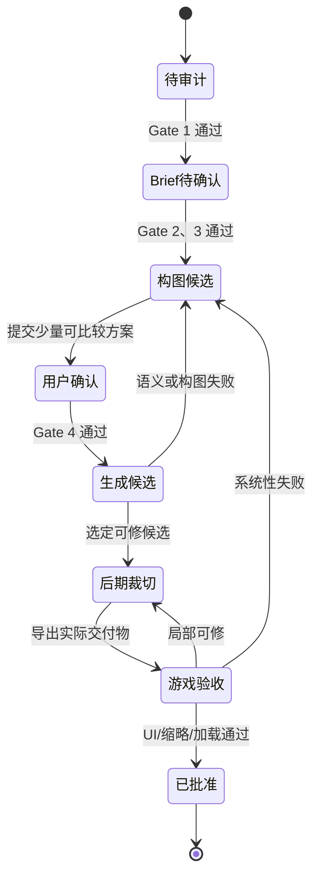

# 次元旅人 · AI 美术工作流草案（审计门控版）

> 状态：**待冻结。**
>
> 本文定义生产职责和状态转移，不定义最终画风，也不授权正式生图。资源规格唯一引用《AI美术资料研究.md》的 A 级证据；未经审计的尺寸、教程建议、旧版本快照和模型惯例不得写入交付 Brief。

## 1. 目标与边界

目标是在不破坏原生 UI 分层的前提下，为次元旅人形成可追溯的资产生产链：

```text
游戏证据
→ 资产规格账本
→ 项目资产清单
→ 对象级 Brief
→ 构图候选
→ 用户确认
→ 生成/修图候选
→ 游戏内验收
→ 已批准资产
```

职责划分：

| 模块 | 负责 | 不负责 |
|---|---|---|
| 核心设计文档 | 玩法语义、叙事身份、内容范围 | 单图构图和图像规格 |
| 美术证据账本 | 资源路径、显示链、尺寸、遮挡、导入与证据等级 | 最终视觉方向和 Prompt |
| 资产清单 | 哪个模型 ID 缺什么资产、复用关系与优先级 | 绘制方法 |
| Asset Brief | 单个资产表达的对象、行为、构图、安全区和验收项 | 某模型私有参数 |
| Prompt 适配层 | 将已批准 Brief 翻译为某模型输入 | 成为项目真源 |
| 人工审核 | 选择、修图、统一、实机验收 | 用随机抽图代替设计 |

当前不做：安装新生成工具、调用生图 API、生成正式资产、修改运行时资源路径、把占位图静默替换为未验收素材。

---

## 2. 生产 Gate

### Gate 0：版本与来源

通过条件：

- 游戏版本、PCK 快照与 DLL 反编译版本可追溯；
- 资源结论来自 `SL2_v0.109.0`，而非无版本号目录或单独的旧快照；
- 依赖 23 个失败脚本的结论标为待验证。

当前状态：**通过**。

### Gate 1：资产规格审计

通过条件：

- 该资产类别至少有 A 级“模型 → 场景 → 纹理”的显示链；
- 原图尺寸/Alpha、容器尺寸、UI 遮挡与交付物职责明确；
- 规格没有由教程值、文件名猜测或 `v0.108` 单独证明。

当前状态：

| 类别 | Gate 1 |
|---|---|
| 卡图内部插画 | 通过 |
| 遗物 | 通过 |
| 原生药水 | 通过 |
| Power 图标 | 通过 |
| 角色选择图 | 通过 |
| 战斗角色 | 部分通过：已证实 Spine 资产结构、状态与原版样本锚点；次元旅人的导出/接入管线未证实 |
| Epoch/事件背景 | 未通过 |
| 项目自定义 UI | 未通过：实现位置未冻结 |

### Gate 2：项目资产清单

通过条件：按内容 ID 列出所有实际缺失资源，标记“共享 / 独立 / 暂不制作”，并绑定已审计类别。

当前状态：**未开始**。不能将“45 张卡”错误等同于全部美术资产数量。

### Gate 3：视觉方向与样本分析

通过条件：

- 用户确认角色身份不变项、色彩方向、品质演进与角色在卡图中的出现频率；
- 每个生产类别完成原版样本直接分析；
- 形成可观察的视觉规则，未使用在世艺术家姓名或“某游戏风格”占位语。

当前已确认的候选方向（仅作为后续 Brief 输入，不是正式 Prompt 或资产授权）：

| 项目 | 用户选择 | 约束 |
|---|---|---|
| 角色定位 | 秘仪药师 | 次元属性通过低饱和符号、局部药雾和器具表达；不以科幻机甲、全身强发光或复杂宇宙背景作为主体。 |
| 整体情绪 | 偏冷、克制、神秘 | 以灰蓝、暗紫等低饱和冷色为基础，保留粗粝材质与有限高亮。 |
| 角色化身 | 人类女性，23～26 岁的成年年轻女性 | 人物比例为匀称敏捷；不以未成年外观、幼态特征或性化姿态表现。 |
| 服装结构 | 几乎全覆盖的贴身行旅内层 + 实用外层装备 | 贴身内层用于表现利落比例，应采用哑光或磨损织物/处理皮革质感，不作为高反光乳胶表现；短斗篷、侧身药剂包、束带、旧铜扣件与少量护具共同打破单一紧身轮廓。 |
| 头部设计 | 兜帽 + 半面面具 | 至少保留眼睛和下半张脸，使角色在神秘感之外仍可读为人类女性；面具不得遮蔽角色选择图的头部焦点。 |
| 面具语言 | 极简刻纹 | 只使用 1～3 个低对比几何或秘仪刻纹；刻纹作为次元研究的次级信息，不发出大面积强光。 |
| 外层装备 | 短斗篷／披肩 | 以可拆分、低遮挡的短斗篷为主，避免长下摆干扰战斗角色的腿部动画与药剂包轮廓。 |
| 色彩职责 | 深靛蓝衣装、青绿色药液/局部高亮、旧铜器具 | 整体保持低饱和和有限高亮；青绿色只用于引导焦点，不能覆盖大面积服装或背景。 |
| 药剂包可见度 | 中 | 正常站姿中药剂包明确可见，仅露出 1～2 只棱角小瓶；不将多瓶小物件堆叠为缩略图噪声。 |
| 发型 | 下巴长度短发 | 轮廓完整、碎边少；优先服务于兜帽、半面面具与后续动作拆件，不让长发遮挡药剂包。 |
| 首张概念图构图 | 3/4 站姿，药剂包一侧朝镜头，一手扶住药瓶或束带 | 图的职责是确认人物、服装和器具设计，不作为战斗动画、卡图或最终角色选择资源。 |
| 首张概念图背景 | 纯中性或浅纹理背景 | 不使用复杂尖塔场景、宇宙背景或强烈裂隙特效；避免背景代替人物身份表达。 |
| 主剪影锚点 | 侧身药剂包 | 在角色选择图、战斗贴图和关键卡图中保持可辨识；药瓶轮廓不得依赖微小文字。 |

当前状态：**未通过**。视觉身份方向已取得初步选择，但原版样本直接分析、角色外形契约、品质演进和卡图出场规则仍缺失。

### Gate 4：对象级 Brief 与构图确认

通过条件：每个资产具有证据引用、用途、构图草案、颜色/背景/透明约束与验收项，并由用户确认构图。

当前状态：**未通过**。

### Gate 5：模型盲测与正式生产

通过条件：在同一 Brief、同一参考职责和同一导出要求下完成模型测试；选择主模型/修图方案后才能批量生成。

当前状态：**禁止进入**。

---

## 3. 资产状态机



| 状态 | 必需输入 | 必需产物 | 拒绝/回退条件 |
|---|---|---|---|
| 待审计 | 资产用途 | 证据槽位 | 无 A 级规格，不得生成 |
| Brief 待确认 | 已审计规格、设计语义 | 对象级 Brief | 缺构图、安全区或引用，退回待审计 |
| 构图候选 | 已确认 Brief | 少量草图/布局候选 | 语义读不出、主体落入遮挡区，重做构图 |
| 用户确认 | 可比较候选 | 明确选择/修改意见 | 未确认，不进入生成 |
| 生成候选 | 锁定构图、参考职责 | 带元数据的候选图 | 身份/器具/语义漂移，回到稳定父图 |
| 后期/裁切 | 可修候选 | 导出前母图与目标文件 | 靠裁切无法修正构图，退回构图候选 |
| 游戏验收 | 已导入的实际资源 | 截图、加载结果、验收记录 | 缩略不可读、UI 冲突、加载失败，按原因回退 |
| 已批准 | 完整谱系与验收记录 | 可发布资产 | 游戏版本变化或发现缺陷，回到验收 |

同一失败原因在 3 个及以上资产重复出现时，暂停该批次并修订 Brief、参考包或导出规则；禁止逐张打补丁。

---

## 4. 对象级 Brief 模板

以下模板是正式生产的唯一入口。字段未填满时，资产保持 `Brief 待确认`。

```text
AssetBrief
├─ id / 资产名称
├─ 用途与游戏位置
├─ 资产类别 / 交付物职责
├─ 证据引用（账本条目、游戏版本）
├─ 设计语义（这一张必须让玩家读懂什么）
├─ 主体与不变项
├─ 构图（镜头、主体占比、焦点、留白）
├─ 安全区（基于显示链，不写猜测值）
├─ 色彩、材质、光影与背景约束
├─ 透明要求 / 图层要求
├─ 禁止项（文字、卡框、按钮、费用、水印等）
├─ 正提示词（模型适配后产物）
├─ 负提示词或编辑保持项（模型支持时）
├─ 后期与裁切计划
└─ 验收清单
```

Prompt 是 Brief 的适配输出，不是项目真源。任何编辑只改变一个变量，并记录：父图、输入参考、模型、参数、改动内容、成本、结果与拒绝原因。

---

## 5. 已允许写入 Brief 的类别约束

### 5.1 卡图

- 最终插画区域：`250×190`。
- 原版样本母图：`1000×760` 无 Alpha；可以保留高分辨率母图，再导出目标画面。
- 只画内部插画；禁止卡框、标题、费用、描述、类型牌、稀有度、文字和水印。
- 首次正式生产前仍须完成原版卡图样本分析与用户确认的视觉方向。

### 5.2 遗物

- 小图最终显示在 `60×60` Icon 区；Outline 与 BigIcon 是独立职责。
- 原版大图样本：`256×256`、带 Alpha。
- 小图首先验证轮廓；不能只从 `256×256` 缩小后赌可读性。

### 5.3 原生药水

- 腰带图最终容器：`60×60`；小图、Outline、大图分离。
- 原版大图样本：`256×256`、带 Alpha。
- 当前次元药剂是战斗内卡牌，不应被错误实现为原生药水资产。

### 5.4 Power

- 小图最终显示区：`40×40`；状态数字由场景文字层负责。
- 原版大图样本：`256×256`、带 Alpha，用于 Power 闪光 VFX。
- 禁止绘制数字、叠层文字和 UI 外框。

### 5.5 角色选择图

- 原版输入样本：`132×195`、带 Alpha。
- 实际显示受 `88×130` Mask 裁切。
- 交付为透明角色图；按钮框、锁、多人角标、文字和外轮廓由原生场景提供。

### 5.6 暂停类别

战斗角色、Epoch/事件背景、药剂包查看 UI、按钮和角标在完成各自 Gate 1 前，只能建立审计任务，不能写最终尺寸、Prompt 或交付格式。战斗角色已确认原版采用 Spine 组合资产，但次元旅人的导出/接入管线未验证，仍不允许按静态图生产。

---

## 6. 批次策略

正式生产不以“全部 45 张卡”为单位，而以已验证的资产系列为单位：

```text
一个已批准的系列基准
→ 3～5 个对象级 Brief
→ 用户确认构图
→ 少量候选
→ 同屏缩略检查
→ 游戏内验收
→ 扩展同系列
```

推荐顺序由 Gate 决定：

1. 卡图样本分析与视觉方向确认；
2. 卡图首个系列；
3. 资源/Power 图标系列；
4. 遗物系列；
5. 角色选择图；
6. 战斗角色、事件和 UI（等待其规格审计）。

当前项目的 37 处 `MissingPortraitPath` 是卡图资产清单的起点，不是可以直接批量替换的授权。

---

## 7. 导出与游戏验收

导出前后分别检查：

| 阶段 | 必检项 |
|---|---|
| 导出前 | 尺寸、Alpha、裁切、无文字/水印、未混入 UI、文件名与 Brief 对齐 |
| 导入后 | 资源路径可加载、未回退到缺图、无导入警告 |
| UI 观察 | 手牌、放大卡、遗物栏、Power 栏、角色选择与目标分辨率下的可读性 |
| 系列观察 | 同类资产并排时的身份一致性、品质层级、颜色/轮廓区分 |
| 留档 | 源图、导出图、截图、模型/参数、父子谱系、通过或拒绝理由 |

游戏验收以当前 `v0.109.0` 运行结果为准；如果游戏更新，重新检查相关显示链后才继承旧资产的批准状态。

---

## 8. 下一检查点

在用户选择视觉方向前，继续完成两项只读工作：

1. 读取原版战斗角色视觉场景，建立动画、纹理和安全区证据；
2. 直接分析账本列出的首批原版样本，产出可观察的分类描述。

在这两项完成前，不输出次元旅人的正式 Prompt、模型选择或批量生产计划。