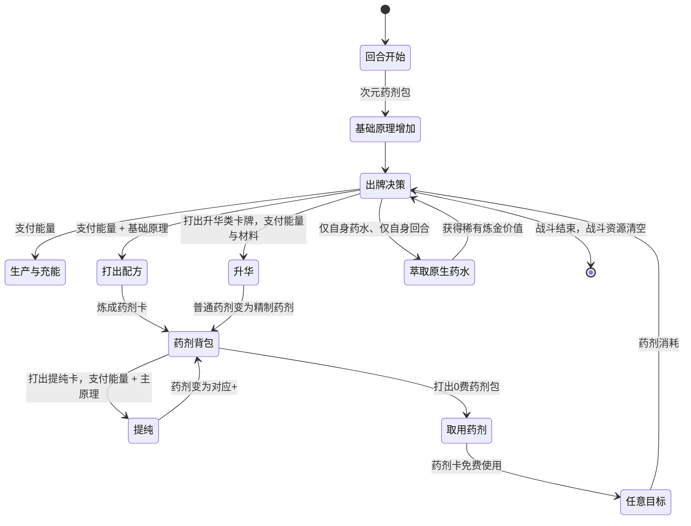

# DimensionalTraveler · 核心设计文档

> 状态：战斗核心与首轮单人测试规格已确认；稳定 `mod id` 已锁定。角色正式显示名、剧情文案、杰作与完整内容扩展仍待后续设计。当前不编写角色代码，等待外部角色 Mod 的解包参考。
>
> 稳定 `mod id` / 工程标识：`DimensionalTraveler`
> 角色暂称：次元旅人

## 1. 产品定位

次元旅人是一名以多人协作为主要体验的炼金辅助角色。

- **首要场景**：双人及以上联机队伍；人数不设上限。
- **单人策略**：允许选择，但明确提示“联机专属，不保证单人平衡”。
- **队友适配**：面向任意原版或 Mod 角色，不依赖指定职业或构筑。
- **战斗职责**：根据局势制造并投放药剂，在救援防护、攻击补位、友方增幅与敌方控场之间调度。
- **叙事身份**：跨越不同世界的旅行者兼游方药师。尖塔只是漫长旅途的一站，先古之民认识并尊敬这位旅人。

## 2. 已冻结的玩法原则

1. 所有炼制、提纯、萃取等行动只在药师自己的回合执行。
2. 炼制与提纯消耗普通能量；炼成的药剂卡使用时不消耗能量。
3. 药剂可以对任意合法生物使用：自己、任意队友、任意敌人。效果按原语义结算，因此伤害药剂可以伤害队友，增益药剂也可以强化敌人。
4. 默认药剂是单目标；多目标必须由“扩散”等明确修饰解锁，不能因队伍人数增加而自动变强。
5. 原生药水保持原版获得与使用方式；永久萃取只允许处理药师本人药水栏中的药水，并且仅能在药师自己的回合进行。

## 3. 战斗状态模型

```text
基础炼金原理
├─ 生机：救援、防护、恢复
├─ 挥发：爆发、调度、效率
└─ 腐化：攻击、侵蚀、削弱

特殊炼金原理（角色 Buff）
├─ 催化：生产提效与生产过程调配
├─ 扩散：阵营范围药剂结算
└─ 回响：回收、重铸、循环
```

### 3.1 基础炼金原理

- 三类独立的 RitsuLib 次级资源。
- 仅在当前战斗存在；战斗结束清空。
- 不设硬上限。
- 配方卡将它们作为明确的支付成本；资源不足时不可打出。
- `次元药剂包` 在战斗开始时使三类各获得 1 点，并在每个回合开始时使三类各获得 1 点。
- 额外的生产、充能、转换与消耗规则由后续卡牌、遗物和附魔内容提供。

### 3.2 特殊炼金原理

- 只由生产类卡牌等高阶内容获得。
- 作为角色自身 Buff 的层数计数。
- 每类最多 3 层，仅本场战斗有效，战斗结束清空。
- 使用模式为“被动生效 + 特定卡牌可消耗层数触发爆发”。

| 特殊原理 | 被动方向 | 消耗方向 |
|---|---|---|
| 催化 | 提高生产效率：定向生产在 1～2 层时对应原理额外 +1，3 层时额外 +2；灵活生产仅在 2 层及以上时令三类原理各额外 +1 | 催化调配卡可消耗层数，强化、转化或重复生产过程 |
| 扩散 | 由扩散调配卡将**本回合下一张**药剂按首次目标所属阵营完整结算；选己方时作用己方全队，选敌人时作用敌方全体。扩散调配为次元旅人专属卡池的金色稀有卡，不加 `MultiplayerOnly` 限制，费用为 1 能量。 | 扩散调配每次消耗 2 层扩散；若本回合未使用药剂则扩散资格在回合结束失效。调配卡自身正常进入弃牌堆，可在后续洗牌再次使用。 |
| 回响 | 高阶能力将已发生的炼制或投药再次转化为价值 | 复制、回收、再次调配或按目标快照重放药剂 |

#### 回响派生硬约束

- 回响重放药剂时，完整使用原药剂已经确定的目标快照；原药剂已被扩散时，对同一阵营全体再次结算。
- 回响重放不重新选择目标，也不重新判断扩散。
- 所有回响派生结算与回响生成的药剂卡均带 `EchoDerived` 标记。
- 回响生成到手牌的付费药剂卡完整继承原药剂的种类、普通/精制/杰作品质与 `+` 状态；普通、精制、杰作的费用分别固定为 1/2/3 能量，`+` 不额外加费。
- 回响药剂作为新手牌可重新自由指定任意合法生物。
- 所有 `EchoDerived` 对象不得触发任何“使用药剂后”的回响、返还、复制或再次生成回响药剂的监听；不得回到药剂背包。
- 该单层限制不削弱原始药剂的扩散收益，但从状态机层面阻断无限递归。

#### 回响生产卡

- 基础回响生产卡正常进入弃牌堆，可在后续洗牌再次使用。
- 每次使用基础获得 1 层回响；若本回合已经炼成或使用过任意药剂，则额外获得 1 层回响。
- 回响仍受每类最多 3 层、仅当前战斗有效的通用限制。

#### 催化生产卡

- 基础催化生产卡消耗 2 能量，获得 1 层催化；其 `+` 版本仍消耗 2 能量，但改为获得 2 层催化。卡牌正常进入弃牌堆，可在后续洗牌再次使用。
- 催化不采用线性叠加。定向生产在 1～2 层催化时额外 +1、3 层时额外 +2；灵活生产仅在 2 层及以上时令三类基础原理各额外 +1。
- 催化调配卡应只操作生产过程，例如强化、转化、重复或消耗催化以爆发生产；不复用扩散的阵营范围职责或回响的复用职责。

#### 扩散调配卡

- 次元旅人专属卡池中的金色罕见卡，不属于无色卡池。
- 不添加 `MultiplayerOnly` 限制；单人模式仍可使用，但角色整体不保证单人平衡。
- 基础扩散生产卡为蓝色稀有卡，每次仅获得 1 层扩散；一次完整扩散至少需要两次生产，或由后续复制/高效生产内容补足第二层。
- 每次使用消耗 2 层扩散。扩散上限为 3 层，因此满层时也只能启动一次；再次启动必须重新由生产端补足层数。
- 卡牌本体不消耗，正常进入弃牌堆并可在后续洗牌后再次使用。
- 效果为：下一张打出的药剂卡，以其首次指定目标所属阵营为范围，对该阵营全体完整结算。药剂效果不按人数削弱；大队伍中的超高强度是有意保留的构筑回报。
- 平衡主要依赖扩散生产、两层支付、稀有度、抽牌时机与药剂准备链，而非额外目标收费或数值衰减。

名称只是功能代号，待角色正式文案阶段统一命名。

## 4. 药剂卡与药剂包

### 4.1 药剂卡

- 9 种专属药剂均为**战斗内药剂卡**，不注册为原生药水奖励内容。
- 药剂由配方卡炼成，优先进入药剂背包。
- 药剂卡可自由指定任意合法生物目标。
- 使用药剂卡不消耗普通能量。
- 使用后一次性消耗，不进入弃牌堆循环。
- **首轮范围不引入净化、移除状态或驱散类效果**。此类效果被视为高风险设计，不作为普通、精制药剂或起始卡组的第二效果。

#### 首发药剂清单

| 功能类别 | 药剂 | 当前效果方向 | 状态 |
|---|---|---|---|
| 防护 | 护盾药剂 | 可对任意合法目标使用。普通：目标获得 **8 格挡**；`+`：**10 格挡**。 | 精制：目标获得 **12 格挡**，并使其下次受到的伤害降低 **30%**；精制+：目标获得 **14 格挡**，并使其下次受到的伤害降低 **50%**；杰作效果待定。 |
| 防护 | 自卫药剂 | 仅自身使用。普通：自身获得 **10 格挡**；`+`：**12 格挡**。 | 精制：自身获得 **12 格挡**与 **3 层覆甲**；精制+：自身获得 **14 格挡**与 **4 层覆甲**。覆甲按游戏原生状态语义结算；杰作效果待定。 |
| 攻击 | 攻击药剂 | 可对任意合法目标使用。普通：造成 **9 伤害**；`+`：造成 **11 伤害**。 | 精制：造成 **14 伤害**，并获得 **1 点腐化**；精制+：造成 **16 伤害**，并获得 **2 点腐化**；杰作效果待定。 |
| 攻击 | 腐化药剂 | 可对任意合法目标使用。普通：造成 **6 伤害**并施加 **1 层易伤**；`+`：造成 **8 伤害**并施加 **1 层易伤**。 | 精制：造成 **10 伤害**，施加 **2 层易伤**与 **1 层摧残**；精制+：造成 **12 伤害**，施加 **3 层易伤**与 **2 层摧残**。摧残复用原版 `DebilitatePower`：持有者的易伤与虚弱对强化攻击的影响翻倍，每层在持有者所属阵营回合结束时递减 1；杰作效果待定。 |
| 工具 | 挥发过牌药剂 | 仅可指定自己或任意队友。普通：目标抽 **3 张牌**；`+`：抽 **4 张牌**。 | 精制：目标抽 **4 张牌**并获得 **1 点能量**；精制+：目标抽 **5 张牌**并获得 **1 点能量**；杰作效果待定。 |
| 增幅 | 临时力量药剂 | 可指定任意合法生物；目标获得 **2 点临时力量**，仅复用原版 `FlexPotion` / `TemporaryStrengthPower` 的生命周期：在目标所属 `CombatSide` 的回合结束时自动移除。`+` 版本为 **4 点**临时力量；成本暂定为 1 能量 + 2 挥发 | 精制：目标获得 **6 点**临时力量，并使其下一张攻击牌伤害提高 **30%**；精制+：仍获得 **6 点**临时力量，但下一张攻击牌伤害提高 **50%**；杰作效果待定 |
| 增幅 | 临时敏捷药剂 | 可指定任意合法生物；目标获得 **2 点临时敏捷**，仅复用原版 `SpeedPotion` / `TemporaryDexterityPower` 的生命周期：在目标所属 `CombatSide` 的回合结束时自动移除。`+` 版本为 **4 点**临时敏捷；成本暂定为 1 能量 + 1 生机 + 1 挥发 | 精制：目标获得 **6 点**临时敏捷，并使其下一次获得的格挡提高 **30%**；精制+：仍获得 **6 点**临时敏捷，但下一次获得的格挡提高 **50%**；杰作效果待定 |
| 控场 | 虚弱药剂 | 对目标施加 **3 层虚弱**；成本为 1 能量 + 2 腐化 | 品质效果待定 |
| 控场 | 降力药剂 | 对目标施加 **4 层力量削弱**：立即降低 4 点力量，每回合自动减少 1 层；成本为 1 能量 + 1 腐化 + 1 挥发 | 品质效果待定 |

### 4.2 药剂品质与 `+` 升级

药剂有两条彼此独立的成长轴：**品质**决定药剂层级，`+` 决定同品质药剂是否已被提纯强化。

```text
品质轴：普通药剂 ── 升华 ──→ 精制药剂 ── 杰作转化 ──→ 杰作药剂
升级轴：任意品质药剂 ── 提纯 ──→ 对应品质的药剂+
```

| 维度 | 规则 |
|---|---|
| 普通 | 基础效果。 |
| 精制 | 普通药剂的高品质版本：明显提高主数值，并获得轻量第二效果。普通药剂通过独立“升华”类卡牌支付能量与材料后转化而来。 |
| 杰作 | 精制药剂的独立高强度版本：产生规则级变化或高影响力结果。高稀有度卡牌是主要来源；永久萃取、事件、先古互动与 Epoch 提供稀有补充。 |
| `+` 版本 | 提纯后的同品质强化版本：只小幅提高主数值，不改变药剂的核心规则。普通、精制、杰作均可各自拥有对应 `+` 版本；升华或杰作转化时完整保留 `+` 状态，例如普通+ → 精制+ → 杰作+。 |

普通药剂到精制药剂的“升华”主要由蓝色稀有卡提供，作为中期开始稳定出现的构筑方向；事件、先古互动与 Epoch 可作为额外来源，不作为唯一入口。基础升华卡指定药剂包中任意一瓶普通品质药剂，支付 **1 能量 + 2 点该药剂主原理** 后，将其转为对应精制版本，并完整保留已有 `+` 状态。卡牌本体正常进入弃牌堆，可在后续洗牌后再次使用。

`升华`打出前必须完成原子预检：扫描药剂背包后，仅保留同时满足以下条件的候选——普通品质（普通或普通+）、且当前可支付其 2 点主原理成本。只有存在至少 1 个此类候选、且可支付卡牌本体的 1 点能量时才可打出；原生选择界面只展示这些可完成升华的药剂。预检失败时，卡牌不可使用，绝不打开空界面或包含不可支付目标的选择界面。

配方卡也遵循同一双轴关系：普通/精制/杰作配方分别炼成对应品质药剂；配方的 `+` 版本直接炼成对应品质的药剂+。

药剂包**不具备初始内建提纯能力**。初始阶段中，`提纯` 卡是药剂 → 药剂+的唯一入口：指定一瓶背包中的药剂，支付 **1 能量 + 1 点该药剂的主原理**，将其转为对应品质的药剂+。`提纯+` 自身费用降为 0 能量，仍消耗主原理。

后续仅能通过先古事件将药剂包进阶为先古遗物后，再考虑赋予药剂包内建提纯等高级能力。

### 4.3 药剂包系统牌

`药剂包` 是由初始遗物提供的永久系统牌。

| 规则 | 设计 |
|---|---|
| 手牌位置 | 永久位于手牌，且占用 1 个正常手牌位 |
| Tag | 永恒 |
| 费用 | 0 费 |
| 打出效果 | 打开药剂背包，每次仅取出 1 张药剂卡到手牌 |
| 结算 | 取用后立即回到手牌 |
| 保护规则 | 不可删除、弃置、消耗或被普通效果改变 |
| 成长 | 可升级；也允许后续卡牌、遗物、附魔与其交互 |

### 4.4 药剂背包

| 阶段 | 容量 | 可收纳品质 |
|---|---:|---|
| 初始 | 3 | 普通、精制 |
| 药剂包升级后 | 4 | 普通、精制、杰作 |

背包已满时，新炼成的药剂改为生成到普通手牌；普通手牌也满时交给游戏默认溢出规则处理。

### 4.5 首轮 UI 约束

- 项目不内嵌任何自写 UI。
- 药剂包取药完全复用游戏原生卡牌选择界面：打出 `药剂包` 后，仅展示背包中的药剂，玩家选择 1 张移入手牌。
- 药剂背包为空时，`药剂包` 不可打出，并显示可由原生交互承载的明确提示。
- 正式落地复杂 UI 前，由用户另行下载多个角色 Mod 进行解包参考；该工作不属于当前首轮验证范围。

## 5. 炼制循环



## 6. 起始配置

### 6.1 基础属性

- 70 生命。
- 3 点基础能量。

### 6.2 初始遗物：次元药剂包

- 给予永久系统牌 `药剂包`。
- 战斗开始时：生机、挥发、腐化各获得 1 点。
- 每回合开始时：生机、挥发、腐化各获得 1 点。
- 第 1 回合额外抽 2 张牌。
- 第 2 回合起，每回合额外抽 1 张牌。

> 抽牌效果的实现应参考原版猎手初始遗物 `RingOfTheSnake` 的 `ModifyHandDraw(...)` 机制，但次元药剂包在首次手牌之外还需要持续提供每回合 +1 抽牌；这是高强度循环补偿项，后续数值验证必须重点覆盖。

### 6.3 初始套牌

- 12 张普通卡，另加 1 张永久系统牌 `药剂包`。
- 采用稳定重复结构，确保每场战斗稳定进入炼制循环。
- 不使用传统打击/防御模板；所有初始卡均为炼金操作、配方或药剂联动。
- 起始阶段不产生催化、扩散、回响等特殊炼金原理。

| 类别 | 数量 | 已确认规则 |
|---|---:|---|
| 护盾药剂配方 | 1 | 消耗 1 能量、1 点生机、1 点挥发；炼成可对任意合法目标使用的护盾药剂，令目标获得 **8 格挡**。 |
| 自卫药剂配方 | 1 | 消耗 1 能量与 2 点生机；炼成仅对自身使用的自卫药剂，令自身获得 **10 格挡**。 |
| 攻击药剂配方 | 1 | 消耗 1 能量与 2 点腐化；炼成可对任意合法目标使用的攻击药剂，对目标造成 **9 伤害**。 |
| 腐化药剂配方 | 1 | 消耗 1 能量、1 点腐化、1 点挥发；炼成可对任意合法目标使用的腐化药剂，造成 **6 伤害**并施加 **1 层易伤**。 |
| 挥发过牌药剂配方 | 1 | 消耗 1 能量与 2 点挥发；炼成可指定自己或任意队友使用的过牌药剂，使目标抽 3 张牌。 |
| 定向生产卡 | 3 | 生机、挥发、腐化各 1 张；每张消耗 1 能量，获得对应基础原理 2 点。 |
| 灵活生产卡 | 1 | 消耗 1 能量，生机、挥发、腐化各获得 1 点。 |
| 配方检索操作卡 | 1 | 消耗 1 能量，进入弃牌堆；仅从当前抽牌堆指定 1 张配方卡置入手牌，抽牌堆没有配方时失效。 |
| 配方保留操作卡 | 1 | 消耗 1 能量，指定手牌中的 1 张配方在本场战斗内永久获得保留；**本体消耗**。`配方保留+` 仍为 1 能量、保留规则不变，但移除消耗，改为进入弃牌堆循环。 |
| 专门提纯卡 | 1 | `提纯`：消耗 1 能量与 1 点目标药剂主原理，指定药剂包中的 1 瓶药剂将其转为对应品质的 `+` 版本，进入弃牌堆。`提纯+`：费用降为 0 能量，仍消耗主原理。 |

初始套牌合计为 12 张。额外抽牌与稳定检索/保留工具共同缓解药剂包永久占位和套牌规模增加造成的循环压力。

## 7. 完整首发内容规模

| 内容 | 目标规模 | 功能方向 |
|---|---:|---|
| 卡牌 | 约 45 张 | 原理生产、提纯品质、专门配方、目标扩展 |
| 遗物 | 约 10 件 | 系统炼金、协作调度、高风险萃取 |
| 战斗内专属药剂 | 9 种 | 救援、防护、攻击、增幅、控场各 2 种，另含 1 种工具药剂 |
| Epoch | 3 个 | 旅途日志主线与玩法解锁 |
| 角色专属事件内容 | 3 个目标 | 优先以原有事件专属分支实现 |

卡池主轴为：原理生产与充能、提纯与品质、专门配方、目标扩展。药剂背包与原生药水萃取作为次级构筑方向，不占据全部普通卡位。

## 8. 多人边界

- 面向 2 人及以上队伍，不设置队伍人数上限。
- 默认药剂单目标；多目标必须通过明确的药剂修饰实现。
- 所有药剂均可指定任意合法生物，玩家承担错误施放或高风险施放的后果。
- 原生药水的永久萃取严格限制为药师本人资源，避免侵入队友财产与联机确认流程。

## 9. 叙事与进度（待定）

已确认：

- 角色是次元旅行者兼游方药师。
- 先古之民认识并尊敬该角色。
- 剧情优先在原有事件和先古互动中增加角色专属分支。
- Timeline / Epoch 以“旅途日志”包装，但具体章节、文案、事件目标尚未决定。

后续将单独创建叙事设计文档，决定：正式角色显示名、旅途故事主题、3 个 Epoch 的解锁条件、原版事件分支目标、先古对白与本地化文案。稳定 `mod id` 固定为 `DimensionalTraveler`，不随显示名调整。

## 10. 首轮单人冒烟测试

- **模式**：单人。
- **优先级**：流程正确性，不以数值平衡或多人同步为验收目标。
- **套牌**：完整 12 张起始普通卡 + 永久系统牌 `药剂包`，包含 `提纯` 与药剂+。
- **品质范围**：首轮实现并测试普通与精制药剂；`+` 作为独立升级轴，保留在对应测试链路中。杰作药剂、杰作转化和先古药剂包进阶全部后置。
- **精制入口**：实现一张不加入初始套牌的正式蓝色稀有 `升华` 卡：指定药剂背包中的任意普通药剂，支付 1 能量与 2 点该药剂主原理，将其转为对应精制版本并保留已有 `+` 状态；卡牌正常进入弃牌堆循环。打出前必须完成原子预检：仅当背包中存在普通／普通+品质，且当前能支付其 2 点主原理成本的候选药剂，并可支付卡牌本体的 1 点能量时才可打出；原生选择界面只展示这些候选。测试时通过控制台取得该卡。
- **控制台 ID**：稳定 `mod id` 固定为 `DimensionalTraveler`；待内容注册完成后，按实际注册结果提供精确控制台命令与卡牌 ID。
- **必须验证**：5 种起始药剂均能完成“炼成 → 入包 → 原生选择界面取出 → 使用 → 一次性消耗”的完整链路，并至少验证一次普通 → 精制与普通+ → 精制+ 转换。
- **后置内容**：队友目标、多人同步、杰作、特殊炼金原理、先古遗物进阶。

## 11. 后续待设计事项

1. `升华`卡与普通／精制转换的运行时实现及单人验证。
2. 9 种药剂、45 张卡、10 件遗物的完整功能清单。
3. 杰作转化条件、杰作药剂效果与先古遗物进阶能力。
4. 药剂包 UI 的精确原生场景复用路径，以及原生目标选择对“任意合法生物”的实现验证。
5. 多人同步、重连、断线和队友目标选择的技术验证。
6. 叙事与 Epoch 专属文案设计文档。
7. 角色正式显示名、程序集名、资源路径与美术规范。
8. 等待用户订阅并提供外部角色 Mod；完成解包参考后再开始实现。