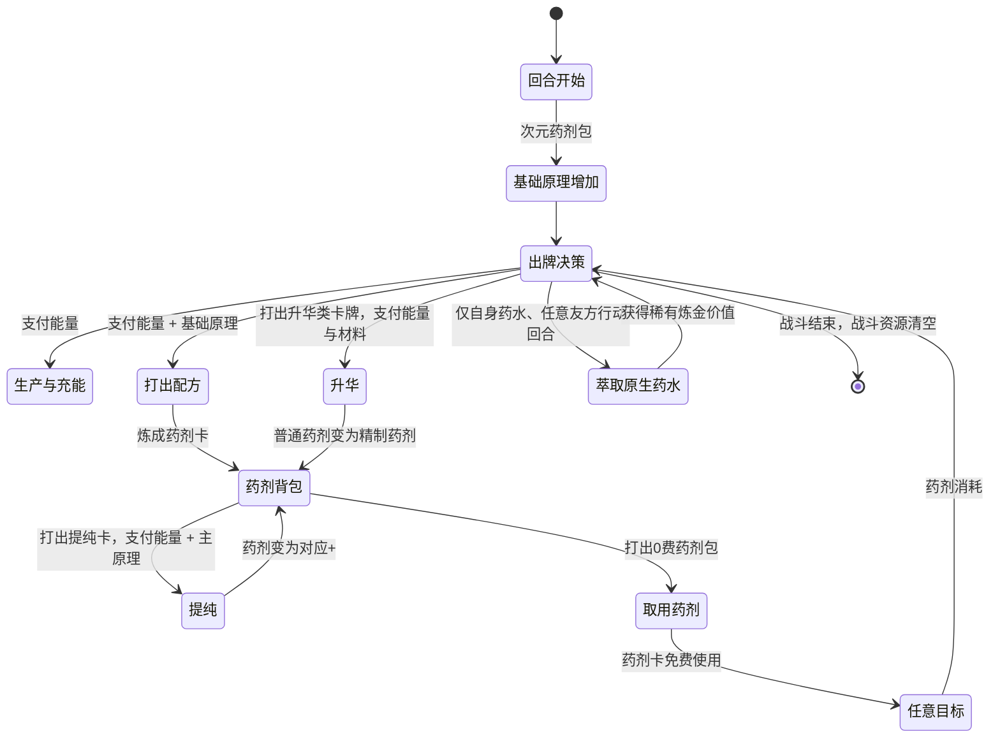
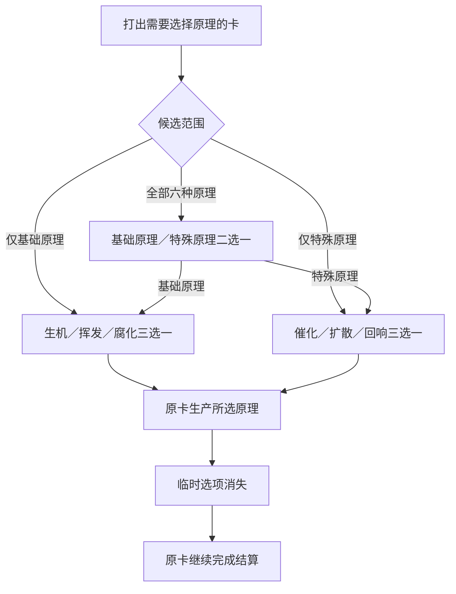

# DimensionalTraveler · 核心设计文档

> 状态：`0.1.0` 纵切代码与首轮单人流程已完成验证，稳定 `mod id` 已锁定。完整首发的发布口径、五条构筑轴、9 种药剂效果、品质／杰作规则、普通与杰作配方、催化／扩散／回响主链、45 张独立奖励卡池、标准 10 件遗物，以及原生药水萃取规则均已冻结；`R00～R09` 的具体效果已经确认。当前设计阶段进入多人完整规则；角色正式显示名、多人完整体验、Epoch、剧情与正式表现仍待后续设计。
>
> 稳定 `mod id` / 工程标识：`DimensionalTraveler`
> 角色暂称：次元旅人

## 1. 产品定位

次元旅人是一名以多人协作为主要体验的炼金辅助角色。

- **首要场景**：双人及以上联机队伍；人数不设上限。
- **单人策略**：允许选择，但明确提示“联机专属，不保证单人平衡”。
- **队友适配**：面向任意原版或 Mod 角色，不依赖指定职业或构筑。
- **战斗职责**：根据局势制造并投放药剂，在救援防护、攻击补位、友方增幅与敌方控场之间调度。
- **叙事身份**：跨越不同世界的旅行者兼游方药师。尖塔只是漫长旅途的一站，先古之民认识并尊敬这位旅人。

## 2. 已冻结的玩法原则

1. 炼制与提纯只在药师自己的回合执行；原生药水萃取可在任意友方玩家的行动回合执行，但敌方行动阶段不可执行。
2. 炼制与提纯消耗普通能量；炼成的药剂卡默认使用时不消耗能量。只有药剂表明确标注的高强度例外需要支付使用费；当前临时敏捷药剂的杰作／杰作+均为 1 费。
3. 药剂可以对任意合法生物使用：自己、任意队友、任意敌人。效果按原语义结算，因此伤害药剂可以伤害队友，增益药剂也可以强化敌人。
4. 默认药剂是单目标；多目标必须由“扩散”等明确修饰解锁，不能因队伍人数增加而自动变强。
5. 原生药水保持原版获得与使用方式；永久萃取只允许处理药师本人药水栏中的药水，可在任意友方玩家的行动回合执行，不限制单场战斗的萃取次数。

## 3. 战斗状态模型

```text
基础炼金原理
├─ 生机：救援、防护、恢复
├─ 挥发：爆发、调度、效率
└─ 腐化：攻击、侵蚀、削弱

特殊炼金原理（角色 Buff）
├─ 催化：生产提效与生产过程调配
├─ 扩散：阵营范围药剂结算
└─ 回响：原始药剂重放与派生投放
```

### 3.1 基础炼金原理

- 三类独立的 RitsuLib 次级资源。
- 仅在当前战斗存在；战斗结束清空。
- 不设硬上限。
- 配方卡将它们作为明确的支付成本；资源不足时不可打出。
- `次元药剂包` 在战斗开始时使三类各获得 1 点，并在每个回合开始时使三类各获得 1 点。
- 额外的生产、充能、转换与消耗规则由后续卡牌、遗物和附魔内容提供。

### 3.2 特殊炼金原理

- 只由生产类卡牌等高阶内容获得。
- 作为角色自身 Buff 的层数计数。
- 每类最多 3 层，仅本场战斗有效，战斗结束清空。
- 使用模式为“被动生效 + 特定卡牌可消耗层数触发爆发”。

| 特殊原理 | 被动方向 | 消耗方向 |
|---|---|---|
| 催化 | 提高生产效率：定向生产在 1～2 层时对应原理额外 +1，3 层时额外 +2；灵活生产仅在 2 层及以上时令三类原理各额外 +1 | 催化调配卡可消耗层数，强化或重复生产过程，也可兑换即时行动力 |
| 扩散 | 由扩散调配卡将**本回合下一张**药剂按首次目标所属阵营完整结算；选己方时作用己方全队，选敌人时作用敌方全体。扩散调配为次元旅人专属卡池的金色稀有卡，不加 `MultiplayerOnly` 限制，基础费用为 1 能量，升级后降为 0 能量。 | 扩散调配每次消耗 2 层扩散；若本回合未使用药剂则扩散资格在回合结束失效。调配卡自身正常进入弃牌堆，可在后续洗牌再次使用。 |
| 回响 | 高阶能力将已发生的炼制或投药再次转化为价值 | 复制、回收、再次调配或按目标快照重放药剂 |

#### 回响派生硬约束

- 回响构筑的核心消费方式是**目标快照重放**：基础重放卡消耗 **1 能量 + 2 层回响**，升级后费用降为 **0 能量**，仍消耗 2 层回响；使刚使用的原始药剂按其已经确定的目标快照再次完整结算。只有本回合存在有效原始药剂快照时才可使用。回响上限为 3，因此满层时也只能启动一次并保留 1 层；药剂品质不改变回响层数成本。
- 目标快照重放是回响的基础消费方式；生成付费回响药剂是较高稀有度辅助玩法。回响不再承担未使用药剂回收、药剂家族重铸或配方复制职责。
- 基础重放只读取**本回合最近一瓶原始药剂**的目标快照；每次使用新的原始药剂都会覆盖旧快照，回合结束时清除。`EchoDerived` 药剂与派生重放不得生成、刷新或覆盖该快照。
- 回响重放药剂时，完整使用原药剂已经确定的目标快照；原药剂已被扩散时，对同一阵营全体再次结算。
- 回响重放不重新选择生物目标，也不重新判断扩散；但药剂内部的次级选择不属于目标快照，必须按重放时的当前状态重新执行。例如杰作轮转药剂重放时，从目标当前抽牌堆重新选择最多 2 张牌。
- 所有回响派生结算与回响生成的药剂卡均带 `EchoDerived` 标记。
- 回响生成到手牌的付费药剂卡完整继承原药剂的种类、普通/精制/杰作品质与 `+` 状态；普通、精制、杰作的费用分别固定为 1/2/3 能量，`+` 不额外加费。
- 回响药剂作为新手牌可重新自由指定任意合法生物。
- 所有 `EchoDerived` 对象不得触发任何“使用药剂后”的回响、返还、复制或再次生成回响药剂的监听；不得回到药剂背包。
- 该单层限制不削弱原始药剂的扩散收益，但从状态机层面阻断无限递归。

#### 回响生产卡

- 基础回响生产卡消耗 **1 能量**；升级后费用降为 **0 能量**。两者均正常进入弃牌堆，可在后续洗牌再次使用。
- 每次使用获得 1 层回响；若本回合已经炼成或使用过任意药剂，则额外获得 1 层回响。升级不改变产量或触发条件。
- 回响仍受每类最多 3 层、仅当前战斗有效的通用限制。

#### 催化生产卡

- 基础催化生产卡消耗 2 能量，获得 1 层催化；其 `+` 版本仍消耗 2 能量，但改为获得 2 层催化。卡牌正常进入弃牌堆，可在后续洗牌再次使用。
- 催化不采用线性叠加。定向生产在 1～2 层催化时额外 +1、3 层时额外 +2；灵活生产仅在 2 层及以上时令三类基础原理各额外 +1。
- 催化仅强化明确标记为“生产”的卡牌，不监听所有基础原理变化。初始遗物在战斗开始／回合开始时的自动产出，以及药剂返还、事件、遗物和其他非生产来源均不受催化影响。
- “生产”必须作为显式卡牌机制标记或统一生产命令表达，不得通过“本次是否获得了基础原理”进行事后推断，避免职责扩散与重复增幅。
- 催化调配不设唯一的主消费方式。完整奖励卡池提供**强化生产、重复生产、即时调配**三类消费手段，玩家可自由混合；已移除职责不清且与定向生产重复的“转化生产调配”，基础原理种类转换如有需要应归入基础炼制轴。
- 强化生产调配消耗 **1 能量 + 2 层催化**，使**本回合下一次显式生产中的炼金原理与普通能量基础产量翻倍**，随后再结算催化被动。可翻倍的炼金原理包含基础原理与特殊原理；若同一生产卡同时产出多项符合条件的资源，则各项基础产量均翻倍。抽牌、格挡、伤害、生成药剂等其他附带效果不属于生产数值，不会被复制或翻倍。
- 强化调配启动时记录支付前的催化层数快照，并用该快照结算下一次生产的催化被动。因此以 3 层催化启动后，虽然支付使当前催化降为 1 层，后续定向生产仍按支付前 3 层催化获得额外 +2。未在本回合触发时，强化资格在回合结束失效；派生生产不能取得或消耗强化资格。
- 即时调配基础版消耗 **1 能量 + 1 层催化**，生产 **2 能量**并抽 **1 张牌**；升级后费用降为 **0 能量**，仍消耗 1 层催化，效果不变。该卡带有显式“生产”标记：其 2 点能量属于生产基础产量，可消耗强化生产资格并翻倍为 4 点；抽牌只是附带效果，不会被翻倍。即时调配结算后可成为本回合最近一次生产快照；重复生产只复制其最终能量产量，不再次抽牌。催化默认被动只对已明确规定的定向生产与灵活生产提供额外原理，不会额外增加即时调配的能量产量。
- 重复生产调配基础版消耗 **1 能量 + 2 层催化**，升级后费用降为 **0 能量**，仍消耗 2 层催化。它复制本回合最近一次生产的**最终产量快照**，包含该次生产当时已经结算的默认催化增幅；不重新读取当前催化层数。重复结果标记为派生生产，不再触发催化被动或任何“生产后”监听，也不能成为下一次重复生产的新快照来源，从状态机上阻断递归。
- 催化轴不复用扩散的阵营范围职责或回响的药剂复用职责；即时调配只提供行动力，不改变药剂目标与结算。

#### 扩散调配卡

- 次元旅人专属卡池中的金色罕见卡，不属于无色卡池。
- 不添加 `MultiplayerOnly` 限制；单人模式仍可使用，但角色整体不保证单人平衡。
- 基础扩散生产卡为蓝色稀有卡，消耗 **1 能量**并获得 **1 层扩散**；升级后仍消耗 1 能量，改为获得 **2 层扩散**。基础版需要两次生产才能满足一次完整扩散，升级版可单卡补足扩散调配的 2 层支付。卡牌正常进入弃牌堆，可在后续洗牌再次使用。
- 基础版消耗 **1 能量**，升级后降为 **0 能量**；升级不降低 2 层扩散支付，也不改变资格只能在本回合使用的时限。
- 每次使用消耗 2 层扩散。扩散上限为 3 层，因此满层时也只能启动一次；再次启动必须重新由生产端补足层数。
- 卡牌本体不消耗，正常进入弃牌堆并可在后续洗牌后再次使用。
- 效果为：下一张打出的药剂卡，以其首次指定目标所属阵营为范围，对该阵营全体完整结算。首次目标必须满足该药剂原本的单体目标规则；首次目标合法后，扩散阶段不再对阵营内每个生物重复检查单体目标限制。因此自卫药剂指定自己后可扩散至己方全体，轮转药剂指定任意己方玩家后也可扩散至己方全体。
- 药剂效果不按人数削弱；大队伍中的超高强度是有意保留的构筑回报。
- 平衡主要依赖扩散生产、两层支付、稀有度、抽牌时机与药剂准备链，而非额外目标收费或数值衰减。

名称只是功能代号，待角色正式文案阶段统一命名。

## 4. 药剂卡与药剂包

### 4.1 药剂卡

- 9 种专属药剂均为**战斗内药剂卡**，不注册为原生药水奖励内容。
- 药剂由配方卡炼成，优先进入药剂背包。
- 药剂卡可自由指定任意合法生物目标。
- 药剂卡默认使用时不消耗普通能量；显式标注费用的高强度药剂除外。当前唯一例外是临时敏捷药剂的杰作／杰作+，二者均为 1 费。
- 使用后一次性消耗，不进入弃牌堆循环。
- **首轮范围不引入净化、移除状态或驱散类效果**。此类效果被视为高风险设计，不作为普通、精制药剂或起始卡组的第二效果。

#### 首发药剂清单

| 功能类别 | 药剂 | 当前效果方向 | 状态 |
|---|---|---|---|
| 防护 | 护盾药剂 | 可对任意合法目标使用。普通：目标获得 **8 格挡**；`+`：**10 格挡**。 | 精制：目标获得 **12 格挡**，并使其下次受到的伤害降低 **30%**；精制+：目标获得 **14 格挡**，并使其下次受到的伤害降低 **50%**；杰作：目标获得 **20 格挡**与 **4 层覆甲**；杰作+：目标获得 **24 格挡**与 **7 层覆甲**。覆甲按游戏原生状态语义结算。 |
| 防护 | 自卫药剂 | 仅自身使用。普通：自身获得 **10 格挡**；`+`：**12 格挡**。 | 精制：自身获得 **12 格挡**与 **3 层覆甲**；精制+：自身获得 **14 格挡**与 **4 层覆甲**。杰作：自身获得 **16 格挡**、**3 层覆甲**与 **2 层虚体**；杰作+：自身获得 **20 格挡**、**5 层覆甲**与 **3 层虚体**。虚体为自定义状态：持有期间，受到的任何来源伤害降低 **50%**。获得虚体的当回合不减少层数，效果完整覆盖目标当前所属阵营回合及随后的敌方行动；从下一次目标所属阵营回合开始时起，每回合开始减少 1 层。覆甲按游戏原生状态语义结算。 |
| 攻击 | 攻击药剂 | 可对任意合法目标使用。普通：造成 **9 伤害**；`+`：造成 **11 伤害**。 | 精制：造成 **14 伤害**，并获得 **1 点腐化**；精制+：造成 **16 伤害**，并获得 **2 点腐化**；杰作：造成 **32 伤害**，并获得 **3 点腐化**；杰作+：造成 **45 伤害**，并获得 **4 点腐化**。 |
| 攻击 | 腐化药剂 | 可对任意合法目标使用。普通：造成 **6 伤害**并施加 **1 层易伤**；`+`：造成 **8 伤害**并施加 **1 层易伤**。 | 精制：造成 **10 伤害**，施加 **2 层易伤**与 **1 层摧残**；精制+：造成 **12 伤害**，施加 **3 层易伤**与 **2 层摧残**。摧残复用原版 `DebilitatePower`：持有者的易伤与虚弱对强化攻击的影响翻倍，每层在持有者所属阵营回合结束时递减 1。杰作：造成 **16 伤害**并施加 **3 层腐蚀**；杰作+：造成 **18 伤害**并施加 **5 层腐蚀**。腐蚀为自定义状态：目标每次受到任意来源伤害时，额外受到等于当前腐蚀层数的伤害；触发追加伤害时不消耗层数，重复施加直接叠加。腐蚀追加伤害标记为派生伤害，不得再次触发腐蚀。每层腐蚀在持有者所属阵营回合结束时统一减少 1 层。 |
| 工具 | 轮转药剂 | 仅可指定自己或任意队友。普通：目标抽 **3 张牌**；`+`：抽 **4 张牌**。 | 精制：目标抽 **4 张牌**并获得 **1 点能量**；精制+：目标抽 **5 张牌**并获得 **1 点能量**。杰作：从目标自己的抽牌堆中指定 **2 张牌**置入其手牌，目标获得 **2 点能量**与 **3 层加速轮转**；杰作+：同样指定 **2 张牌**并获得 **2 点能量**，改为获得 **4 层加速轮转**。指定牌完整沿用原版牌堆选择口径，只检查当前抽牌堆且不自动洗入弃牌堆：0 张时跳过取牌，1 张时自动将该牌置入手牌，2 张及以上时必须指定 2 张；无论实际取得几张牌，能量与加速轮转均照常结算。加速轮转为持续回合数状态：目标每次所属阵营回合开始时获得 **1 点能量**，随后失去 1 层；3／4 层分别提供连续 3／4 个回合的回合开始能量。 |
| 增幅 | 临时力量药剂 | 可指定任意合法生物；目标获得 **2 点临时力量**，仅复用原版 `FlexPotion` / `TemporaryStrengthPower` 的生命周期：在目标所属 `CombatSide` 的回合结束时自动移除。`+` 版本为 **4 点**临时力量；普通／精制效果与配方成本均已确认。 | 精制：目标获得 **6 点**临时力量，并使其下一张攻击牌伤害提高 **30%**；精制+：仍获得 **6 点**临时力量，但下一张攻击牌伤害提高 **50%**。杰作：目标获得 **10 点临时力量**，并使其接下来 **2 张攻击牌**的所有伤害段提高 **50%**；杰作+：目标获得 **12 点临时力量**，并使其接下来 **3 张攻击牌**的所有伤害段提高 **50%**。 |
| 增幅 | 临时敏捷药剂 | 可指定任意合法生物；目标获得 **2 点临时敏捷**，仅复用原版 `SpeedPotion` / `TemporaryDexterityPower` 的生命周期：在目标所属 `CombatSide` 的回合结束时自动移除。`+` 版本为 **4 点**临时敏捷；普通／精制效果与配方成本均已确认。 | 精制：目标获得 **6 点**临时敏捷，并使其下一次获得的格挡提高 **30%**；精制+：仍获得 **6 点**临时敏捷，但下一次获得的格挡提高 **50%**。杰作：**1 费**，目标获得 **1 层无实体**；杰作+：**1 费**，目标获得 **2 层无实体**。杰作品质不再提供临时敏捷或格挡增幅。无实体完整复用原版 `IntangiblePower`。 |
| 控场 | 虚弱药剂 | 可对任意合法目标使用。普通：施加 **3 层虚弱**；`+`：施加 **4 层虚弱**；普通／精制效果已确认，配方成本为 1 能量 + 1 腐化 + 1 挥发。 | 精制：施加 **5 层虚弱**与 **1 层摧残**；精制+：施加 **7 层虚弱**与 **2 层摧残**。摧残沿用腐化药剂中的原版 `DebilitatePower` 语义。杰作：施加 **8 层虚弱**与 **3 层摧残**，随后读取目标最终虚弱总层数，每满 **4 层虚弱**施加 **1 层力量削弱**；杰作+：施加 **10 层虚弱**与 **4 层摧残**，改为每满 **3 层虚弱**施加 **1 层力量削弱**。目标在使用药剂前已有的虚弱也计入最终总层数。转换量按施加虚弱后的单次快照向下取整，追加力量削弱后不再次重算。力量削弱会立即降低目标等量力量；目标每次所属阵营回合结束时恢复 1 点力量并减少 1 层力量削弱，直至归零。 |
| 控场 | 降力药剂 | 对任意合法目标施加力量削弱。普通：施加 **2 层力量削弱**；`+`：施加 **4 层力量削弱**。普通／精制效果已确认。力量削弱会立即降低等量力量；目标每次所属阵营回合结束时恢复 1 点力量，同时力量削弱减少 1 层，直至归零；重复施加直接叠加，并允许将目标力量降低到负数。配方成本为 1 能量 + 1 腐化 + 1 挥发。 | 精制：施加 **6 层力量削弱**；精制+：施加 **8 层力量削弱**。杰作效果已确认：先施加基础 **10 层力量削弱**，再读取此时目标的力量削弱总层数，每满 **5 层**额外施加 1 层；杰作+同样先施加基础 **10 层力量削弱**，改为每满 **3 层**额外施加 1 层。额外层数基于施加基础值后的单次快照向下取整，追加后不再次重算，不形成递归增长。 |

临时力量药剂提供的“攻击牌伤害提高”资格在目标打出下一张 `Attack` 类型卡牌时消耗 1 次，并作用于该牌的**所有伤害段**；多段攻击的每一段分别按对应比例增幅。即使该攻击牌最终未造成伤害、目标失效或被其他效果完全抵消，仍在出牌时消耗 1 次资格。精制／精制+提供 1 次 30%／50% 增伤；杰作／杰作+分别提供 2／3 次 50% 增伤。

临时敏捷药剂的精制／精制+提供 1 次 30%／50%的“获得格挡提高”资格。该资格响应目标下一次**实际获得正数格挡的单次事件**，无论事件来自卡牌、药剂、能力或遗物；仅增强该次事件，并在事件结算后立即消耗。若同一来源连续产生多次格挡，后续事件不会共享本次增幅。未产生正数格挡、被规则取消或结算结果为 0 时不消耗资格。

临时敏捷药剂的杰作／杰作+完整复用原版 `IntangiblePower`：将目标受到的每次伤害与生命减少效果分别限制为 **1**，并在每个敌方阵营回合结束时减少 1 层。1／2 层分别覆盖接下来的 1／2 个敌方回合。二者炼成后的药剂卡使用费均为 **1 能量**，与杰作转化或直接杰作配方在生产阶段支付的能量和基础原理成本分别结算；使用后药剂卡照常一次性消耗。

### 4.2 药剂品质与 `+` 升级

药剂有两条彼此独立的成长轴：**品质**决定药剂层级，`+` 决定同品质药剂是否已被提纯强化。

```text
品质轴：普通药剂 ── 升华 ──→ 精制药剂 ── 杰作转化 ──→ 杰作药剂
升级轴：任意品质药剂 ── 提纯 ──→ 对应品质的药剂+
```

| 维度 | 规则 |
|---|---|
| 普通 | 基础效果。 |
| 精制 | 普通药剂的高品质版本：明显提高主数值，并获得轻量第二效果。普通药剂通过独立“升华”类卡牌支付能量与材料后转化而来。 |
| 杰作 | 精制药剂的独立高强度版本：产生规则级变化或高影响力结果。每个药剂家族都具有两条入口：通过通用高稀有度转化卡将对应精制药剂转为杰作，或通过该家族独立的金色高代价杰作配方直接炼成。永久萃取、事件、先古互动与 Epoch 仅提供稀有补充，不替代战斗卡池中的主要入口。 |
| `+` 版本 | 提纯后的同品质强化版本：只小幅提高主数值，不改变药剂的核心规则。普通、精制、杰作均可各自拥有对应 `+` 版本；升华或杰作转化时完整保留 `+` 状态，例如普通+ → 精制+ → 杰作+。 |

普通药剂到精制药剂的“升华”主要由蓝色稀有卡提供，作为中期开始稳定出现的构筑方向；事件、先古互动与 Epoch 可作为额外来源，不作为唯一入口。基础升华卡指定药剂包中任意一瓶普通品质药剂，支付 **1 能量 + 2 点该药剂主原理** 后，将其转为对应精制版本，并完整保留已有 `+` 状态。卡牌本体正常进入弃牌堆，可在后续洗牌后再次使用。

`升华`打出前必须完成原子预检：扫描药剂背包后，仅保留同时满足以下条件的候选——普通品质（普通或普通+）、且当前可支付其 2 点主原理成本。只有存在至少 1 个此类候选、且可支付卡牌本体的 1 点能量时才可打出；原生选择界面只展示这些可完成升华的药剂。预检失败时，卡牌不可使用，绝不打开空界面或包含不可支付目标的选择界面。

杰作药剂采用覆盖全部 9 个家族的双入口，职责不对等：

- **通用转化入口**：持有对应精制药剂后，通过高稀有度杰作转化卡支付 **1 能量 + 4 点目标药剂主原理** 完成精制 → 杰作，并保留已有 `+` 状态。该入口成本较低且一张卡可服务全部药剂家族。
- **独立配方入口**：全部 9 种药剂各自拥有一张金色杰作配方；无需先持有精制药剂，统一支付 **3 能量 + 对应普通配方各项基础原料的 3 倍**，直接生成对应杰作药剂。
- 独立杰作配方属于家族专属高投入路线，不取代通用转化卡的灵活性。基础配方生成杰作，卡牌升级后以相同成本直接生成对应杰作+。

| 金色杰作配方 | 能量成本 | 基础原理成本 |
|---|---:|---|
| 护盾药剂杰作配方 | 3 | 3 生机 + 3 挥发 |
| 自卫药剂杰作配方 | 3 | 6 生机 |
| 攻击药剂杰作配方 | 3 | 6 腐化 |
| 腐化药剂杰作配方 | 3 | 3 腐化 + 3 挥发 |
| 轮转药剂杰作配方 | 3 | 6 挥发 |
| 临时力量药剂杰作配方 | 3 | 3 生机 + 3 挥发 |
| 临时敏捷药剂杰作配方 | 3 | 3 生机 + 3 挥发 |
| 虚弱药剂杰作配方 | 3 | 3 腐化 + 3 挥发 |
| 降力药剂杰作配方 | 3 | 3 腐化 + 3 挥发 |

杰作转化卡基础版消耗 **1 能量 + 4 点目标药剂主原理**；升级版费用降为 **0 能量**，仍完整支付 4 点主原理，不降低炼金材料门槛。该升级模式与 `提纯+`、`升华+` 的行动效率强化保持一致。

杰作转化卡沿用升华的原子预检原则：打出前只保留位于药剂背包、品质为精制／精制+且当前能够支付 4 点对应主原理的候选；同时无法支付卡牌本体 1 点能量时不可打出。支付、品质替换与 `+` 状态继承必须作为一次不可部分完成的提交处理。

转化后的杰作优先回到原药剂所在的背包位置；若当前药剂包尚未升级、不能收纳杰作品质，则移除原精制药剂后将杰作产物生成到普通手牌。普通手牌已满时交给游戏默认溢出规则处理，不因尚未取得先古药剂包进阶而禁止杰作转化。

9 种独立杰作配方全部属于次元旅人专属金色卡。统一成本公式为 **3 能量 + 对应普通配方各项基础原料的 3 倍**；因此纯原理配方支付单类 6 点，混合配方支付两类各 3 点。支付必须进行原子预检，能量或任一基础原理不足时不可打出，不允许部分支付或生成药剂。

配方卡遵循同一双轴关系：普通／精制／杰作配方分别炼成对应品质药剂；配方的 `+` 版本直接炼成对应品质的药剂+。全部 9 个药剂家族均具有独立杰作配方；杰作配方升级只改变产物的 `+` 状态，不降低已冻结的 3 能量与 6 点总基础原理成本。

药剂包**不具备初始内建提纯能力**。初始阶段中，`提纯` 卡是药剂 → 药剂+的唯一入口：指定一瓶背包中的药剂，支付 **1 能量 + 1 点该药剂的主原理**，将其转为对应品质的药剂+。`提纯+` 自身费用降为 0 能量，仍消耗主原理。

药剂包本身仍保留可升级性，但完整首发不设置额外先古药剂包遗物。药剂包升级只按第 4.4 节提高容量与可收纳品质；不自动获得内建提纯，也不改变初始遗物。

### 4.3 药剂包系统牌

`药剂包` 是由初始遗物提供的永久系统牌。

| 规则 | 设计 |
|---|---|
| 手牌位置 | 永久位于手牌，且占用 1 个正常手牌位 |
| Tag | 永恒 |
| 费用 | 0 费 |
| 打出效果 | 打开药剂背包，每次仅取出 1 张药剂卡到手牌 |
| 结算 | 取用后立即回到手牌 |
| 保护规则 | 不可删除、弃置、消耗或被普通效果改变 |
| 成长 | 可升级；也允许后续卡牌、遗物、附魔与其交互 |

### 4.4 药剂背包

| 阶段 | 容量 | 可收纳品质 |
|---|---:|---|
| 初始 | 3 | 普通、精制 |
| 药剂包升级后 | 4 | 普通、精制、杰作 |

背包已满时，新炼成的药剂改为生成到普通手牌；普通手牌也满时交给游戏默认溢出规则处理。

未升级药剂包不能收纳杰作，但不阻止精制 → 杰作转化：此时杰作产物直接进入普通手牌。药剂包升级后，杰作转化可在背包原位完成。

### 4.5 UI 复用与原生药水萃取入口

- 项目不内嵌任何自写 UI。
- 药剂包取药完全复用游戏原生卡牌选择界面：打出 `药剂包` 后，仅展示背包中的药剂，玩家选择 1 张移入手牌。
- 战斗界面额外提供一个药剂背包查看入口。该入口将原生抽牌堆按钮场景的节点布局、图标风格、数量角标、悬浮提示、点击反馈、控制器交互及牌堆查看屏幕复制到 `DimensionalTraveler` 自己的资源命名空间，但数据源必须直接绑定旅者药剂背包牌堆，不得复制、镜像或修改真实抽牌堆数据。点击后打开专用的只读药剂背包查看屏幕，展示全部药剂及其当前品质、`+` 状态和悬浮提示；查看行为不得取出、选择、排序或改变药剂。原版 `NCombatCardPile` 与 `NCardPileScreen` 都明确禁止直接扩展给其他牌堆，因此实现时必须建立职责单一的药剂背包按钮与查看屏幕脚本；可以复用原生场景结构、资产、卡牌网格和输入交互，但不得继承、补丁修改或直接调用原版抽牌堆的状态逻辑。
- 药剂背包为空时，查看入口仍显示数量 `0`；点击后只显示原生空背包提示，不打开空牌堆屏幕。`药剂包` 系统牌则保持不可打出。
- 原生药水萃取直接复用顶部药水栏及其原生药水弹窗。在“使用／丢弃”之外，为次元旅人本人药水栏中的可萃取药水增加第三个“萃取”按钮；不制作独立药水选择界面或其他新 UI。
- 萃取不使用二次确认弹窗。药水悬浮提示或萃取按钮自身的悬浮提示必须在点击前完整展示该药水被永久消耗后将获得的确定收益；玩家点击可用的“萃取”按钮后直接提交动作。
- 萃取可在任意友方玩家的行动回合执行，敌方行动阶段不可执行。药师死亡、行动被禁用、药水正在使用／丢弃／等待同步或目标不再位于药师本人药水栏时，按钮禁用。
- 单场战斗不限制成功萃取次数。玩家可以连续永久消耗多瓶原生药水形成临时爆发；药水腰带等扩大药水储备的原版遗物属于允许出现的高强度“爽局”协同，不设置隐性衰减或次数上限。
- 萃取成功后永久移除该瓶药水并原子结算收益。“永久”只表示从当前跑局的当前药水库存中移除，不影响图鉴、解锁状态或后续再次获得同名药水。
- 提交时必须再次核对药水实例、槽位所有者、友方行动阶段与可萃取资格。任一条件失效时整次动作取消：既不移除药水，也不获得收益。

### 4.6 原生药水萃取收益

#### 适用池与基础结构

旅者正常随机获得的原生药水由旅者角色药水池与原版共享药水池合并产生。完整首发中旅者角色药水池保持为空，因此正常获取和平衡范围固定为原版 **45 瓶共享药水**。五名原版角色各自的 3 瓶专属药水不加入旅者药水池；其他 Mod、事件或调试手段若强制给予这些药水，只走兼容映射，不计入标准平衡范围。事件药水与 Token 药水不套用下方稀有度通式，只允许“已冻结的特殊药水”中按稳定 ID 明确登记的发光水、污浊药水和药水形状的石头使用各自配方；其他未知内容默认不可萃取。

标准萃取收益固定由三部分组成：

1. 生产 **1 层特殊炼金原理**；不随稀有度提高，仍受对应特殊原理最多 3 层限制。
2. 按原生药水稀有度生产确定数量的同一种基础炼金原理。
3. 若存在足够相似的旅者药剂家族，额外生成对应药剂卡；没有合理对应时不强行生成药剂，改为额外生产 1 点基础原理。

| 原生药水稀有度 | 特殊原理 | 基础原理 | 对应旅者药剂卡 |
|---|---:|---:|---|
| 普通 | 1 层 | 2 点 | 普通药剂 |
| 罕见 | 1 层 | 3 点 | 精制药剂 |
| 稀有 | 1 层 | 4 点 | 精制+药剂 |
| 没有合理药剂卡 | 1 层 | 在对应稀有度基础上额外 +1 点 | 不生成药剂卡 |

稀有原生药水不直接生成杰作药剂，避免萃取同时给予特殊原理、基础原理并绕过杰作转化与独立杰作配方。萃取产物具有独立来源标记，但不属于 `EchoDerived`：萃取本身不算炼成、不触发 R03 或 X02 的炼成记录；生成的药剂在后续真正使用时仍属于原始药剂，可以正常被扩散、记录目标快照、被回响重放，并触发 R05、R08 等原始药剂使用收益。药剂产物优先进入药剂背包；背包不接受或已满时进入普通手牌，并继续沿用原版手牌溢出规则。

#### 直接词条对应原理

最终实现必须按稳定药水 ID 使用显式映射，不能在运行时通过本地化文本、金色着色词语或动态变量名称推断。下表是正式萃取映射的设计基准；其中“暂无直接对应药剂”的项目仍照常获得原理，后续正式版本再通过新增药剂、兼容药剂或其他补偿内容逐步完善。

| 词条／作用 | 特殊原理 | 基础原理 | 对应旅者药剂 |
|---|---|---|---|
| 获得格挡 | 扩散 | 生机 | 护盾药剂 |
| 获得力量 | 催化 | 生机 | 临时力量药剂 |
| 获得敏捷 | 催化 | 生机 | 临时敏捷药剂 |
| 令敌人失去力量 | 扩散 | 腐化 | 降力药剂 |
| 集中 | 催化 | 挥发 | 暂无直接对应药剂 |
| 中毒 | 回响 | 腐化 | 腐化药剂 |
| 灾厄 | 回响 | 腐化 | 腐化药剂 |
| 虚弱 | 扩散 | 腐化 | 虚弱药剂 |
| 易伤 | 扩散 | 腐化 | 腐化药剂 |
| 无实体 | 催化 | 生机 | 临时敏捷药剂家族 |
| 覆甲 | 回响 | 生机 | 自卫药剂 |
| 荆棘 | 回响 | 腐化 | 暂无直接对应药剂 |
| 缓冲 | 催化 | 生机 | 护盾药剂 |
| 仪式 | 回响 | 生机 | 临时力量药剂 |
| 再生 | 回响 | 生机 | 暂无直接恢复药剂 |
| 能量 | 催化 | 挥发 | 轮转药剂 |
| 消耗 | 催化 | 腐化 | 暂无直接对应药剂 |
| 保留 | 回响 | 挥发 | 轮转药剂 |
| 召唤 | 回响 | 生机 | 暂无直接对应药剂 |
| 生成充能球 | 催化 | 挥发 | 暂无直接对应药剂 |
| 铸造 | 催化 | 挥发 | 暂无直接对应药剂 |
| 重放 | 回响 | 挥发 | 轮转药剂 |

同名词条必须结合药水的真实作用方向解释。例如“获得力量”映射催化与生机，“令敌人失去力量”则映射扩散与腐化；不得只看到“力量”二字便使用同一结果。

#### 多词条与模型预览

- **异鱼之油**同时获得力量和敏捷，属于真正的并列双效果：萃取获得 **1 催化 + 3 生机**，并按固定顺序生成普通临时力量药剂、普通临时敏捷药剂。因一瓶原生药水生成两张药剂，其卡牌品质由罕见通常对应的精制降为普通。
- **缚魂药水**同时给予虚弱和易伤，属于真正的并列双效果：萃取获得 **1 扩散 + 3 腐化**，并按固定顺序生成普通虚弱药剂、普通腐化药剂；同样不生成两张精制药剂。
- **铁心药水**以覆甲为主效果，“格挡”提示只解释覆甲的行为；只按覆甲计算一次。
- **马萨雷斯的赠礼**以仪式为主效果，“力量”提示只解释仪式的结果；只按仪式计算一次。
- 狡诈药水的小刀+、尸鬼瓮的灵魂、王之勇气的君王之剑、黑暗精华的黑暗充能球均属于生成物或模型预览，不视为独立炼金词条，不额外增加原理产量。四瓶药水均属于原版角色专属药水，正常不会进入旅者随机药水池。

#### 已冻结的特殊药水

- **攻击药水**不再固定映射轮转药剂。萃取仍获得普通药水对应的 **1 扩散 + 2 挥发**；随后从攻击药剂、腐化药剂、虚弱药剂、降力药剂四个腐化主原理家族中，使用战斗卡牌生成随机数流抽取三个互不重复的普通品质候选，并复用原生三选一卡牌界面让玩家选择一瓶。选择不可跳过；联机同步固定候选顺序与选择位置。候选只是临时界面对象，只有最终选择的药剂进入药剂背包／手牌路由，未选候选立即消失。该流程可直接复用原版攻击药水的 `FromChooseACardScreen` 交互模式，不制作新 UI。
- **发光水**允许萃取。成功后获得 **1 催化 + 5 腐化**，并生成 1 瓶精制+轮转药剂。消耗手牌对应催化与腐化，大量补牌对应轮转；事件药水的基础原理产量高于普通稀有药水，但药剂产物仍止于精制+，不直接绕过杰作体系。
- **污浊药水**允许萃取。成功后获得 **1 扩散 + 3 腐化、200 金币与 3 点最大生命值**，但不生成旅者药剂卡。范围伤害对应扩散与腐化；200 金币和 3 点最大生命值已经构成主要事件收益，因此基础原理不提高到 5 点。药水快递员一次取得的多瓶污浊药水可以在后续战斗中分别萃取，不设置批次上限。原理、金币、最大生命值与永久移除药水必须作为一次原子提交处理，任何一项无法提交时整次萃取取消。
- **药水形状的石头**作为唯一明确支持的原版 Token 药水允许萃取。成功后获得 **1 催化 + 1 腐化**，并生成 1 瓶普通攻击药剂。它由石化蟾蜍每场战斗重复生成，因此不套用普通药水的完整基础产量；该映射只适用于稳定 ID 对应的原版药水形状的石头，不能推广到其他 Token。
- 未登记的 Mod 药水与未知 Token 默认不可萃取，并显示“尚未建立萃取配方”。兼容内容必须通过显式注册提供特殊原理、基础原理、药剂产物与可萃取资格；不得扫描本地化描述自动推断。

#### 45 瓶共享药水逐瓶映射

下表是旅者正常药水池的完整萃取映射。`基础量`已包含无合理药剂卡时的 +1 补偿；药剂品质按普通→普通、罕见→精制、稀有→精制+执行。攻击药水与两瓶双效果药水按上节特例，不机械套用品质列。

| 原生药水 | 稀有度 | 特殊原理 | 基础原理与数量 | 旅者药剂产物 |
|---|---|---|---|---|
| 攻击药水 | 普通 | 扩散 1 | 挥发 2 | 腐化主原理四家族随机取三，原生三选一选择 1 瓶普通药剂 |
| 甲虫汁 | 稀有 | 回响 1 | 生机 4 | 精制+虚弱药剂 |
| 熔炉的祝福 | 罕见 | 催化 1 | 挥发 4 | 无 |
| 格挡药水 | 普通 | 扩散 1 | 生机 2 | 普通护盾药剂 |
| 瓶装潜能 | 稀有 | 催化 1 | 挥发 4 | 精制+轮转药剂 |
| 明晰提取物 | 罕见 | 回响 1 | 挥发 3 | 精制轮转药剂 |
| 无色药水 | 普通 | 扩散 1 | 挥发 2 | 普通轮转药剂 |
| 痊愈药水 | 罕见 | 催化 1 | 挥发 3 | 精制轮转药剂 |
| 敏捷药水 | 普通 | 催化 1 | 生机 2 | 普通临时敏捷药剂 |
| 精炼混沌 | 稀有 | 回响 1 | 挥发 4 | 精制+轮转药剂 |
| 预知之滴 | 稀有 | 催化 1 | 挥发 4 | 精制+轮转药剂 |
| 复制药水 | 罕见 | 回响 1 | 挥发 3 | 精制轮转药剂 |
| 能量药水 | 普通 | 催化 1 | 挥发 2 | 普通轮转药剂 |
| 混沌药水 | 稀有 | 扩散 1 | 挥发 5 | 无 |
| 爆炸安瓿 | 普通 | 扩散 1 | 腐化 2 | 普通攻击药剂 |
| 瓶中精灵 | 稀有 | 回响 1 | 生机 4 | 精制+自卫药剂 |
| 火焰药水 | 普通 | 催化 1 | 腐化 2 | 普通攻击药剂 |
| 肌肉药水 | 普通 | 催化 1 | 生机 2 | 普通临时力量药剂 |
| 固化药水 | 罕见 | 扩散 1 | 生机 3 | 精制护盾药剂 |
| 果汁 | 稀有 | 催化 1 | 生机 4 | 精制+自卫药剂 |
| 异鱼之油 | 罕见 | 催化 1 | 生机 3 | 普通临时力量药剂 + 普通临时敏捷药剂 |
| 赌徒特酿 | 罕见 | 催化 1 | 挥发 3 | 精制轮转药剂 |
| 超巨化药水 | 稀有 | 催化 1 | 生机 4 | 精制+临时力量药剂 |
| 铁心药水 | 罕见 | 回响 1 | 生机 3 | 精制自卫药剂 |
| 流动铜液 | 罕见 | 回响 1 | 腐化 4 | 无 |
| 液态记忆 | 稀有 | 回响 1 | 挥发 4 | 精制+轮转药剂 |
| 幸运补剂 | 稀有 | 催化 1 | 生机 4 | 精制+护盾药剂 |
| 马萨雷斯的赠礼 | 稀有 | 回响 1 | 生机 4 | 精制+临时力量药剂 |
| 欧洛巴斯之酸 | 稀有 | 扩散 1 | 挥发 4 | 精制+轮转药剂 |
| 缚魂药水 | 罕见 | 扩散 1 | 腐化 3 | 普通虚弱药剂 + 普通腐化药剂 |
| 消亡粉末 | 罕见 | 回响 1 | 腐化 3 | 精制腐化药剂 |
| 能力药水 | 普通 | 扩散 1 | 挥发 2 | 普通轮转药剂 |
| 明耀酊剂 | 罕见 | 催化 1 | 挥发 3 | 精制轮转药剂 |
| 再生药水 | 罕见 | 回响 1 | 生机 4 | 无 |
| 镣铐药水 | 稀有 | 扩散 1 | 腐化 4 | 精制+降力药剂 |
| 瓶中船 | 稀有 | 扩散 1 | 生机 4 | 精制+护盾药剂 |
| 技能药水 | 普通 | 扩散 1 | 挥发 2 | 普通轮转药剂 |
| 异蛇之油 | 稀有 | 催化 1 | 挥发 4 | 精制+轮转药剂 |
| 速度药水 | 普通 | 催化 1 | 生机 2 | 普通临时敏捷药剂 |
| 稳定血清 | 罕见 | 回响 1 | 挥发 3 | 精制轮转药剂 |
| 力量药水 | 普通 | 催化 1 | 生机 2 | 普通临时力量药剂 |
| 迅捷药水 | 普通 | 催化 1 | 挥发 2 | 普通轮转药剂 |
| 癫狂之触 | 罕见 | 催化 1 | 挥发 3 | 精制轮转药剂 |
| 易伤药水 | 普通 | 扩散 1 | 腐化 2 | 普通腐化药剂 |
| 虚弱药水 | 普通 | 扩散 1 | 腐化 2 | 普通虚弱药剂 |

熔炉的祝福、混沌药水、流动铜液与再生药水按“无合理药剂卡”规则多生产 1 点基础原理。无悬浮词条药水按其实际效果使用固定 ID 语义映射，不能自动回退到随机原理。R09 只改变原生药水栏位、商店购买成本、满血开战时的随机药水获得与药剂包容量，不修改任何药水的萃取配方或基础收益。

## 5. 炼制循环



## 6. 起始配置

### 6.1 基础属性

- 70 生命。
- 3 点基础能量。

### 6.2 初始遗物：次元药剂包

- 给予永久系统牌 `药剂包`。
- 战斗开始时：生机、挥发、腐化各获得 1 点。
- 每回合开始时：生机、挥发、腐化各获得 1 点。
- 第 1 回合额外抽 2 张牌。
- 第 2 回合起，每回合额外抽 1 张牌。

> 抽牌效果的实现应参考原版猎手初始遗物 `RingOfTheSnake` 的 `ModifyHandDraw(...)` 机制，但次元药剂包在首次手牌之外还需要持续提供每回合 +1 抽牌；这是高强度循环补偿项，后续数值验证必须重点覆盖。

### 6.3 初始套牌

- 12 张普通卡，另加 1 张永久系统牌 `药剂包`。
- 采用稳定重复结构，确保每场战斗稳定进入炼制循环。
- 不使用传统打击/防御模板；所有初始卡均为炼金操作、配方或药剂联动。
- 起始阶段不产生催化、扩散、回响等特殊炼金原理。

| 类别 | 数量 | 已确认规则 |
|---|---:|---|
| 护盾药剂配方 | 1 | 消耗 1 能量、1 点生机、1 点挥发；炼成可对任意合法目标使用的护盾药剂，令目标获得 **8 格挡**。 |
| 自卫药剂配方 | 1 | 消耗 1 能量与 2 点生机；炼成仅对自身使用的自卫药剂，令自身获得 **10 格挡**。 |
| 攻击药剂配方 | 1 | 消耗 1 能量与 2 点腐化；炼成可对任意合法目标使用的攻击药剂，对目标造成 **9 伤害**。 |
| 腐化药剂配方 | 1 | 消耗 1 能量、1 点腐化、1 点挥发；炼成可对任意合法目标使用的腐化药剂，造成 **6 伤害**并施加 **1 层易伤**。 |
| 轮转药剂配方 | 1 | 消耗 1 能量与 2 点挥发；炼成仅可指定自己或任意队友使用的轮转药剂，使目标抽 3 张牌。 |
| 定向生产卡 | 3 | 生机、挥发、腐化各 1 张；每张消耗 1 能量，获得对应基础原理 2 点。 |
| 灵活生产卡 | 1 | 消耗 1 能量，生机、挥发、腐化各获得 1 点。 |
| 配方检索操作卡 | 1 | 消耗 1 能量，进入弃牌堆；仅从当前抽牌堆指定 1 张配方卡置入手牌，抽牌堆没有配方时失效。 |
| 配方保留操作卡 | 1 | 消耗 1 能量，指定手牌中的 1 张配方在本场战斗内永久获得保留；**本体消耗**。`配方保留+` 仍为 1 能量、保留规则不变，但移除消耗，改为进入弃牌堆循环。 |
| 专门提纯卡 | 1 | `提纯`：消耗 1 能量与 1 点目标药剂主原理，指定药剂包中的 1 瓶药剂将其转为对应品质的 `+` 版本，进入弃牌堆。`提纯+`：费用降为 0 能量，仍消耗主原理。 |

9 种药剂的普通配方成本已正式冻结为完整首发规则：

| 药剂 | 主原理 | 普通配方成本 |
|---|---|---|
| 护盾药剂 | 生机 | **1 能量 + 1 生机 + 1 挥发** |
| 自卫药剂 | 生机 | **1 能量 + 2 生机** |
| 攻击药剂 | 腐化 | **1 能量 + 2 腐化** |
| 腐化药剂 | 腐化 | **1 能量 + 1 腐化 + 1 挥发** |
| 轮转药剂 | 挥发 | **1 能量 + 2 挥发** |
| 临时力量药剂 | 生机 | **1 能量 + 1 生机 + 1 挥发** |
| 临时敏捷药剂 | 生机 | **1 能量 + 1 生机 + 1 挥发** |
| 虚弱药剂 | 腐化 | **1 能量 + 1 腐化 + 1 挥发** |
| 降力药剂 | 腐化 | **1 能量 + 1 腐化 + 1 挥发** |

主原理是每个药剂家族唯一的品质材料归属，用于提纯、升华与杰作转化支付；它与普通配方实际消耗的单一或混合原料彼此独立，不能由配方成本自动推断。临时力量与临时敏捷的普通配方均消耗 1 点生机和 1 点挥发；虚弱与降力的普通配方均消耗 1 点腐化和 1 点挥发。

前五种起始配方已经过纵切运行验收；后四种配方在完整首发设计阶段确认。后续平衡调整如需改变成本，必须作为明确的版本变更处理，不再视为未定草案。

初始套牌合计为 12 张。额外抽牌与稳定检索/保留工具共同缓解药剂包永久占位和套牌规模增加造成的循环压力。

### 6.4 原版机制兼容基础打防

角色完整卡牌池额外注册一对仅供原版机制查找的基础打击／防御牌。它们不是初始卡，也不进入 45 张战后奖励池；只有原版或其他兼容机制明确要求为该角色获得基础打击／防御时，才可能进入玩家牌组。

| 兼容牌 | 稀有度与标记 | 基础效果 | 升级效果 |
|---|---|---|---|
| 兼容打击 | 基础稀有度；打击标签；基础打防标记 | 1 能量，对敌人造成 **9 伤害**。 | 伤害提高为 **13**。 |
| 兼容防御 | 基础稀有度；防御标签；基础打防标记 | 1 能量，获得 **10 格挡**。 | 格挡提高为 **13**。 |

这两张牌必须同时满足原版按“基础稀有度 + 打击／防御标签”查找角色对应卡牌的契约，并保留原版识别基础打防所需的标记，使“获得一对打击／防御”类遗物与潘多拉魔盒等基础打防处理流程不会因角色完全没有传统打防而报错。它们不占奖励卡编号，不用于补足稀有度比例，也不改变“不使用传统打防作为起始套牌”的角色设计。

## 7. 完整首发内容规模

| 内容 | 目标规模 | 功能方向 |
|---|---:|---|
| 奖励卡池 | 42～48 张，中心目标 45 张 | 不包含现有 12 张起始卡，也不包含战斗中生成的药剂卡；用于原理生产、提纯品质、专门配方与目标扩展。现有 12 张起始卡全部不进入战后奖励池，奖励卡池采用完全独立的内容集合。卡池总量允许随职责完整性小幅浮动，不为凑固定数量保留同质卡。 |
| 遗物 | 10 件 | 系统炼金、协作调度、原生药水储备与商店经济 |
| 战斗内专属药剂 | 9 种 | 救援、防护、攻击、增幅、控场各 2 种，另含 1 种工具药剂 |
| Epoch | 3 个 | 旅途日志主线与玩法解锁 |
| 角色专属事件内容 | 3 个目标 | 优先以原有事件专属分支实现 |

卡池正式构筑轴为：

1. **基础炼制**：生产三类基础原理、调度配方并连续制造药剂。
2. **品质升级**：通过提纯、升华与杰作转化提高少量关键药剂的品质。
3. **催化生产**：强化、转换或重复生产过程。
4. **扩散投放**：以较高准备成本将单体药剂扩大到目标所属阵营。
5. **回响循环**：重放已经使用的原始药剂，或生成可重新选择目标的付费派生药剂。

五条构筑轴均获得完整奖励卡池支持，并采用**自由混合**结构：大部分卡牌必须具备脱离专属组件后的独立价值，不设置路线锁定、互斥选择或硬性专精门槛；高阶收益可以要求明确的药剂品质、特殊原理或战斗状态，但这些条件应能由其他构筑轴共同提供，从而形成跨轴协同。药剂背包是所有构筑共享的核心基础设施，不单独占用构筑轴。

### 7.1 奖励卡池职责骨架

完整奖励卡池的职责骨架固定为 **45 张**。本节只冻结卡位数量、编号与职责边界；正式名称、尚未确认的普通／蓝色／金色稀有度、费用、具体数值和升级效果按组继续确认。起始卡、系统牌、药剂卡、Token、状态、事件、先古牌，以及两张仅供原版机制查找的兼容基础打防均不计入这 45 张。

| 分组 | 数量 | 编号 | 已冻结职责 |
|---|---:|---|---|
| 基础炼制与普通配方 | 12 | B01～B12 | 三类免费爆发生产、灵活基础原理生产、配方回收、配方临时副本、下一张配方降费、未使用药剂回包、四种非起始普通配方。 |
| 品质升级与杰作配方 | 13 | Q01～Q13 | 通用升华、通用杰作转化、预先提纯、品质收益，以及 9 种药剂各自的独立杰作配方。 |
| 催化生产 | 6 | C01～C06 | 催化生产、复合催化生产、强化生产、重复生产、即时调配、生产与配方调度衔接。 |
| 扩散投放 | 5 | D01～D05 | 扩散生产、复合扩散生产、局部双目标扩散、完整阵营扩散、扩散后的资源／手牌回报。 |
| 回响循环 | 5 | E01～E05 | 回响生产、复合回响生产、目标快照重放、生成付费回响药剂、原始药剂使用收益。 |
| 通用调度 | 2 | G01～G02 | 从抽牌堆指定取牌并整理手牌；永久提高本场战斗的每回合能量。 |
| 跨轴桥梁 | 2 | X01～X02 | 灵活生产一种特殊原理；将炼成、品质升级或原始药剂使用记录转化为所选特殊原理。 |

职责编号明细如下：

- **B01～B04**：生机、挥发、腐化的免费爆发生产，以及从三种基础原理中选择一种的灵活生产。具体规则见下表。

| 编号 | 稀有度 | 基础效果 | 升级效果 |
|---|---|---|---|
| B01 | 普通 | 0 能量；显式生产 **3 点生机**；消耗。 | 产量、费用与消耗不变；额外**抽 1 张牌**。 |
| B02 | 普通 | 0 能量；显式生产 **3 点挥发**；消耗。 | 产量、费用与消耗不变；额外**抽 1 张牌**。 |
| B03 | 普通 | 0 能量；显式生产 **3 点腐化**；消耗。 | 产量、费用与消耗不变；额外**抽 1 张牌**。 |
| B04 | 蓝色 | 0 能量；从生机、挥发、腐化中选择一种，显式生产所选原理 **2 点**；正常进入弃牌堆。 | 所选原理产量提高为 **3 点**。 |

B01～B03 是免费启动牌：抽到后可在不支付能量的情况下获得足以支持普通配方的启动原理；升级提供的抽 1 张牌用于补回其占用的抽牌位，不继续增加原理产量。B04 以蓝色稀有度换取自由选择与可循环使用，不消耗其他原理，也不属于原理置换。

#### 原理选择的统一原生界面规则

凡效果要求玩家从原理中选择一种，统一复用游戏原生的小型卡牌选择界面，不制作自定义 UI。界面中的选项牌只是临时选择按钮：不进入手牌、抽牌堆、弃牌堆、奖励池或卡牌统计，选择完成后立即消失；实际生产与相关生产快照均归属于原本打出的卡。

- 从三种基础原理中选择时，直接展示 **生机 → 挥发 → 腐化**，必须选择一种，不可跳过。
- 从三种特殊原理中选择时，直接展示 **催化 → 扩散 → 回响**，必须选择一种，不可跳过。
- 若某张卡允许从全部六种原理中选择，则采用两级界面：第一层固定展示 **基础炼金原理 → 特殊炼金原理**；选择类别后，第二层再展示该类别对应的三种原理。两层均不可跳过，也不提供返回上一层重新选择的功能。
- 所有候选顺序在单人、多人和所有本地化语言下保持一致。联机只同步选中的候选位置，因此不得按本地化名称、字典遍历结果或客户端状态动态排序。
- 只有真正允许六选一的效果才采用两级选择；普通三选一不得额外增加类别选择步骤。

选择流程如下：



- **B05～B08**：弃牌堆配方回收、手牌配方虚无副本、下一张配方普通能量降费、未使用且非 `EchoDerived` 药剂重新装回背包。具体规则如下。

| 编号 | 稀有度 | 基础效果 | 升级效果 |
|---|---|---|---|
| B05 | 普通 | 1 能量；从弃牌堆选择 1 张正式配方置入手牌；弃牌堆没有配方时不可使用。 | 费用降为 **0 能量**。 |
| B06 | 蓝色 | 1 能量；选择手牌中的 1 张正式配方，生成 1 张继承其升级状态的临时副本；副本具有**虚无**与**消耗**，仍完整支付炼制费用和基础原理。 | 费用降为 **0 能量**。 |
| B07 | 普通 | 0 能量；使本回合下一张配方的普通能量费用减少 1；不降低基础原理成本；本卡消耗。 | 移除消耗，改为正常进入弃牌堆。 |
| B08 | 普通 | 0 能量；选择手牌中 1 瓶非 `EchoDerived` 药剂，将其重新装入药剂背包，然后抽 1 张牌；正常进入弃牌堆。 | 抽牌数提高为 **2 张**。 |

B06 复制的是再次炼制的机会，不复制已经炼成的药剂。正式配方仍留在原处；临时副本打出后因消耗而离场，未在本回合打出则按原版虚无规则在回合结束时消耗。临时副本不能再次成为配方复制、配方保留或弃牌堆配方回收的候选，避免复制链与永久化。

B07 的降费只作用于配方的普通能量费用。多次获得的降费可以叠加，费用最低降至 0；打出下一张配方时消耗当前全部降费资格，本回合未触发则在回合结束时清除。即使降费超过目标配方当前费用，多余部分也不会保留给下一张配方。

B08 必须在选择界面打开前完成合法性过滤：背包存在可用位置，且目标药剂的品质可被当前背包收纳。若不存在合法药剂则不可使用。重新装包不是使用药剂，不生成原始药剂快照，也不触发任何“使用药剂后”效果；所有 `EchoDerived` 药剂均不得回到背包。

- **B09～B12**：临时力量、临时敏捷、虚弱、降力药剂的普通配方。四张卡的费用、基础原理成本和普通药剂效果沿用第 4、6 节已经冻结的规则；升级只将产物从普通药剂改为对应普通+，不降低成本。

| 编号 | 配方 | 稀有度 | 普通配方成本 | 基础产物 | 升级产物 |
|---|---|---|---|---|---|
| B09 | 临时力量药剂配方 | 普通 | 1 能量 + 1 生机 + 1 挥发 | 目标获得 2 点临时力量 | 对应普通+：4 点临时力量 |
| B10 | 临时敏捷药剂配方 | 普通 | 1 能量 + 1 生机 + 1 挥发 | 目标获得 2 点临时敏捷 | 对应普通+：4 点临时敏捷 |
| B11 | 虚弱药剂配方 | 蓝色 | 1 能量 + 1 腐化 + 1 挥发 | 目标获得 3 层虚弱 | 对应普通+：4 层虚弱 |
| B12 | 降力药剂配方 | 蓝色 | 1 能量 + 1 腐化 + 1 挥发 | 目标获得 2 层力量削弱 | 对应普通+：4 层力量削弱 |

临时力量与临时敏捷属于需要在目标当前回合继续配合攻击或格挡的短时基础增幅，因此置于普通池。虚弱与力量削弱能够直接压制敌方后续输出，在多人模式下具有更高的全队保护价值，因此置于蓝色池。

基础炼制与普通配方组共 12 张，其中普通 8 张、蓝色 4 张；本组不含金色卡。

- **Q01～Q04**：通用升华、通用杰作转化、预先提纯与品质收益。具体规则如下。

| 编号 | 稀有度 | 基础效果 | 升级效果 |
|---|---|---|---|
| Q01 | 蓝色 | 1 能量；选择背包中 1 瓶普通／普通+药剂，支付 2 点该药剂主原理，将其升华为对应精制／精制+。 | 费用降为 **0 能量**；主原理成本不变。 |
| Q02 | 金色 | 1 能量；选择背包中 1 瓶精制／精制+药剂，支付 4 点该药剂主原理，将其转化为对应杰作／杰作+。 | 费用降为 **0 能量**；主原理成本不变。 |
| Q03 | 蓝色 | 0 能量；使本回合下一瓶原本不带 `+` 的炼成药剂直接变为对应药剂+；本卡消耗。 | 移除消耗，改为正常进入弃牌堆。 |
| Q04 | 蓝色 | 1 能量，抽 2 张牌；若背包中最高品质为精制，返还 1 点能量；若最高品质为杰作，返还 1 点能量并额外抽 1 张牌。 | 获得**保留**；数值不变。 |

Q03 只监听明确的炼成结果，不修改已存在药剂。若下一瓶炼成药剂本来就带 `+`，则不消耗预先提纯资格；资格继续等待本回合下一瓶原本不带 `+` 的炼成药剂。多次使用可以积累次数，回合结束时未使用的次数全部清除。预先提纯不额外支付主原理，也不改变药剂品质。

Q04 只读取药剂品质，不读取 `+` 状态；普通+仍按普通品质计算，精制+仍按精制品质计算，杰作+仍按杰作品质计算。背包为空或最高只有普通品质时，仅执行基础抽 2 张牌。品质在打出时读取一次，结算过程中不重新判断。

- **Q05～Q13**：护盾、自卫、攻击、腐化、轮转、临时力量、临时敏捷、虚弱、降力药剂的独立杰作配方。九张全部为金色卡，基础版直接炼成对应杰作药剂，升级后以相同费用炼成对应杰作+；费用与原理成本均不因升级降低。

| 编号 | 杰作配方 | 能量成本 | 基础原理成本 |
|---|---|---:|---|
| Q05 | 护盾药剂杰作配方 | 3 | 3 生机 + 3 挥发 |
| Q06 | 自卫药剂杰作配方 | 3 | 6 生机 |
| Q07 | 攻击药剂杰作配方 | 3 | 6 腐化 |
| Q08 | 腐化药剂杰作配方 | 3 | 3 腐化 + 3 挥发 |
| Q09 | 轮转药剂杰作配方 | 3 | 6 挥发 |
| Q10 | 临时力量药剂杰作配方 | 3 | 3 生机 + 3 挥发 |
| Q11 | 临时敏捷药剂杰作配方 | 3 | 3 生机 + 3 挥发 |
| Q12 | 虚弱药剂杰作配方 | 3 | 3 腐化 + 3 挥发 |
| Q13 | 降力药剂杰作配方 | 3 | 3 腐化 + 3 挥发 |

品质升级与杰作配方组共 13 张，其中蓝色 3 张、金色 10 张；本组不含普通卡。

- **C01～C06**：基础催化生产、催化与基础原理复合生产、强化生产、重复生产、即时调配、显式生产后的配方调度。具体规则如下。

| 编号 | 稀有度 | 基础效果 | 升级效果 |
|---|---|---|---|
| C01 | 蓝色 | 2 能量；显式生产 1 层催化；正常进入弃牌堆。 | 费用不变；产量提高为 **2 层催化**。 |
| C02 | 蓝色 | 1 能量；选择一种基础原理，显式生产 1 层催化与 2 点所选原理；本卡消耗。 | 费用降为 **0 能量**；产量与消耗不变。 |
| C03 | 金色 | 1 能量 + 2 层催化；使本回合下一次显式生产的炼金原理与普通能量基础产量翻倍；随后再结算支付前催化层数快照对应的被动。 | 费用降为 **0 能量**；催化成本不变。 |
| C04 | 金色 | 1 能量 + 2 层催化；复制本回合最近一次生产的最终产量快照；复制结果属于派生生产。 | 费用降为 **0 能量**；催化成本不变。 |
| C05 | 蓝色 | 1 能量 + 1 层催化；显式生产 2 点能量并抽 1 张牌。 | 费用降为 **0 能量**；催化成本与效果不变。 |
| C06 | 蓝色能力 | 2 能量；每回合第一次完成显式生产后，从抽牌堆顶部向下找到第一张正式配方并置入手牌。 | 费用降为 **1 能量**。 |

C02 的两项产量都属于同一次显式生产。只有打出 C02 前已经持有的催化可以增强其基础原理产量；C02 本次新生产的催化从后续生产开始生效，不得反过来强化同一次 C02。若 C02 消耗了 C03 的强化资格，则 1 层催化与 2 点所选基础原理的基础产量分别翻倍，之后仅对基础原理结算支付前催化层数对应的默认被动。

C06 每回合最多触发一次。它只检查当前抽牌堆，不自动将弃牌堆洗回；抽牌堆没有正式配方时本次触发不产生卡牌，但仍视为本回合已经触发。检索过程不打开选择界面，不打乱其他卡牌的相对顺序；临时配方副本不属于合法候选。

催化组共 6 张，其中蓝色 4 张、金色 2 张；本组不含普通卡。

- **D01～D05**：基础扩散生产、扩散与基础炼制复合生产、消耗 1 层扩散的局部双目标投放、消耗 2 层扩散的完整阵营投放、扩散结算后的回报。具体规则如下。

| 编号 | 稀有度 | 基础效果 | 升级效果 |
|---|---|---|---|
| D01 | 蓝色 | 1 能量；显式生产 1 层扩散；正常进入弃牌堆。 | 费用不变；产量提高为 **2 层扩散**。 |
| D02 | 蓝色 | 2 能量；显式生产 1 层扩散，以及生机、挥发、腐化各 2 点；本卡消耗。 | 费用降为 **1 能量**；产量与消耗不变。 |
| D03 | 蓝色 | 1 能量 + 1 层扩散；使本回合下一瓶原始药剂在首次目标正常结算后，再由玩家选择首次目标同阵营的另一个存活生物完整结算一次。 | 费用降为 **0 能量**；扩散成本不变。 |
| D04 | 金色 | 1 能量 + 2 层扩散；使本回合下一瓶原始药剂按首次目标所属阵营全体完整结算。 | 费用降为 **0 能量**；扩散成本不变。 |
| D05 | 金色能力 | 2 能量；每回合第一次通过局部或完整扩散，使一瓶原始药剂实际作用于至少 2 个目标后，抽 1 张牌并获得 1 点能量。 | 费用降为 **1 能量**；触发次数与回报不变。 |

D02 的扩散与三类基础原理都属于同一次显式生产，可以被 C03 整体翻倍。扩散没有默认催化被动；三类基础原理按灵活生产口径，只在支付前至少持有 2 层催化时各额外获得 1 点。D02 本次新生产的扩散不影响同一次生产，且本卡消耗后不能循环提供大规模备料。

D03 的首次目标必须满足药剂原本的目标规则；第二目标只要求与首次目标同阵营且仍然存活，不重新检查药剂的单体目标限制。若不存在第二个存活目标，药剂只对首次目标结算，已支付的扩散不返还。第二目标必须由玩家选择，不自动指定。D03 资格未在本回合触发时清除。

D04 完整沿用第 3 节已经冻结的扩散调配规则。D03 与 D04 不能同时修饰同一瓶药剂；打出其中任意一张时，如果另一种扩散资格仍未使用，则新资格覆盖旧资格，已支付资源不返还，避免一瓶药剂同时走双目标与全阵营两套范围流程。

D05 每瓶药剂最多触发一次，不随实际目标数量增加收益。只有原始药剂通过 D03 或 D04 实际作用于至少 2 个目标时才满足条件；单人模式下未形成第二目标的 D03、只有单个存活目标的 D04、回响重放与所有 `EchoDerived` 药剂均不能触发。每回合第一次满足条件后，即使后续再次扩散也不再提供回报。

扩散组共 5 张，其中蓝色 3 张、金色 2 张；本组不含普通卡。

- **E01～E05**：基础回响生产、回响与基础炼制复合生产、最近原始药剂目标快照重放、生成可重新选目标的付费 `EchoDerived` 药剂、使用原始药剂后的非重放收益。具体规则如下。

| 编号 | 稀有度 | 基础效果 | 升级效果 |
|---|---|---|---|
| E01 | 蓝色 | 1 能量；显式生产 1 层回响；若本回合已经炼成或使用过任意原始药剂，则额外生产 1 层回响。 | 费用降为 **0 能量**；产量与触发条件不变。 |
| E02 | 普通 | 0 能量；显式生产 1 层回响，并从生机、挥发、腐化中选择一种生产 1 点；本卡消耗。 | 移除消耗，改为正常进入弃牌堆；产量不变。 |
| E03 | 金色 | 1 能量 + 2 层回响；按本回合最近一瓶原始药剂已经确定的目标快照再次完整结算。 | 费用降为 **0 能量**；回响成本不变。 |
| E04 | 金色 | 1 能量 + 1 层回响；根据本回合最近一瓶原始药剂，生成一瓶完整继承家族、品质与 `+` 状态、可重新选择目标的付费 `EchoDerived` 药剂。 | 费用降为 **0 能量**；回响成本和派生药剂费用不变。 |
| E05 | 普通 | 0 能量，抽 1 张牌；若本回合已经使用过原始药剂，则额外抽 1 张；本卡消耗。 | 移除消耗，改为正常进入弃牌堆。 |

E02 的回响与所选基础原理属于同一次显式生产，可以被 C03 整体翻倍。E02 本次新生产的回响不产生额外自我增幅；基础原理也不适用定向／灵活生产的默认催化被动，因为 E02 不属于这两类生产。

E03、E04 完整遵守第 3 节的回响派生硬约束。没有有效原始药剂快照时不可使用；两者产生的派生结算或药剂不得生成、刷新或覆盖原始快照，也不得触发任何回响递归。E04 生成药剂的固定费用仍为普通 1、精制 2、杰作 3，`+` 不额外加费。

E05 只判断本回合是否已经成功使用过至少一瓶原始药剂，不要求当前仍保留有效快照；每次打出都按当时状态独立判断。炼成但未使用药剂、重新装包、回响重放与使用 `EchoDerived` 药剂均不能满足额外抽牌条件。

回响组共 5 张，其中普通 2 张、蓝色 1 张、金色 2 张。此前为凑满 7 张提出的未使用药剂回收、保留品质家族重铸、快照延期和追忆配方方案全部废弃，不得在后续恢复为待确认内容。

- **G01～G02**：所有构筑都可使用的手牌整理与长期能量能力。它们不消耗回响，也不属于任何单一特殊原理构筑轴。具体规则如下。

| 编号 | 稀有度 | 基础效果 | 升级效果 |
|---|---|---|---|
| G01 | 蓝色 | 1 能量；从当前抽牌堆指定 1 张牌置入手牌，然后选择手牌中的 1 张合法牌弃掉；正常进入弃牌堆。 | 费用降为 **0 能量**；其余规则不变。 |
| G02 | 金色能力 | 2 能量 + 2 生机 + 2 挥发 + 2 腐化；本场战斗中，此后每回合获得的基础能量增加 1。 | 费用降为 **1 能量**；三种基础原理成本不变。 |

G01 是定向手牌整理，不属于普通抽牌：它不会触发“抽牌”监听。抽牌堆为空时不可使用；被取出的牌加入手牌后再进行弃牌选择，因此该牌本身也可以被弃掉。永久系统牌及其他规则上不可弃置的牌不属于合法候选。选择完成前不得改变抽牌堆或提交弃牌结果，联机中两次选择都沿用原生同步流程。

G02 的普通能量与三种基础原理必须在打出前同时满足，并作为一次原子支付处理，不能先扣一部分再因资源不足失败。能力从后续回合开始持续生效，不返还打出当回合的能量；多张 G02 可以叠加，每张使每回合基础能量再增加 1。该能力不属于“生产”，不能被催化强化、C03 翻倍或 C04 重复。

通用调度组共 2 张，其中蓝色 1 张、金色 1 张。

- **X01～X02**：所有特殊原理构筑都可使用的一次性跨轴生产入口。两张牌均使用固定顺序的“催化 → 扩散 → 回响”原生三选一界面，实际生产归属于原卡。具体规则如下。

| 编号 | 稀有度 | 基础效果 | 升级效果 |
|---|---|---|---|
| X01 | 蓝色 | 1 能量；选择一种特殊原理并显式生产 1 层；本卡消耗。 | 费用降为 **0 能量**；产量与消耗不变。 |
| X02 | 蓝色 | 1 能量；根据本回合的**实验记录**，选择一种特殊原理，每项记录显式生产 1 层；本卡消耗。 | 费用降为 **0 能量**；产量规则与消耗不变。 |

X01 无需任何前置状态，是稳定但一次性的转轨入口。它不得移除消耗或提高基础产量，以免通过灵活性直接替代催化、扩散、回响各自的专门生产牌。

X02 的**实验记录**是卡牌关键词。卡面只显示短句；鼠标悬停时，由右侧独立悬浮提示解释完整规则：

> **实验记录**：本回合每完成以下一种不同炼金步骤，记录 1 项：炼成原始药剂；成功提纯、升华或杰作转化背包中的已有药剂；使用原始药剂。同类步骤重复完成仍只记录 1 项。回响重放与 `EchoDerived` 药剂不计入记录。

X02 只能在本回合至少有 1 项实验记录时使用。三类记录分别计数，基础产量为 1～3 层；最终结果仍受特殊原理最多 3 层的通用上限约束。由升级配方或预先提纯直接炼成药剂+只属于“炼成”，不会额外获得“品质升级”记录；品质升级记录只在背包中的既有药剂成功发生提纯、升华或杰作转化时产生。

X01、X02 都属于显式生产，可以被 C03 翻倍并成为 C04 的最近生产快照；催化的默认被动不会再额外增加特殊原理产量。两张牌均为一次性桥梁，不建立第六条构筑轴。

跨轴桥梁组共 2 张，均为蓝色。完整 45 张奖励卡最终稀有度固定为：**普通 10 张、蓝色 18 张、金色 17 张**。金色数量高于早期暂定盘，主要来自 9 张固定杰作配方，以及后来确认的扩散长期能力和永久能量能力；不为贴近原版比例而降低这些高阶引擎的稀有度。

#### 卡面关键词与悬浮提示规范

卡牌描述中的短标签统一称为**关键词（Keyword）**；鼠标移到卡牌上时在右侧出现的独立解释框称为**悬浮提示（Hover Tip / Tooltip）**。复杂流程应优先压缩为关键词，不在卡面展开成多行说明。

- 卡面只保留玩家做决定时必须立即知道的费用、目标、产量和核心结果。
- 条件枚举、派生对象限制、联机固定顺序、同类行为是否重复计数等细则放入悬浮提示。
- 同一机制在所有卡牌上复用同一个关键词与同一份提示，禁止每张卡使用近义词重新解释。
- 关键词不能隐藏会改变玩家当前选择的关键成本或目标限制；费用和不可跳过的目标选择仍必须直接显示在卡面。
- 当前 `X02` 正式使用关键词**实验记录**。后续实现时可继续将“原始药剂”“显式生产”“回响派生”等高频规则制作成统一悬浮提示，但是否显示为卡面关键词应在文案阶段逐张审核。

原生药水萃取不作为构筑轴，也不配置一组要求持续选牌支持的萃取卡。它是角色自带的特殊功能：永久消耗药师本人持有、通常较难获取的原生药水，为当前战斗提供一次强力炼金帮助；入口、药水分类、逐瓶收益与兼容边界均以第 4.5、4.6 节的冻结规则为准。

### 7.2 遗物数量与职责骨架

完整首发的标准角色遗物池固定为 **10 件**，并包含已经确定的初始遗物。稀有度分布固定为：初始 1 件、普通 2 件、蓝色 3 件、金色 3 件、商店 1 件。完整首发不设置额外先古进阶遗物；药剂包系统牌自身的升级不产生新的遗物模型。

| 编号 | 稀有度 | 已冻结职责 |
|---|---|---|
| R00 | 初始 | `次元药剂包`：提供药剂包系统牌、战斗期基础原理与额外抽牌。 |
| R01 | 普通 | 基础原理稳定，缓解配方与原理暂时不匹配。 |
| R02 | 普通 | 药剂背包日常管理，不直接提高药剂效果。 |
| R03 | 蓝色 | 成功炼成原始药剂后的有限行动收益。 |
| R04 | 蓝色 | 提纯、升华与杰作转化后的品质升级收益。 |
| R05 | 蓝色 | 对其他生物投放原始药剂的通用协作收益，单人必须具有兜底。 |
| R06 | 金色 | 催化高阶构筑遗物。 |
| R07 | 金色 | 扩散高阶构筑遗物。 |
| R08 | 金色 | 回响高阶构筑遗物。 |
| R09 | 商店 | 原生药水栏位与购买经济，并提高满血开战时的药水储备和药剂包容量。 |

R01、R02 必须在没有特殊原理构筑时正常发挥。R03～R05 支持所有药剂家族，不得成为某种药剂的专用遗物。R06～R08 可以要求对应特殊原理，但不能成为该构筑唯一的启动入口。R09 只提供原生药水与药剂包基础设施，不修改萃取收益，也不恢复旧版扣除生命或高风险炼金经济方向。

#### R01 · 普通遗物：第一张配方主原理减免

每场战斗成功打出的第一张配方，其主原理成本减少 1 点，最低降至 0；普通能量与其他辅助原理成本不变。只有配方完成原子支付并成功炼成药剂后，才消耗本场战斗的减免机会。查看、取消或因剩余成本不足而无法打出配方，均不消耗机会。

普通配方、杰作配方和带虚无／消耗的临时配方副本都属于合法触发对象。该遗物不影响提纯、升华、杰作转化卡或回响药剂使用费。成本减免不是生产或资源返还，不受催化强化，不生成生产快照，也不能被重复生产复制。

#### R02 · 普通遗物：药剂背包扩容

药剂背包容量增加 1。未升级药剂包的容量由 3 提高为 4；升级药剂包的容量由 4 提高为 5。该遗物只增加槽位，不解锁新的可收纳品质：未升级药剂包仍不能收纳杰作药剂，所有 `EchoDerived` 药剂仍不得进入背包。

背包满载后的手牌溢出规则保持不变；该遗物不改变药剂效果、药剂包系统牌的手牌占位、每次取药数量或药剂包升级规则。

#### R03 · 蓝色遗物：炼成后抽牌

每回合第一次成功炼成一瓶原始药剂后，抽 1 张牌。每回合最多触发一次。普通／升级／杰作配方和临时配方副本都可触发；背包已满、药剂转入普通手牌时仍视为成功炼成。

提纯、升华、杰作转化、取药、重新装包、回响重放、E04 生成的付费药剂及其他 `EchoDerived` 对象均不能触发。配方未完成支付或未生成药剂时不触发。

#### R04 · 蓝色遗物：品质升级后返还主原理

每回合第一次成功对背包中的既有药剂执行提纯、升华或杰作转化后，返还 1 点该药剂的主原理。每回合最多触发一次；普通能量不返还。品质操作必须先按原规则完成原子支付与品质替换，随后才结算返还。

升级配方直接炼成药剂+、Q03 预先提纯、杰作配方直接炼成杰作、回响生成继承高品质药剂及失败的品质操作均不能触发。返还不是显式生产，不受催化强化，不生成生产快照，也不能被重复生产复制。

#### R05 · 蓝色遗物：原始药剂投放返还主原理

每回合第一次使用原始药剂时，按玩家最初选择的目标返还该药剂的主原理：目标为药师自己时返还 1 点；目标为任何其他生物时返还 2 点。其他生物同时包含队友与敌人，因此单人模式可以通过对敌人投放攻击或控制药剂获得完整收益。遗物只判断目标身份，不判断投药对目标是否有利。

扩散时只读取最初指定的目标，不按额外目标数量增加收益。一瓶药剂每回合最多触发一次；回响目标快照重放、付费回响药剂、其他 `EchoDerived` 对象和扩散附加结算均不能触发。主原理返还不是显式生产，不受催化或生产快照影响。

#### R06 · 金色遗物：催化消费返还

每回合第一次成功支付催化并完成对应卡牌结算后，返还 1 层催化。必须先满足并完整支付原催化成本，返还不能用于补足本次支付；出牌取消、失败或未真正支付催化时不触发。

C03 强化生产仍在支付前记录催化层数快照，遗物返还不会修改该快照。返还不是显式生产，不触发催化被动，不消耗强化资格，不生成生产快照，也不能被重复生产复制。

#### R07 · 金色遗物：成功扩散返还

每回合第一次通过 D03 或 D04，使一瓶原始药剂实际作用于至少 2 个不同目标后，返还 1 层扩散。扩散成本必须先正常支付；D03 没有合法第二目标、D04 结算时只有一个存活目标，均不返还。

一瓶药剂无论作用于 2 个还是更多目标，都只返还 1 层。回响目标快照重放、付费回响药剂、其他 `EchoDerived` 对象和扩散附加结算均不能触发。返还不是显式生产，不受催化或生产快照影响。

#### R08 · 金色遗物：使用原始药剂获得回响

每回合第一次使用原始药剂后，获得 1 层回响。对自己、队友或敌人使用均可触发；药剂品质与扩散目标数量不改变产量。获得后可以在同一回合立即支付给 E03 或 E04。

回响仍受最多 3 层的通用上限限制，满层时额外获得的回响直接浪费，不转换为其他收益。目标快照重放、付费回响药剂、其他 `EchoDerived` 对象和扩散附加结算均不能触发。遗物给予回响不是显式生产，不能被 C03 翻倍、C04 重复或记录为生产快照。

#### R09 · 商店遗物：药水储备与购买经济

获得遗物后，立即增加 **2 个原生药水栏位**，并使药剂包容量增加 **1**。药剂包扩容只增加槽位，不解锁新的可收纳品质；它与 R02、药剂包升级及其他明确的容量修正相加结算。例如未升级药剂包同时持有 R02 与 R09 时，容量由 3 提高为 5。

在商店购买药水时享受 **75% 折扣**，即支付该药水原价的 25%。折扣只作用于药水商品，必须接入原生商店价格机制；与其他折扣的叠加顺序及最终价格取整完整遵循原版价格钩子，不建立 R09 专用的第二套价格计算。

每场战斗开始时，按进入战斗瞬间的生命值快照判断：若药师当时生命值等于最大生命值，则尝试获得 1 瓶随机原版药水。后续战斗开始流程中的治疗、最大生命变化或伤害都不反向改变本次判定。随机池严格限定为旅者正常可获得的 **45 瓶原版共享药水**，不包含五名原版角色专属药水、事件药水、Token 药水或任何 Mod 药水。

随机药水完整走原版获得药水流程。若判定时药水栏已满，或原版规则因任何原因禁止获得药水，则本次奖励直接失效：不补发、不掉落到地面，也不转换为金币或其他资源。增加的两个原生药水栏位和药剂包 1 点容量均在获得 R09 后立即生效；遗物不修改萃取配方、萃取次数、萃取产量或药剂品质。

完整首发后的“三件特殊原理流派初始遗物”仍只属于候选扩展，不计入这 10 件，也不在当前遗物效果中预留依赖。

### 7.3 发布阶段

完整首发内容采用分阶段发布，不要求所有战斗、多人、叙事与美术内容一次性交付：

1. **战斗内容阶段**：完成并验收完整卡池、9 种药剂、遗物、品质链路与单人战斗流程。
2. **多人验证阶段**：完成队友目标、同步、重连、断线恢复及不同队伍规模下的运行验证。
3. **叙事与表现阶段**：完成 Epoch、角色专属事件、正式美术、动画、VFX 与发布文案。

各阶段可以独立形成可运行版本；后续阶段不得阻塞已经完成的战斗内容交付。

## 8. 多人边界

- 面向 2 人及以上队伍，不设置队伍人数上限。
- 默认药剂单目标；多目标必须通过明确的药剂修饰实现。
- 所有药剂均可指定任意合法生物，玩家承担错误施放或高风险施放的后果。
- 原生药水的永久萃取严格限制为药师本人资源，避免侵入队友财产与联机确认流程。

## 9. 叙事与进度（待定）

已确认：

- 角色是次元旅行者兼游方药师。
- 先古之民认识并尊敬该角色。
- 剧情优先在原有事件和先古互动中增加角色专属分支。
- Timeline / Epoch 以“旅途日志”包装，但具体章节、文案、事件目标尚未决定。

后续将单独创建叙事设计文档，决定：正式角色显示名、旅途故事主题、3 个 Epoch 的解锁条件、原版事件分支目标、先古对白与本地化文案。稳定 `mod id` 固定为 `DimensionalTraveler`，不随显示名调整。

### 9.1 完整首发后的候选扩展

完整首发完成并稳定后，可再评估在角色选择界面为次元旅人提供三件额外初始遗物，让玩家在开局时选择催化、扩散或回响之一作为特殊原理构筑倾向。该想法目前只作为候选扩展记录：不纳入完整首发内容口径，不占当前约 10 件遗物名额，不提前冻结遗物效果，也不在当前卡池、UI 或多人规则中预留实现依赖。

## 10. 首轮单人冒烟测试

### 10.1 验收规格

- **模式**：单人。
- **优先级**：流程正确性，不以数值平衡或多人同步为验收目标。
- **套牌**：完整 12 张起始普通卡 + 永久系统牌 `药剂包`，包含 `提纯` 与药剂+。
- **品质范围**：首轮实现并测试普通与精制药剂；`+` 作为独立升级轴，保留在对应测试链路中。杰作药剂、杰作转化、药剂包升级与杰作收纳全部后置。
- **精制入口**：实现一张不加入初始套牌的正式蓝色稀有 `升华` 卡：指定药剂背包中的任意普通药剂，支付 1 能量与 2 点该药剂主原理，将其转为对应精制版本并保留已有 `+` 状态；卡牌正常进入弃牌堆循环。打出前必须完成原子预检：仅当背包中存在普通／普通+品质，且当前能支付其 2 点主原理成本的候选药剂，并可支付卡牌本体的 1 点能量时才可打出；原生选择界面只展示这些候选。测试时通过控制台取得该卡。
- **控制台 ID**：稳定 `mod id` 固定为 `DimensionalTraveler`；内容已按 `DIMENSIONAL_TRAVELER_*` 稳定 ID 注册，具体命令以当前 KitLib／游戏控制台接口为准。
- **必须验证**：5 种起始药剂均能完成“炼成 → 入包 → 原生选择界面取出 → 使用 → 一次性消耗”的完整链路，并至少验证一次普通 → 精制与普通+ → 精制+ 转换。
- **后置内容**：队友目标、多人同步、杰作、特殊炼金原理与药剂包升级后的杰作收纳。

### 10.2 2026-07-17 运行证据

| 验收项 | 状态 | 证据／限制 |
|---|---|---|
| 构建并部署 DLL、PCK、manifest | 通过 | 源码产物、`torelease` 与游戏加载目录的 SHA-256 一致；本次跑局加载时间晚于产物时间。 |
| Mod、内容与本地化注册 | 通过 | RitsuLib 自动注册 40 项成功、0 项失败；英文、简体中文共 12 份表成功合并。 |
| 三原理战斗 UI | 通过 | 三个原版能量图标可见且视觉可区分；生机、挥发、腐化中文悬浮说明均可触发，提示保持在屏幕内。 |
| 三原理获得反馈 | 通过 | 腐化生产时捕获到图标亮度／burst 帧；图标区域较静态基线有 2670 个显著变化像素，最大差值 252。 |
| 战斗开始与回合增长 | 通过 | 腐化支付归零后，第 2 回合攻击配方仍不可用，第 3 回合恢复可用，证明每回合准确 +1 且未重复触发。 |
| 生产与支付 | 通过 | 腐化生产使攻击配方由不可用变为可用；配方支付 2 点后再次不可用。 |
| 无硬上限 | 通过 | 腐化从 2 累积到 12，连续支持 6 次各 2 点的配方支付；第 7 张配方不可用。 |
| 跨战斗重置 | 通过 | 携带至少 12 点腐化结束第二战；第三战第一回合只能支付一次 2 点配方，第二张立即不可用。 |
| 护盾药剂完整链路 | 通过 | 已完成炼成、入包、提纯、原生界面取出和指定自身使用。 |
| 自卫／攻击／腐化／轮转药剂 | 通过 | 自卫药剂仅对自身使用，格挡 `0 → 10`；攻击药剂真实指定敌人，生命 `21 → 12`；腐化药剂使同一敌人生命 `12 → 6` 并施加 `VulnerablePower=1`；轮转药剂使抽牌堆 `7 → 4`，扣除药剂自身离场后手牌净增 2，证明实际抽 3。四种药剂均一次性移除且未消耗能量。 |
| 普通 → 精制／普通+ → 精制+ | 通过 | 腐化专用配方按“不可用 → 生产 2 腐化后可用 → 支付后再次不可用”闭环证明主原理支付；普通升华能量 `17 → 16`，取回 `REFINED_ATTACK_POTION` 且 `upgradeLevel=0`；升级链路能量 `20 → 19`，取回同一精制药剂且 `upgradeLevel=1`。 |
| 连续战斗与奖励流程 | 通过 | 第一、第二战均正常生成卡牌奖励；可跳过奖励、返回地图并进入后续战斗节点。 |
| KitLib 测试基础设施 | 已记录 | 实际加载 KitLib `0.27.0`，部署 DLL SHA-256 为 `0E18BB2D353AE19A76F868C2B7D0D05171C41279A56D5F6C4D345FDE18727700`；MCP Bridge 为 `devmode-mcp-bridge 1.0.0`、协议版本 `2024-11-05`；本地源码参考点为 `38743dd`，不作为部署 DLL 来源证明。其自动出牌器仅解析原生 `TargetType`，无法为 RitsuLib 自定义 `Anyone` 目标类型传入目标；相关药剂已通过真实游戏目标交互验收，该限制不作为 Mod 药剂结算失败证据。 |

当前运行结论是“三原理、5 种起始药剂、普通／精制品质链路与连续跑局流程均通过；首轮单人纵切核心流程完成”。后续运行验收将在完整内容设计结束后继续；原生药水萃取与 R09 设计已经冻结，当前进入第 11 节列出的多人完整规则设计。

## 11. 后续待设计与实现事项

当前设计任务顺序以本节为准：

1. **进行中**：冻结多人目标、同步、重连、断线恢复与不同队伍规模体验规则。
2. 确定 3 个 Epoch、叙事、角色专属事件、UI、美术、本地化与发布标准。
3. 在内容设计完成后，继续药剂背包边界验收与完整战斗内容实现。

已完成且不得再作为“待确定”恢复的设计项：分阶段发布口径、正式构筑轴、杰作来源与转化规则、9 种药剂效果、9 种药剂主原理与普通／杰作配方成本、催化／扩散／回响卡牌交互主链、完整 45 张奖励卡、标准 10 件遗物的 `R00～R09` 具体效果，以及原生药水萃取入口、45 瓶共享药水逐瓶映射、事件药水与 Token 特例。奖励卡最终分布为普通 10 张、蓝色 18 张、金色 17 张；遗物分布为初始 1、普通 2、蓝色 3、金色 3、商店 1。

### 11.1 压缩恢复锚点

后续上下文压缩、会话交接或任务恢复必须以本节为唯一当前进度源：

- 当前进行中的任务是 `multiplayer`：冻结多人目标、所有权、同步、重连、断线恢复与不同队伍规模体验规则。
- `extraction` 已完成：萃取入口、45 瓶共享药水逐瓶映射、词条原理规则、发光水、污浊药水、药水形状的石头和 R09 均已冻结，不得恢复为待定。
- 萃取基础产量固定为普通 `1 特殊 + 2 基础 + 普通药剂`、罕见 `1 特殊 + 3 基础 + 精制药剂`、稀有 `1 特殊 + 4 基础 + 精制+药剂`；无合理药剂时额外 +1 基础。异鱼之油与缚魂药水各生成两张普通药剂；攻击药水改为腐化主原理四家族随机取三后原生三选一。
- 事件／Token 特例固定为：发光水 `1 催化 + 5 腐化 + 精制+轮转药剂`；污浊药水 `1 扩散 + 3 腐化 + 200 金币 + 3 最大生命` 且不生成药剂；药水形状的石头 `1 催化 + 1 腐化 + 普通攻击药剂`。未知 Mod 药水与 Token 默认不可萃取。
- R09 固定为：立即增加 2 个原生药水栏位；商店药水支付原价的 25%；以进入战斗时满血快照为条件，从 45 瓶共享药水中尝试获得 1 瓶随机药水；药剂包容量 +1。栏位已满或原版规则禁止获得时不补发。
- 药剂包查看入口必须复制原生抽牌堆按钮与牌堆查看屏幕的布局和交互到 Mod 命名空间，并直接绑定药剂背包数据；不得复制真实抽牌堆状态，也不得直接扩展原版明确限制为三种标准牌堆的节点脚本。
- 遗物主体设计已经完成：标准池固定为 10 件并包含初始遗物；稀有度为初始 1、普通 2、蓝色 3、金色 3、商店 1。`R00～R09` 具体效果均已冻结。
- 完整首发不设置额外先古进阶遗物。药剂包系统牌仍可升级，但不会产生新的遗物模型。
- `card-pool` 已完成。45 张奖励卡最终分布为普通 10、蓝色 18、金色 17，不得恢复为 43 张已确认或 `X01～X02` 待确认状态。
- 回响组已经由旧 7 张正式缩为 `E01～E05` 共 5 张；旧 `E05／E06` 辅助方案已废弃，原 `E07` 已重编号为当前 `E05`。
- 两个移出的卡位已成为 `G01` 手牌整理和 `G02` 永久能量能力，不得恢复为回响卡。
- `X01` 是一次性稳定生产任一特殊原理；`X02` 使用**实验记录**关键词，按本回合完成的不同炼金步骤生产 1～3 层所选特殊原理。
- 兼容打击／防御只供原版机制查找，不属于起始套牌或 45 张奖励卡。
- “选角界面追加三种特殊原理初始遗物”只属于完整首发后的候选扩展，当前不设计、不实现。
- 下一设计任务已经进入多人完整规则；多人阶段完成后，再按第 11 节顺序处理 Epoch、叙事、角色事件、UI、美术、本地化与发布标准。
