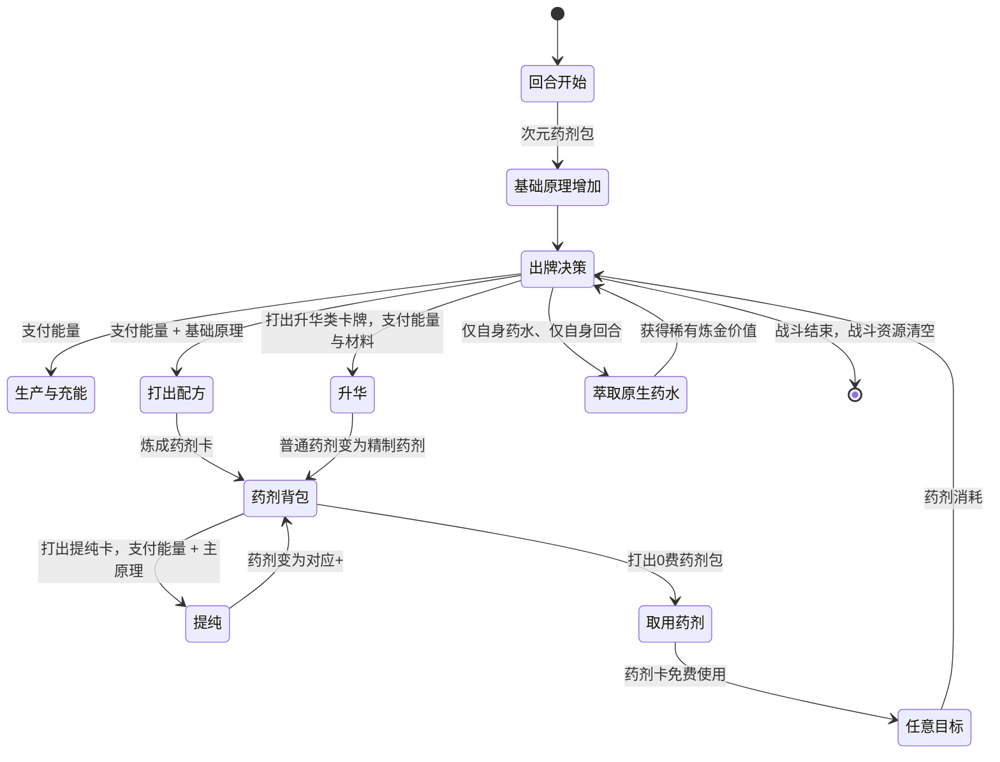
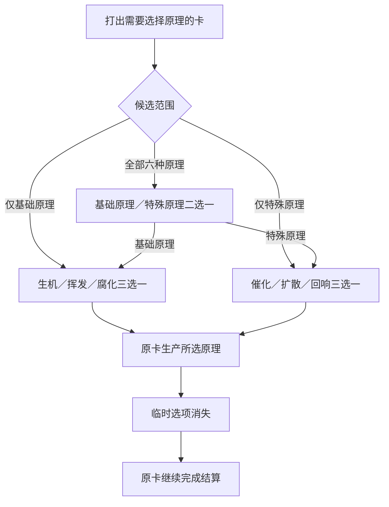

# DimensionalTraveler · 核心设计文档

> 状态：`0.1.0` 纵切代码与首轮单人流程已完成验证，稳定 `mod id` 已锁定。完整首发的发布口径、五条构筑轴、9 种药剂效果、品质／杰作规则、普通与杰作配方、催化／扩散／回响主链均已冻结；当前进入约 45 张独立奖励卡池的职责、稀有度与升级方向设计。角色正式显示名、遗物、原生药水萃取、多人完整体验、Epoch、剧情与正式表现仍待后续设计。
>
> 稳定 `mod id` / 工程标识：`DimensionalTraveler`
> 角色暂称：次元旅人

## 1. 产品定位

次元旅人是一名以多人协作为主要体验的炼金辅助角色。

- **首要场景**：双人及以上联机队伍；人数不设上限。
- **单人策略**：允许选择，但明确提示“联机专属，不保证单人平衡”。
- **队友适配**：面向任意原版或 Mod 角色，不依赖指定职业或构筑。
- **战斗职责**：根据局势制造并投放药剂，在救援防护、攻击补位、友方增幅与敌方控场之间调度。
- **叙事身份**：跨越不同世界的旅行者兼游方药师。尖塔只是漫长旅途的一站，先古之民认识并尊敬这位旅人。

## 2. 已冻结的玩法原则

1. 所有炼制、提纯、萃取等行动只在药师自己的回合执行。
2. 炼制与提纯消耗普通能量；炼成的药剂卡默认使用时不消耗能量。只有药剂表明确标注的高强度例外需要支付使用费；当前临时敏捷药剂的杰作／杰作+均为 1 费。
3. 药剂可以对任意合法生物使用：自己、任意队友、任意敌人。效果按原语义结算，因此伤害药剂可以伤害队友，增益药剂也可以强化敌人。
4. 默认药剂是单目标；多目标必须由“扩散”等明确修饰解锁，不能因队伍人数增加而自动变强。
5. 原生药水保持原版获得与使用方式；永久萃取只允许处理药师本人药水栏中的药水，并且仅能在药师自己的回合进行。

## 3. 战斗状态模型

```text
基础炼金原理
├─ 生机：救援、防护、恢复
├─ 挥发：爆发、调度、效率
└─ 腐化：攻击、侵蚀、削弱

特殊炼金原理（角色 Buff）
├─ 催化：生产提效与生产过程调配
├─ 扩散：阵营范围药剂结算
└─ 回响：回收、重铸、循环
```

### 3.1 基础炼金原理

- 三类独立的 RitsuLib 次级资源。
- 仅在当前战斗存在；战斗结束清空。
- 不设硬上限。
- 配方卡将它们作为明确的支付成本；资源不足时不可打出。
- `次元药剂包` 在战斗开始时使三类各获得 1 点，并在每个回合开始时使三类各获得 1 点。
- 额外的生产、充能、转换与消耗规则由后续卡牌、遗物和附魔内容提供。

### 3.2 特殊炼金原理

- 只由生产类卡牌等高阶内容获得。
- 作为角色自身 Buff 的层数计数。
- 每类最多 3 层，仅本场战斗有效，战斗结束清空。
- 使用模式为“被动生效 + 特定卡牌可消耗层数触发爆发”。

| 特殊原理 | 被动方向 | 消耗方向 |
|---|---|---|
| 催化 | 提高生产效率：定向生产在 1～2 层时对应原理额外 +1，3 层时额外 +2；灵活生产仅在 2 层及以上时令三类原理各额外 +1 | 催化调配卡可消耗层数，强化或重复生产过程，也可兑换即时行动力 |
| 扩散 | 由扩散调配卡将**本回合下一张**药剂按首次目标所属阵营完整结算；选己方时作用己方全队，选敌人时作用敌方全体。扩散调配为次元旅人专属卡池的金色稀有卡，不加 `MultiplayerOnly` 限制，基础费用为 1 能量，升级后降为 0 能量。 | 扩散调配每次消耗 2 层扩散；若本回合未使用药剂则扩散资格在回合结束失效。调配卡自身正常进入弃牌堆，可在后续洗牌再次使用。 |
| 回响 | 高阶能力将已发生的炼制或投药再次转化为价值 | 复制、回收、再次调配或按目标快照重放药剂 |

#### 回响派生硬约束

- 回响构筑的核心消费方式是**目标快照重放**：基础重放卡消耗 **1 能量 + 2 层回响**，升级后费用降为 **0 能量**，仍消耗 2 层回响；使刚使用的原始药剂按其已经确定的目标快照再次完整结算。只有本回合存在有效原始药剂快照时才可使用。回响上限为 3，因此满层时也只能启动一次并保留 1 层；药剂品质不改变回响层数成本。
- 生成付费回响药剂、回收与重铸不是基础消费方式，只作为较高稀有度回响卡牌的辅助玩法。
- 基础重放只读取**本回合最近一瓶原始药剂**的目标快照；每次使用新的原始药剂都会覆盖旧快照，回合结束时清除。`EchoDerived` 药剂与派生重放不得生成、刷新或覆盖该快照。
- 回响重放药剂时，完整使用原药剂已经确定的目标快照；原药剂已被扩散时，对同一阵营全体再次结算。
- 回响重放不重新选择生物目标，也不重新判断扩散；但药剂内部的次级选择不属于目标快照，必须按重放时的当前状态重新执行。例如杰作轮转药剂重放时，从目标当前抽牌堆重新选择最多 2 张牌。
- 所有回响派生结算与回响生成的药剂卡均带 `EchoDerived` 标记。
- 回响生成到手牌的付费药剂卡完整继承原药剂的种类、普通/精制/杰作品质与 `+` 状态；普通、精制、杰作的费用分别固定为 1/2/3 能量，`+` 不额外加费。
- 回响药剂作为新手牌可重新自由指定任意合法生物。
- 所有 `EchoDerived` 对象不得触发任何“使用药剂后”的回响、返还、复制或再次生成回响药剂的监听；不得回到药剂背包。
- 该单层限制不削弱原始药剂的扩散收益，但从状态机层面阻断无限递归。

#### 回响生产卡

- 基础回响生产卡消耗 **1 能量**；升级后费用降为 **0 能量**。两者均正常进入弃牌堆，可在后续洗牌再次使用。
- 每次使用获得 1 层回响；若本回合已经炼成或使用过任意药剂，则额外获得 1 层回响。升级不改变产量或触发条件。
- 回响仍受每类最多 3 层、仅当前战斗有效的通用限制。

#### 催化生产卡

- 基础催化生产卡消耗 2 能量，获得 1 层催化；其 `+` 版本仍消耗 2 能量，但改为获得 2 层催化。卡牌正常进入弃牌堆，可在后续洗牌再次使用。
- 催化不采用线性叠加。定向生产在 1～2 层催化时额外 +1、3 层时额外 +2；灵活生产仅在 2 层及以上时令三类基础原理各额外 +1。
- 催化仅强化明确标记为“生产”的卡牌，不监听所有基础原理变化。初始遗物在战斗开始／回合开始时的自动产出，以及药剂返还、事件、遗物和其他非生产来源均不受催化影响。
- “生产”必须作为显式卡牌机制标记或统一生产命令表达，不得通过“本次是否获得了基础原理”进行事后推断，避免职责扩散与重复增幅。
- 催化调配不设唯一的主消费方式。完整奖励卡池提供**强化生产、重复生产、即时调配**三类消费手段，玩家可自由混合；已移除职责不清且与定向生产重复的“转化生产调配”，基础原理种类转换如有需要应归入基础炼制轴。
- 强化生产调配消耗 **1 能量 + 2 层催化**，使**本回合下一次显式生产中的炼金原理与普通能量基础产量翻倍**，随后再结算催化被动。可翻倍的炼金原理包含基础原理与特殊原理；若同一生产卡同时产出多项符合条件的资源，则各项基础产量均翻倍。抽牌、格挡、伤害、生成药剂等其他附带效果不属于生产数值，不会被复制或翻倍。
- 强化调配启动时记录支付前的催化层数快照，并用该快照结算下一次生产的催化被动。因此以 3 层催化启动后，虽然支付使当前催化降为 1 层，后续定向生产仍按支付前 3 层催化获得额外 +2。未在本回合触发时，强化资格在回合结束失效；派生生产不能取得或消耗强化资格。
- 即时调配基础版消耗 **1 能量 + 1 层催化**，生产 **2 能量**并抽 **1 张牌**；升级后费用降为 **0 能量**，仍消耗 1 层催化，效果不变。该卡带有显式“生产”标记：其 2 点能量属于生产基础产量，可消耗强化生产资格并翻倍为 4 点；抽牌只是附带效果，不会被翻倍。即时调配结算后可成为本回合最近一次生产快照；重复生产只复制其最终能量产量，不再次抽牌。催化默认被动只对已明确规定的定向生产与灵活生产提供额外原理，不会额外增加即时调配的能量产量。
- 重复生产调配基础版消耗 **1 能量 + 2 层催化**，升级后费用降为 **0 能量**，仍消耗 2 层催化。它复制本回合最近一次生产的**最终产量快照**，包含该次生产当时已经结算的默认催化增幅；不重新读取当前催化层数。重复结果标记为派生生产，不再触发催化被动或任何“生产后”监听，也不能成为下一次重复生产的新快照来源，从状态机上阻断递归。
- 催化轴不复用扩散的阵营范围职责或回响的药剂复用职责；即时调配只提供行动力，不改变药剂目标与结算。

#### 扩散调配卡

- 次元旅人专属卡池中的金色罕见卡，不属于无色卡池。
- 不添加 `MultiplayerOnly` 限制；单人模式仍可使用，但角色整体不保证单人平衡。
- 基础扩散生产卡为蓝色稀有卡，消耗 **1 能量**并获得 **1 层扩散**；升级后仍消耗 1 能量，改为获得 **2 层扩散**。基础版需要两次生产才能满足一次完整扩散，升级版可单卡补足扩散调配的 2 层支付。卡牌正常进入弃牌堆，可在后续洗牌再次使用。
- 基础版消耗 **1 能量**，升级后降为 **0 能量**；升级不降低 2 层扩散支付，也不改变资格只能在本回合使用的时限。
- 每次使用消耗 2 层扩散。扩散上限为 3 层，因此满层时也只能启动一次；再次启动必须重新由生产端补足层数。
- 卡牌本体不消耗，正常进入弃牌堆并可在后续洗牌后再次使用。
- 效果为：下一张打出的药剂卡，以其首次指定目标所属阵营为范围，对该阵营全体完整结算。首次目标必须满足该药剂原本的单体目标规则；首次目标合法后，扩散阶段不再对阵营内每个生物重复检查单体目标限制。因此自卫药剂指定自己后可扩散至己方全体，轮转药剂指定任意己方玩家后也可扩散至己方全体。
- 药剂效果不按人数削弱；大队伍中的超高强度是有意保留的构筑回报。
- 平衡主要依赖扩散生产、两层支付、稀有度、抽牌时机与药剂准备链，而非额外目标收费或数值衰减。

名称只是功能代号，待角色正式文案阶段统一命名。

## 4. 药剂卡与药剂包

### 4.1 药剂卡

- 9 种专属药剂均为**战斗内药剂卡**，不注册为原生药水奖励内容。
- 药剂由配方卡炼成，优先进入药剂背包。
- 药剂卡可自由指定任意合法生物目标。
- 药剂卡默认使用时不消耗普通能量；显式标注费用的高强度药剂除外。当前唯一例外是临时敏捷药剂的杰作／杰作+，二者均为 1 费。
- 使用后一次性消耗，不进入弃牌堆循环。
- **首轮范围不引入净化、移除状态或驱散类效果**。此类效果被视为高风险设计，不作为普通、精制药剂或起始卡组的第二效果。

#### 首发药剂清单

| 功能类别 | 药剂 | 当前效果方向 | 状态 |
|---|---|---|---|
| 防护 | 护盾药剂 | 可对任意合法目标使用。普通：目标获得 **8 格挡**；`+`：**10 格挡**。 | 精制：目标获得 **12 格挡**，并使其下次受到的伤害降低 **30%**；精制+：目标获得 **14 格挡**，并使其下次受到的伤害降低 **50%**；杰作：目标获得 **20 格挡**与 **4 层覆甲**；杰作+：目标获得 **24 格挡**与 **7 层覆甲**。覆甲按游戏原生状态语义结算。 |
| 防护 | 自卫药剂 | 仅自身使用。普通：自身获得 **10 格挡**；`+`：**12 格挡**。 | 精制：自身获得 **12 格挡**与 **3 层覆甲**；精制+：自身获得 **14 格挡**与 **4 层覆甲**。杰作：自身获得 **16 格挡**、**3 层覆甲**与 **2 层虚体**；杰作+：自身获得 **20 格挡**、**5 层覆甲**与 **3 层虚体**。虚体为自定义状态：持有期间，受到的任何来源伤害降低 **50%**。获得虚体的当回合不减少层数，效果完整覆盖目标当前所属阵营回合及随后的敌方行动；从下一次目标所属阵营回合开始时起，每回合开始减少 1 层。覆甲按游戏原生状态语义结算。 |
| 攻击 | 攻击药剂 | 可对任意合法目标使用。普通：造成 **9 伤害**；`+`：造成 **11 伤害**。 | 精制：造成 **14 伤害**，并获得 **1 点腐化**；精制+：造成 **16 伤害**，并获得 **2 点腐化**；杰作：造成 **32 伤害**，并获得 **3 点腐化**；杰作+：造成 **45 伤害**，并获得 **4 点腐化**。 |
| 攻击 | 腐化药剂 | 可对任意合法目标使用。普通：造成 **6 伤害**并施加 **1 层易伤**；`+`：造成 **8 伤害**并施加 **1 层易伤**。 | 精制：造成 **10 伤害**，施加 **2 层易伤**与 **1 层摧残**；精制+：造成 **12 伤害**，施加 **3 层易伤**与 **2 层摧残**。摧残复用原版 `DebilitatePower`：持有者的易伤与虚弱对强化攻击的影响翻倍，每层在持有者所属阵营回合结束时递减 1。杰作：造成 **16 伤害**并施加 **3 层腐蚀**；杰作+：造成 **18 伤害**并施加 **5 层腐蚀**。腐蚀为自定义状态：目标每次受到任意来源伤害时，额外受到等于当前腐蚀层数的伤害；触发追加伤害时不消耗层数，重复施加直接叠加。腐蚀追加伤害标记为派生伤害，不得再次触发腐蚀。每层腐蚀在持有者所属阵营回合结束时统一减少 1 层。 |
| 工具 | 轮转药剂 | 仅可指定自己或任意队友。普通：目标抽 **3 张牌**；`+`：抽 **4 张牌**。 | 精制：目标抽 **4 张牌**并获得 **1 点能量**；精制+：目标抽 **5 张牌**并获得 **1 点能量**。杰作：从目标自己的抽牌堆中指定 **2 张牌**置入其手牌，目标获得 **2 点能量**与 **3 层加速轮转**；杰作+：同样指定 **2 张牌**并获得 **2 点能量**，改为获得 **4 层加速轮转**。指定牌完整沿用原版牌堆选择口径，只检查当前抽牌堆且不自动洗入弃牌堆：0 张时跳过取牌，1 张时自动将该牌置入手牌，2 张及以上时必须指定 2 张；无论实际取得几张牌，能量与加速轮转均照常结算。加速轮转为持续回合数状态：目标每次所属阵营回合开始时获得 **1 点能量**，随后失去 1 层；3／4 层分别提供连续 3／4 个回合的回合开始能量。 |
| 增幅 | 临时力量药剂 | 可指定任意合法生物；目标获得 **2 点临时力量**，仅复用原版 `FlexPotion` / `TemporaryStrengthPower` 的生命周期：在目标所属 `CombatSide` 的回合结束时自动移除。`+` 版本为 **4 点**临时力量；普通／精制效果与配方成本均已确认。 | 精制：目标获得 **6 点**临时力量，并使其下一张攻击牌伤害提高 **30%**；精制+：仍获得 **6 点**临时力量，但下一张攻击牌伤害提高 **50%**。杰作：目标获得 **10 点临时力量**，并使其接下来 **2 张攻击牌**的所有伤害段提高 **50%**；杰作+：目标获得 **12 点临时力量**，并使其接下来 **3 张攻击牌**的所有伤害段提高 **50%**。 |
| 增幅 | 临时敏捷药剂 | 可指定任意合法生物；目标获得 **2 点临时敏捷**，仅复用原版 `SpeedPotion` / `TemporaryDexterityPower` 的生命周期：在目标所属 `CombatSide` 的回合结束时自动移除。`+` 版本为 **4 点**临时敏捷；普通／精制效果与配方成本均已确认。 | 精制：目标获得 **6 点**临时敏捷，并使其下一次获得的格挡提高 **30%**；精制+：仍获得 **6 点**临时敏捷，但下一次获得的格挡提高 **50%**。杰作：**1 费**，目标获得 **1 层无实体**；杰作+：**1 费**，目标获得 **2 层无实体**。杰作品质不再提供临时敏捷或格挡增幅。无实体完整复用原版 `IntangiblePower`。 |
| 控场 | 虚弱药剂 | 可对任意合法目标使用。普通：施加 **3 层虚弱**；`+`：施加 **4 层虚弱**；普通／精制效果已确认，配方成本为 1 能量 + 1 腐化 + 1 挥发。 | 精制：施加 **5 层虚弱**与 **1 层摧残**；精制+：施加 **7 层虚弱**与 **2 层摧残**。摧残沿用腐化药剂中的原版 `DebilitatePower` 语义。杰作：施加 **8 层虚弱**与 **3 层摧残**，随后读取目标最终虚弱总层数，每满 **4 层虚弱**施加 **1 层力量削弱**；杰作+：施加 **10 层虚弱**与 **4 层摧残**，改为每满 **3 层虚弱**施加 **1 层力量削弱**。目标在使用药剂前已有的虚弱也计入最终总层数。转换量按施加虚弱后的单次快照向下取整，追加力量削弱后不再次重算。力量削弱会立即降低目标等量力量；目标每次所属阵营回合结束时恢复 1 点力量并减少 1 层力量削弱，直至归零。 |
| 控场 | 降力药剂 | 对任意合法目标施加力量削弱。普通：施加 **2 层力量削弱**；`+`：施加 **4 层力量削弱**。普通／精制效果已确认。力量削弱会立即降低等量力量；目标每次所属阵营回合结束时恢复 1 点力量，同时力量削弱减少 1 层，直至归零；重复施加直接叠加，并允许将目标力量降低到负数。配方成本为 1 能量 + 1 腐化 + 1 挥发。 | 精制：施加 **6 层力量削弱**；精制+：施加 **8 层力量削弱**。杰作效果已确认：先施加基础 **10 层力量削弱**，再读取此时目标的力量削弱总层数，每满 **5 层**额外施加 1 层；杰作+同样先施加基础 **10 层力量削弱**，改为每满 **3 层**额外施加 1 层。额外层数基于施加基础值后的单次快照向下取整，追加后不再次重算，不形成递归增长。 |

临时力量药剂提供的“攻击牌伤害提高”资格在目标打出下一张 `Attack` 类型卡牌时消耗 1 次，并作用于该牌的**所有伤害段**；多段攻击的每一段分别按对应比例增幅。即使该攻击牌最终未造成伤害、目标失效或被其他效果完全抵消，仍在出牌时消耗 1 次资格。精制／精制+提供 1 次 30%／50% 增伤；杰作／杰作+分别提供 2／3 次 50% 增伤。

临时敏捷药剂的精制／精制+提供 1 次 30%／50%的“获得格挡提高”资格。该资格响应目标下一次**实际获得正数格挡的单次事件**，无论事件来自卡牌、药剂、能力或遗物；仅增强该次事件，并在事件结算后立即消耗。若同一来源连续产生多次格挡，后续事件不会共享本次增幅。未产生正数格挡、被规则取消或结算结果为 0 时不消耗资格。

临时敏捷药剂的杰作／杰作+完整复用原版 `IntangiblePower`：将目标受到的每次伤害与生命减少效果分别限制为 **1**，并在每个敌方阵营回合结束时减少 1 层。1／2 层分别覆盖接下来的 1／2 个敌方回合。二者炼成后的药剂卡使用费均为 **1 能量**，与杰作转化或直接杰作配方在生产阶段支付的能量和基础原理成本分别结算；使用后药剂卡照常一次性消耗。

### 4.2 药剂品质与 `+` 升级

药剂有两条彼此独立的成长轴：**品质**决定药剂层级，`+` 决定同品质药剂是否已被提纯强化。

```text
品质轴：普通药剂 ── 升华 ──→ 精制药剂 ── 杰作转化 ──→ 杰作药剂
升级轴：任意品质药剂 ── 提纯 ──→ 对应品质的药剂+
```

| 维度 | 规则 |
|---|---|
| 普通 | 基础效果。 |
| 精制 | 普通药剂的高品质版本：明显提高主数值，并获得轻量第二效果。普通药剂通过独立“升华”类卡牌支付能量与材料后转化而来。 |
| 杰作 | 精制药剂的独立高强度版本：产生规则级变化或高影响力结果。每个药剂家族都具有两条入口：通过通用高稀有度转化卡将对应精制药剂转为杰作，或通过该家族独立的金色高代价杰作配方直接炼成。永久萃取、事件、先古互动与 Epoch 仅提供稀有补充，不替代战斗卡池中的主要入口。 |
| `+` 版本 | 提纯后的同品质强化版本：只小幅提高主数值，不改变药剂的核心规则。普通、精制、杰作均可各自拥有对应 `+` 版本；升华或杰作转化时完整保留 `+` 状态，例如普通+ → 精制+ → 杰作+。 |

普通药剂到精制药剂的“升华”主要由蓝色稀有卡提供，作为中期开始稳定出现的构筑方向；事件、先古互动与 Epoch 可作为额外来源，不作为唯一入口。基础升华卡指定药剂包中任意一瓶普通品质药剂，支付 **1 能量 + 2 点该药剂主原理** 后，将其转为对应精制版本，并完整保留已有 `+` 状态。卡牌本体正常进入弃牌堆，可在后续洗牌后再次使用。

`升华`打出前必须完成原子预检：扫描药剂背包后，仅保留同时满足以下条件的候选——普通品质（普通或普通+）、且当前可支付其 2 点主原理成本。只有存在至少 1 个此类候选、且可支付卡牌本体的 1 点能量时才可打出；原生选择界面只展示这些可完成升华的药剂。预检失败时，卡牌不可使用，绝不打开空界面或包含不可支付目标的选择界面。

杰作药剂采用覆盖全部 9 个家族的双入口，职责不对等：

- **通用转化入口**：持有对应精制药剂后，通过高稀有度杰作转化卡支付 **1 能量 + 4 点目标药剂主原理** 完成精制 → 杰作，并保留已有 `+` 状态。该入口成本较低且一张卡可服务全部药剂家族。
- **独立配方入口**：全部 9 种药剂各自拥有一张金色杰作配方；无需先持有精制药剂，统一支付 **3 能量 + 对应普通配方各项基础原料的 3 倍**，直接生成对应杰作药剂。
- 独立杰作配方属于家族专属高投入路线，不取代通用转化卡的灵活性。基础配方生成杰作，卡牌升级后以相同成本直接生成对应杰作+。

| 金色杰作配方 | 能量成本 | 基础原理成本 |
|---|---:|---|
| 护盾药剂杰作配方 | 3 | 3 生机 + 3 挥发 |
| 自卫药剂杰作配方 | 3 | 6 生机 |
| 攻击药剂杰作配方 | 3 | 6 腐化 |
| 腐化药剂杰作配方 | 3 | 3 腐化 + 3 挥发 |
| 轮转药剂杰作配方 | 3 | 6 挥发 |
| 临时力量药剂杰作配方 | 3 | 3 生机 + 3 挥发 |
| 临时敏捷药剂杰作配方 | 3 | 3 生机 + 3 挥发 |
| 虚弱药剂杰作配方 | 3 | 3 腐化 + 3 挥发 |
| 降力药剂杰作配方 | 3 | 3 腐化 + 3 挥发 |

杰作转化卡基础版消耗 **1 能量 + 4 点目标药剂主原理**；升级版费用降为 **0 能量**，仍完整支付 4 点主原理，不降低炼金材料门槛。该升级模式与 `提纯+`、`升华+` 的行动效率强化保持一致。

杰作转化卡沿用升华的原子预检原则：打出前只保留位于药剂背包、品质为精制／精制+且当前能够支付 4 点对应主原理的候选；同时无法支付卡牌本体 1 点能量时不可打出。支付、品质替换与 `+` 状态继承必须作为一次不可部分完成的提交处理。

转化后的杰作优先回到原药剂所在的背包位置；若当前药剂包尚未升级、不能收纳杰作品质，则移除原精制药剂后将杰作产物生成到普通手牌。普通手牌已满时交给游戏默认溢出规则处理，不因尚未取得先古药剂包进阶而禁止杰作转化。

9 种独立杰作配方全部属于次元旅人专属金色卡。统一成本公式为 **3 能量 + 对应普通配方各项基础原料的 3 倍**；因此纯原理配方支付单类 6 点，混合配方支付两类各 3 点。支付必须进行原子预检，能量或任一基础原理不足时不可打出，不允许部分支付或生成药剂。

配方卡遵循同一双轴关系：普通／精制／杰作配方分别炼成对应品质药剂；配方的 `+` 版本直接炼成对应品质的药剂+。全部 9 个药剂家族均具有独立杰作配方；杰作配方升级只改变产物的 `+` 状态，不降低已冻结的 3 能量与 6 点总基础原理成本。

药剂包**不具备初始内建提纯能力**。初始阶段中，`提纯` 卡是药剂 → 药剂+的唯一入口：指定一瓶背包中的药剂，支付 **1 能量 + 1 点该药剂的主原理**，将其转为对应品质的药剂+。`提纯+` 自身费用降为 0 能量，仍消耗主原理。

后续仅能通过先古事件将药剂包进阶为先古遗物后，再考虑赋予药剂包内建提纯等高级能力。

### 4.3 药剂包系统牌

`药剂包` 是由初始遗物提供的永久系统牌。

| 规则 | 设计 |
|---|---|
| 手牌位置 | 永久位于手牌，且占用 1 个正常手牌位 |
| Tag | 永恒 |
| 费用 | 0 费 |
| 打出效果 | 打开药剂背包，每次仅取出 1 张药剂卡到手牌 |
| 结算 | 取用后立即回到手牌 |
| 保护规则 | 不可删除、弃置、消耗或被普通效果改变 |
| 成长 | 可升级；也允许后续卡牌、遗物、附魔与其交互 |

### 4.4 药剂背包

| 阶段 | 容量 | 可收纳品质 |
|---|---:|---|
| 初始 | 3 | 普通、精制 |
| 药剂包升级后 | 4 | 普通、精制、杰作 |

背包已满时，新炼成的药剂改为生成到普通手牌；普通手牌也满时交给游戏默认溢出规则处理。

未升级药剂包不能收纳杰作，但不阻止精制 → 杰作转化：此时杰作产物直接进入普通手牌。药剂包升级后，杰作转化可在背包原位完成。

### 4.5 首轮 UI 约束

- 项目不内嵌任何自写 UI。
- 药剂包取药完全复用游戏原生卡牌选择界面：打出 `药剂包` 后，仅展示背包中的药剂，玩家选择 1 张移入手牌。
- 药剂背包为空时，`药剂包` 不可打出，并显示可由原生交互承载的明确提示。
- 正式落地复杂 UI 前，由用户另行下载多个角色 Mod 进行解包参考；该工作不属于当前首轮验证范围。

## 5. 炼制循环



## 6. 起始配置

### 6.1 基础属性

- 70 生命。
- 3 点基础能量。

### 6.2 初始遗物：次元药剂包

- 给予永久系统牌 `药剂包`。
- 战斗开始时：生机、挥发、腐化各获得 1 点。
- 每回合开始时：生机、挥发、腐化各获得 1 点。
- 第 1 回合额外抽 2 张牌。
- 第 2 回合起，每回合额外抽 1 张牌。

> 抽牌效果的实现应参考原版猎手初始遗物 `RingOfTheSnake` 的 `ModifyHandDraw(...)` 机制，但次元药剂包在首次手牌之外还需要持续提供每回合 +1 抽牌；这是高强度循环补偿项，后续数值验证必须重点覆盖。

### 6.3 初始套牌

- 12 张普通卡，另加 1 张永久系统牌 `药剂包`。
- 采用稳定重复结构，确保每场战斗稳定进入炼制循环。
- 不使用传统打击/防御模板；所有初始卡均为炼金操作、配方或药剂联动。
- 起始阶段不产生催化、扩散、回响等特殊炼金原理。

| 类别 | 数量 | 已确认规则 |
|---|---:|---|
| 护盾药剂配方 | 1 | 消耗 1 能量、1 点生机、1 点挥发；炼成可对任意合法目标使用的护盾药剂，令目标获得 **8 格挡**。 |
| 自卫药剂配方 | 1 | 消耗 1 能量与 2 点生机；炼成仅对自身使用的自卫药剂，令自身获得 **10 格挡**。 |
| 攻击药剂配方 | 1 | 消耗 1 能量与 2 点腐化；炼成可对任意合法目标使用的攻击药剂，对目标造成 **9 伤害**。 |
| 腐化药剂配方 | 1 | 消耗 1 能量、1 点腐化、1 点挥发；炼成可对任意合法目标使用的腐化药剂，造成 **6 伤害**并施加 **1 层易伤**。 |
| 轮转药剂配方 | 1 | 消耗 1 能量与 2 点挥发；炼成仅可指定自己或任意队友使用的轮转药剂，使目标抽 3 张牌。 |
| 定向生产卡 | 3 | 生机、挥发、腐化各 1 张；每张消耗 1 能量，获得对应基础原理 2 点。 |
| 灵活生产卡 | 1 | 消耗 1 能量，生机、挥发、腐化各获得 1 点。 |
| 配方检索操作卡 | 1 | 消耗 1 能量，进入弃牌堆；仅从当前抽牌堆指定 1 张配方卡置入手牌，抽牌堆没有配方时失效。 |
| 配方保留操作卡 | 1 | 消耗 1 能量，指定手牌中的 1 张配方在本场战斗内永久获得保留；**本体消耗**。`配方保留+` 仍为 1 能量、保留规则不变，但移除消耗，改为进入弃牌堆循环。 |
| 专门提纯卡 | 1 | `提纯`：消耗 1 能量与 1 点目标药剂主原理，指定药剂包中的 1 瓶药剂将其转为对应品质的 `+` 版本，进入弃牌堆。`提纯+`：费用降为 0 能量，仍消耗主原理。 |

9 种药剂的普通配方成本已正式冻结为完整首发规则：

| 药剂 | 主原理 | 普通配方成本 |
|---|---|---|
| 护盾药剂 | 生机 | **1 能量 + 1 生机 + 1 挥发** |
| 自卫药剂 | 生机 | **1 能量 + 2 生机** |
| 攻击药剂 | 腐化 | **1 能量 + 2 腐化** |
| 腐化药剂 | 腐化 | **1 能量 + 1 腐化 + 1 挥发** |
| 轮转药剂 | 挥发 | **1 能量 + 2 挥发** |
| 临时力量药剂 | 生机 | **1 能量 + 1 生机 + 1 挥发** |
| 临时敏捷药剂 | 生机 | **1 能量 + 1 生机 + 1 挥发** |
| 虚弱药剂 | 腐化 | **1 能量 + 1 腐化 + 1 挥发** |
| 降力药剂 | 腐化 | **1 能量 + 1 腐化 + 1 挥发** |

主原理是每个药剂家族唯一的品质材料归属，用于提纯、升华与杰作转化支付；它与普通配方实际消耗的单一或混合原料彼此独立，不能由配方成本自动推断。临时力量与临时敏捷的普通配方均消耗 1 点生机和 1 点挥发；虚弱与降力的普通配方均消耗 1 点腐化和 1 点挥发。

前五种起始配方已经过纵切运行验收；后四种配方在完整首发设计阶段确认。后续平衡调整如需改变成本，必须作为明确的版本变更处理，不再视为未定草案。

初始套牌合计为 12 张。额外抽牌与稳定检索/保留工具共同缓解药剂包永久占位和套牌规模增加造成的循环压力。

## 7. 完整首发内容规模

| 内容 | 目标规模 | 功能方向 |
|---|---:|---|
| 奖励卡池 | 42～48 张，中心目标 45 张 | 不包含现有 12 张起始卡，也不包含战斗中生成的药剂卡；用于原理生产、提纯品质、专门配方与目标扩展。现有 12 张起始卡全部不进入战后奖励池，奖励卡池采用完全独立的内容集合。卡池总量允许随职责完整性小幅浮动，不为凑固定数量保留同质卡。 |
| 遗物 | 约 10 件 | 系统炼金、协作调度、高风险萃取 |
| 战斗内专属药剂 | 9 种 | 救援、防护、攻击、增幅、控场各 2 种，另含 1 种工具药剂 |
| Epoch | 3 个 | 旅途日志主线与玩法解锁 |
| 角色专属事件内容 | 3 个目标 | 优先以原有事件专属分支实现 |

卡池正式构筑轴为：

1. **基础炼制**：生产三类基础原理、调度配方并连续制造药剂。
2. **品质升级**：通过提纯、升华与杰作转化提高少量关键药剂的品质。
3. **催化生产**：强化、转换或重复生产过程。
4. **扩散投放**：以较高准备成本将单体药剂扩大到目标所属阵营。
5. **回响循环**：重放、复制、回收或重铸已经使用的药剂价值。

五条构筑轴均获得完整奖励卡池支持，并采用**自由混合**结构：大部分卡牌必须具备脱离专属组件后的独立价值，不设置路线锁定、互斥选择或硬性专精门槛；高阶收益可以要求明确的药剂品质、特殊原理或战斗状态，但这些条件应能由其他构筑轴共同提供，从而形成跨轴协同。药剂背包是所有构筑共享的核心基础设施，不单独占用构筑轴。

### 7.1 奖励卡池职责骨架

完整奖励卡池的职责骨架固定为 **45 张**。本节只冻结卡位数量、编号与职责边界；正式名称、普通／蓝色／金色稀有度、费用、具体数值和升级效果按组继续确认。起始卡、系统牌、药剂卡、Token、状态、事件与先古牌均不计入这 45 张。

| 分组 | 数量 | 编号 | 已冻结职责 |
|---|---:|---|---|
| 基础炼制与普通配方 | 12 | B01～B12 | 三类免费爆发生产、灵活基础原理生产、配方回收、配方临时副本、下一张配方降费、未使用药剂回包、四种非起始普通配方。 |
| 品质升级与杰作配方 | 13 | Q01～Q13 | 通用升华、通用杰作转化、预先提纯、品质收益，以及 9 种药剂各自的独立杰作配方。 |
| 催化生产 | 6 | C01～C06 | 催化生产、复合催化生产、强化生产、重复生产、即时调配、生产与配方调度衔接。 |
| 扩散投放 | 5 | D01～D05 | 扩散生产、复合扩散生产、局部双目标扩散、完整阵营扩散、扩散后的资源／手牌回报。 |
| 回响循环 | 7 | E01～E07 | 回响生产、复合回响生产、目标快照重放、生成付费回响药剂、未使用药剂回收、保留品质的家族重铸、原始药剂使用收益。 |
| 跨轴桥梁 | 2 | X01～X02 | 灵活生产一种特殊原理；将炼成、品质升级或原始药剂使用记录转化为所选特殊原理。 |

职责编号明细如下：

- **B01～B04**：生机、挥发、腐化的免费爆发生产，以及从三种基础原理中选择一种的灵活生产。具体规则见下表。

| 编号 | 稀有度 | 基础效果 | 升级效果 |
|---|---|---|---|
| B01 | 普通 | 0 能量；显式生产 **3 点生机**；消耗。 | 产量、费用与消耗不变；额外**抽 1 张牌**。 |
| B02 | 普通 | 0 能量；显式生产 **3 点挥发**；消耗。 | 产量、费用与消耗不变；额外**抽 1 张牌**。 |
| B03 | 普通 | 0 能量；显式生产 **3 点腐化**；消耗。 | 产量、费用与消耗不变；额外**抽 1 张牌**。 |
| B04 | 蓝色 | 0 能量；从生机、挥发、腐化中选择一种，显式生产所选原理 **2 点**；正常进入弃牌堆。 | 所选原理产量提高为 **3 点**。 |

B01～B03 是免费启动牌：抽到后可在不支付能量的情况下获得足以支持普通配方的启动原理；升级提供的抽 1 张牌用于补回其占用的抽牌位，不继续增加原理产量。B04 以蓝色稀有度换取自由选择与可循环使用，不消耗其他原理，也不属于原理置换。

#### 原理选择的统一原生界面规则

凡效果要求玩家从原理中选择一种，统一复用游戏原生的小型卡牌选择界面，不制作自定义 UI。界面中的选项牌只是临时选择按钮：不进入手牌、抽牌堆、弃牌堆、奖励池或卡牌统计，选择完成后立即消失；实际生产与相关生产快照均归属于原本打出的卡。

- 从三种基础原理中选择时，直接展示 **生机 → 挥发 → 腐化**，必须选择一种，不可跳过。
- 从三种特殊原理中选择时，直接展示 **催化 → 扩散 → 回响**，必须选择一种，不可跳过。
- 若某张卡允许从全部六种原理中选择，则采用两级界面：第一层固定展示 **基础炼金原理 → 特殊炼金原理**；选择类别后，第二层再展示该类别对应的三种原理。两层均不可跳过，也不提供返回上一层重新选择的功能。
- 所有候选顺序在单人、多人和所有本地化语言下保持一致。联机只同步选中的候选位置，因此不得按本地化名称、字典遍历结果或客户端状态动态排序。
- 只有真正允许六选一的效果才采用两级选择；普通三选一不得额外增加类别选择步骤。

选择流程如下：



- **B05～B08**：弃牌堆配方回收、手牌配方临时副本、下一张配方普通能量降费、未使用且非 `EchoDerived` 药剂重新装回背包。
- **B09～B12**：临时力量、临时敏捷、虚弱、降力药剂的普通配方；升级后生成对应普通+。
- **Q01～Q04**：通用升华、通用杰作转化、本回合下一瓶炼成药剂预先带 `+`、按背包中最高药剂品质获得额外收益。
- **Q05～Q13**：护盾、自卫、攻击、腐化、轮转、临时力量、临时敏捷、虚弱、降力药剂的独立杰作配方。
- **C01～C06**：基础催化生产、催化与基础原理复合生产、强化生产、重复生产、即时调配、显式生产后的配方调度。
- **D01～D05**：基础扩散生产、扩散与防护复合生产、消耗 1 层扩散的局部双目标投放、消耗 2 层扩散的完整阵营投放、扩散结算后的回报。
- **E01～E07**：基础回响生产、回响与基础炼制复合生产、最近原始药剂目标快照重放、生成可重新选目标的付费 `EchoDerived` 药剂、未使用原始药剂回收、保留品质与 `+` 状态的家族重铸、使用原始药剂后的非重放收益。
- **X01～X02**：从催化／扩散／回响中选择一种进行生产；满足炼成、品质升级或使用原始药剂记录后生产一种所选特殊原理。

原生药水萃取不作为构筑轴，也不配置一组要求持续选牌支持的萃取卡。它是角色自带的特殊功能：永久消耗药师本人持有、通常较难获取的原生药水，为当前战斗提供一次强力炼金帮助；具体入口、药水分类与战斗收益另行确定。

### 7.2 发布阶段

完整首发内容采用分阶段发布，不要求所有战斗、多人、叙事与美术内容一次性交付：

1. **战斗内容阶段**：完成并验收完整卡池、9 种药剂、遗物、品质链路与单人战斗流程。
2. **多人验证阶段**：完成队友目标、同步、重连、断线恢复及不同队伍规模下的运行验证。
3. **叙事与表现阶段**：完成 Epoch、角色专属事件、正式美术、动画、VFX 与发布文案。

各阶段可以独立形成可运行版本；后续阶段不得阻塞已经完成的战斗内容交付。

## 8. 多人边界

- 面向 2 人及以上队伍，不设置队伍人数上限。
- 默认药剂单目标；多目标必须通过明确的药剂修饰实现。
- 所有药剂均可指定任意合法生物，玩家承担错误施放或高风险施放的后果。
- 原生药水的永久萃取严格限制为药师本人资源，避免侵入队友财产与联机确认流程。

## 9. 叙事与进度（待定）

已确认：

- 角色是次元旅行者兼游方药师。
- 先古之民认识并尊敬该角色。
- 剧情优先在原有事件和先古互动中增加角色专属分支。
- Timeline / Epoch 以“旅途日志”包装，但具体章节、文案、事件目标尚未决定。

后续将单独创建叙事设计文档，决定：正式角色显示名、旅途故事主题、3 个 Epoch 的解锁条件、原版事件分支目标、先古对白与本地化文案。稳定 `mod id` 固定为 `DimensionalTraveler`，不随显示名调整。

## 10. 首轮单人冒烟测试

### 10.1 验收规格

- **模式**：单人。
- **优先级**：流程正确性，不以数值平衡或多人同步为验收目标。
- **套牌**：完整 12 张起始普通卡 + 永久系统牌 `药剂包`，包含 `提纯` 与药剂+。
- **品质范围**：首轮实现并测试普通与精制药剂；`+` 作为独立升级轴，保留在对应测试链路中。杰作药剂、杰作转化和先古药剂包进阶全部后置。
- **精制入口**：实现一张不加入初始套牌的正式蓝色稀有 `升华` 卡：指定药剂背包中的任意普通药剂，支付 1 能量与 2 点该药剂主原理，将其转为对应精制版本并保留已有 `+` 状态；卡牌正常进入弃牌堆循环。打出前必须完成原子预检：仅当背包中存在普通／普通+品质，且当前能支付其 2 点主原理成本的候选药剂，并可支付卡牌本体的 1 点能量时才可打出；原生选择界面只展示这些候选。测试时通过控制台取得该卡。
- **控制台 ID**：稳定 `mod id` 固定为 `DimensionalTraveler`；内容已按 `DIMENSIONAL_TRAVELER_*` 稳定 ID 注册，具体命令以当前 KitLib／游戏控制台接口为准。
- **必须验证**：5 种起始药剂均能完成“炼成 → 入包 → 原生选择界面取出 → 使用 → 一次性消耗”的完整链路，并至少验证一次普通 → 精制与普通+ → 精制+ 转换。
- **后置内容**：队友目标、多人同步、杰作、特殊炼金原理、先古遗物进阶。

### 10.2 2026-07-17 运行证据

| 验收项 | 状态 | 证据／限制 |
|---|---|---|
| 构建并部署 DLL、PCK、manifest | 通过 | 源码产物、`torelease` 与游戏加载目录的 SHA-256 一致；本次跑局加载时间晚于产物时间。 |
| Mod、内容与本地化注册 | 通过 | RitsuLib 自动注册 40 项成功、0 项失败；英文、简体中文共 12 份表成功合并。 |
| 三原理战斗 UI | 通过 | 三个原版能量图标可见且视觉可区分；生机、挥发、腐化中文悬浮说明均可触发，提示保持在屏幕内。 |
| 三原理获得反馈 | 通过 | 腐化生产时捕获到图标亮度／burst 帧；图标区域较静态基线有 2670 个显著变化像素，最大差值 252。 |
| 战斗开始与回合增长 | 通过 | 腐化支付归零后，第 2 回合攻击配方仍不可用，第 3 回合恢复可用，证明每回合准确 +1 且未重复触发。 |
| 生产与支付 | 通过 | 腐化生产使攻击配方由不可用变为可用；配方支付 2 点后再次不可用。 |
| 无硬上限 | 通过 | 腐化从 2 累积到 12，连续支持 6 次各 2 点的配方支付；第 7 张配方不可用。 |
| 跨战斗重置 | 通过 | 携带至少 12 点腐化结束第二战；第三战第一回合只能支付一次 2 点配方，第二张立即不可用。 |
| 护盾药剂完整链路 | 通过 | 已完成炼成、入包、提纯、原生界面取出和指定自身使用。 |
| 自卫／攻击／腐化／轮转药剂 | 通过 | 自卫药剂仅对自身使用，格挡 `0 → 10`；攻击药剂真实指定敌人，生命 `21 → 12`；腐化药剂使同一敌人生命 `12 → 6` 并施加 `VulnerablePower=1`；轮转药剂使抽牌堆 `7 → 4`，扣除药剂自身离场后手牌净增 2，证明实际抽 3。四种药剂均一次性移除且未消耗能量。 |
| 普通 → 精制／普通+ → 精制+ | 通过 | 腐化专用配方按“不可用 → 生产 2 腐化后可用 → 支付后再次不可用”闭环证明主原理支付；普通升华能量 `17 → 16`，取回 `REFINED_ATTACK_POTION` 且 `upgradeLevel=0`；升级链路能量 `20 → 19`，取回同一精制药剂且 `upgradeLevel=1`。 |
| 连续战斗与奖励流程 | 通过 | 第一、第二战均正常生成卡牌奖励；可跳过奖励、返回地图并进入后续战斗节点。 |
| KitLib 测试基础设施 | 已记录 | 实际加载 KitLib `0.27.0`，部署 DLL SHA-256 为 `0E18BB2D353AE19A76F868C2B7D0D05171C41279A56D5F6C4D345FDE18727700`；MCP Bridge 为 `devmode-mcp-bridge 1.0.0`、协议版本 `2024-11-05`；本地源码参考点为 `38743dd`，不作为部署 DLL 来源证明。其自动出牌器仅解析原生 `TargetType`，无法为 RitsuLib 自定义 `Anyone` 目标类型传入目标；相关药剂已通过真实游戏目标交互验收，该限制不作为 Mod 药剂结算失败证据。 |

当前运行结论是“三原理、5 种起始药剂、普通／精制品质链路与连续跑局流程均通过；首轮单人纵切核心流程完成”。后续运行验收将在完整内容设计结束后继续，当前设计任务以第 11 节列出的奖励卡池工作为准。

## 11. 后续待设计与实现事项

当前设计任务顺序以本节为准：

1. **进行中**：分配约 45 张独立奖励卡的职责、普通／蓝色／金色稀有度与升级方向；不计入 12 张起始卡、药剂卡、系统牌、Token、状态、事件与先古牌。
2. 确定约 10 件遗物的数量口径与构筑职责。
3. 确定原生药水萃取的入口、分类与当场收益。
4. 冻结多人目标、同步、重连、断线恢复与不同队伍规模体验规则。
5. 确定 3 个 Epoch、叙事、角色专属事件、UI、美术、本地化与发布标准。
6. 在内容设计完成后，继续药剂背包边界验收与完整战斗内容实现。

已完成且不得再作为“待确定”恢复的设计项：分阶段发布口径、正式构筑轴、杰作来源与转化规则、9 种药剂效果、9 种药剂主原理与普通／杰作配方成本、催化／扩散／回响卡牌交互主链。
