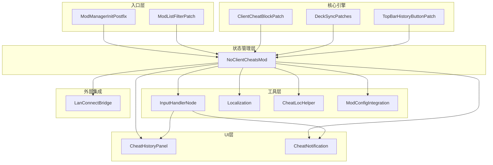
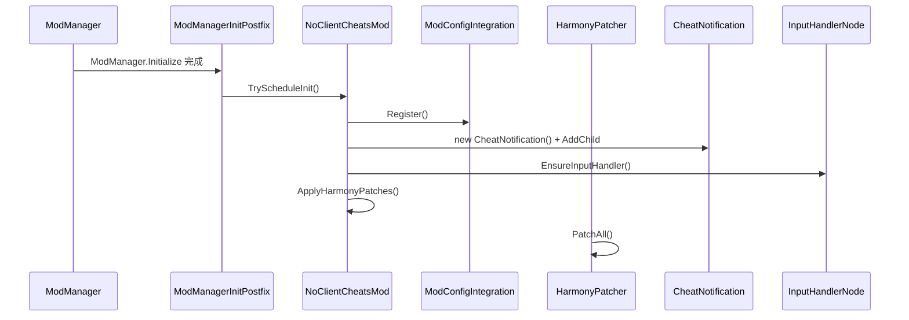
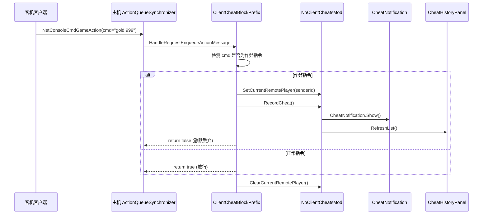
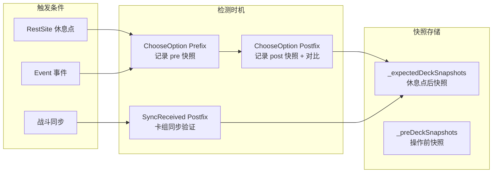
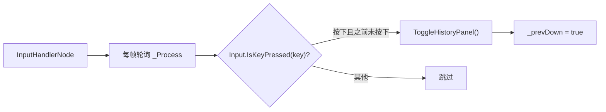
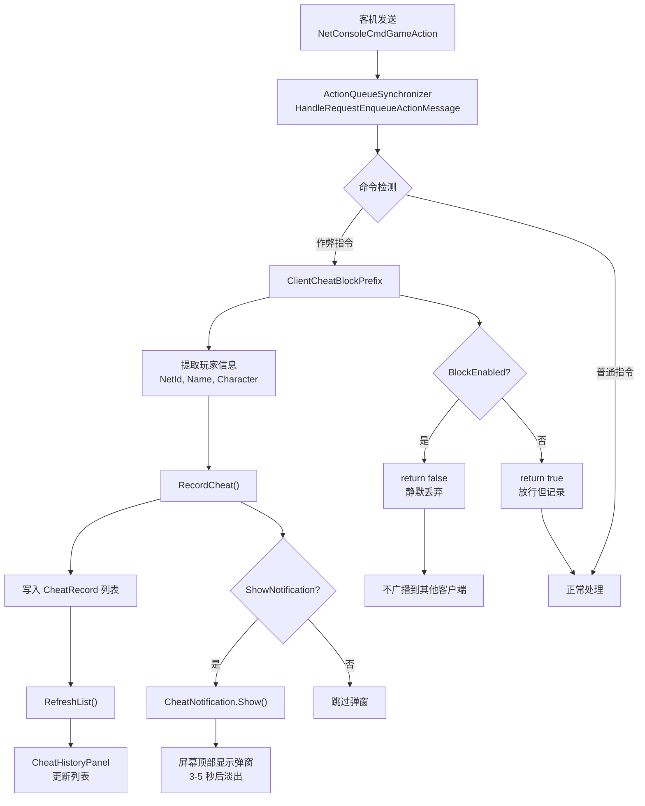
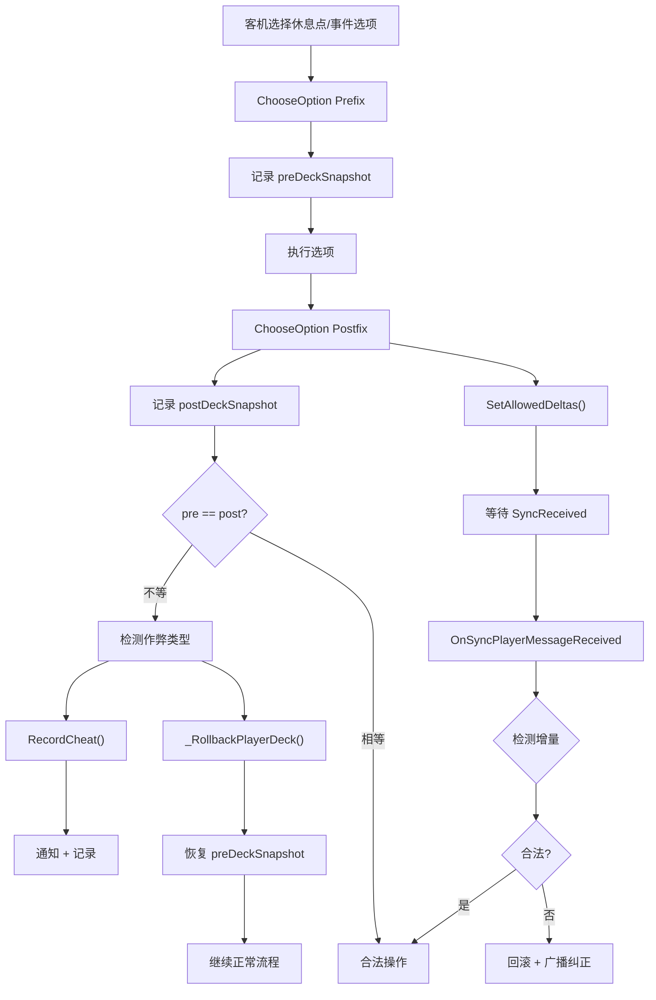
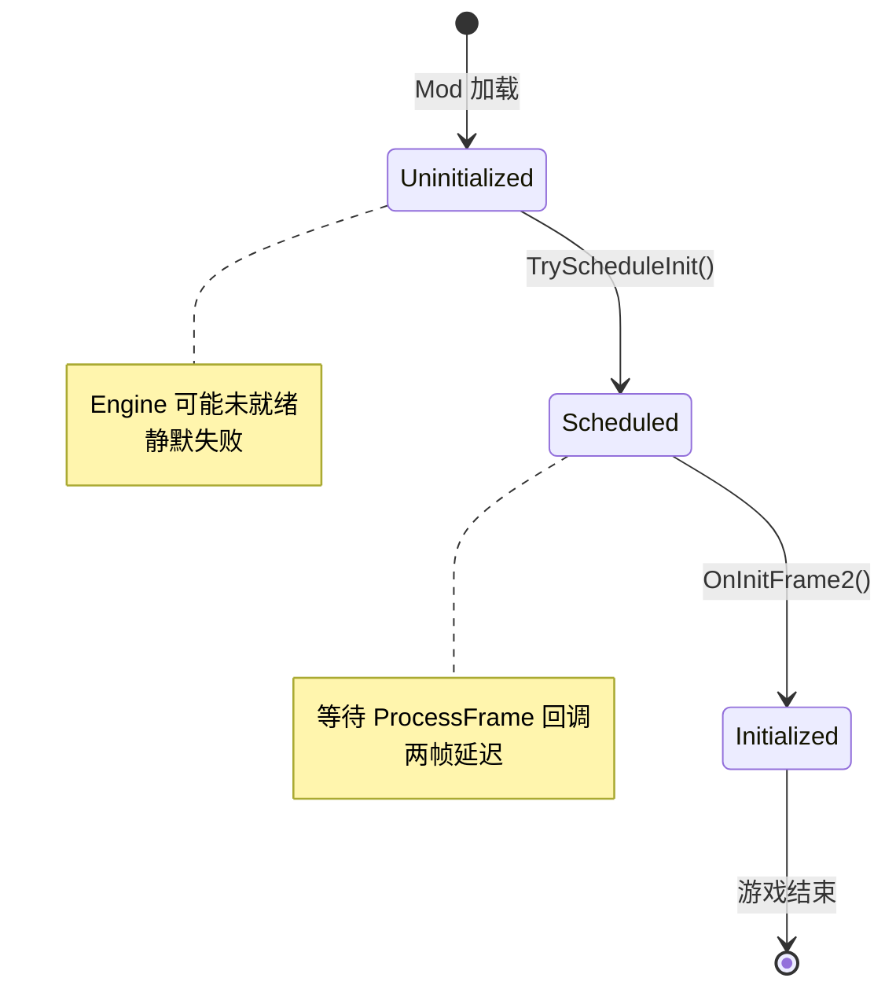
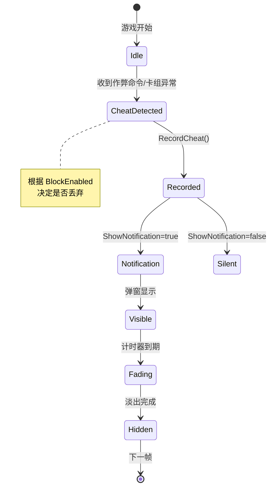

# NoClientCheats（NCC）架构文档

> **版本**: 1.3.0
> **作者**: bili@我叫煎包 / claude-4.6-opus
> **游戏**: Slay the Spire 2 (STS2)
> **目标**: 多人联机时禁止客机（非房主）使用控制台作弊指令

---

## 1. 项目整体架构

### 1.1 架构概览

```
┌─────────────────────────────────────────────────────────────────────────────┐
│                              NoClientCheats Mod                              │
├─────────────────────────────────────────────────────────────────────────────┤
│                                                                              │
│  ┌─────────────────┐     ┌──────────────────┐     ┌─────────────────────┐   │
│  │   Mod 入口层     │────▶│   Harmony 补丁层  │────▶│   业务逻辑层         │   │
│  └─────────────────┘     └──────────────────┘     └─────────────────────┘   │
│         │                        │                         │               │
│  NoClientCheatsMod          HarmonyPatcher           核心功能模块          │
│  ModManagerInitPostfix      DeckSyncPatches           ClientCheatBlockPatch │
│  ModListFilterPatch         TopBarHistoryButtonPatch  DeckSyncPatches      │
│                                                             │               │
│  ┌─────────────────┐     ┌──────────────────┐     ┌─────────────────────┐   │
│  │   UI 交互层      │◀────│   输入处理层      │     │   数据管理层         │   │
│  └─────────────────┘     └──────────────────┘     └─────────────────────┘   │
│         │                        │                         │               │
│  CheatHistoryPanel         InputHandlerNode         NoClientCheatsMod      │
│  CheatNotification         (热键轮询)              CheatRecord 记录          │
│                                                      卡组快照管理             │
│  ┌─────────────────┐     ┌──────────────────┐     ┌─────────────────────┐   │
│  │   外部集成层      │     │   国际化层         │     │   配置管理层          │   │
│  └─────────────────┘     └──────────────────┘     └─────────────────────┘   │
│         │                        │                         │               │
│  LanConnectBridge          Localization              ModConfigIntegration │
│  (大厅聊天广播)              CheatLocHelper           (ModConfig 插件)      │
│                                                                              │
└─────────────────────────────────────────────────────────────────────────────┘
                                    │
                                    ▼
┌─────────────────────────────────────────────────────────────────────────────┐
│                              游戏核心 (STS2 Engine)                          │
├─────────────────────────────────────────────────────────────────────────────┤
│  ActionQueueSynchronizer  │  CombatStateSynchronizer  │  RestSiteSync    │
│  ModManager               │  RunState                  │  NTopBar          │
└─────────────────────────────────────────────────────────────────────────────┘
```

### 1.2 模块依赖关系



---

## 2. 核心模块详解

### 2.1 Mod 入口与初始化

**文件**: `NoClientCheatsMod.cs`

#### 2.1.1 初始化流程



#### 2.1.2 三重初始化保险

```3:11:HarmonyPatcher.cs
/// <summary>
/// ModManager.Initialize 完成后调度 NoClientCheats 初始化与 ModConfig 注册。
///
/// 三重保险：
/// 1. static ctor：PatchAll 时尝试注册（此时 Engine 可能为 null，失败则静默）
/// 2. Postfix：ModManager.Initialize 完成后注册（Engine 应该已就绪）
/// 3. CheatBlockPrefix.TryScheduleInit：作弊拦截首次触发时兜底尝试（确保终局调用）
/// </summary>
```

**初始化入口点**:
- **静态构造函数**: Harmony 加载时执行（可能 Engine 未就绪）
- **ModManager.Initialize Postfix**: 游戏 Mod 初始化完成后
- **作弊拦截触发时**: 作为最后兜底方案

### 2.2 作弊拦截核心

**文件**: `ClientCheatBlockPatch.cs`

#### 2.2.1 作弊命令白名单

```20:26:ClientCheatBlockPatch.cs
static readonly string[] CheatCommands =
{
    "gold", "relic", "card", "potion", "damage", "block", "heal", "power",
    "kill", "win", "godmode", "stars", "room", "event", "fight", "act",
    "travel", "ancient", "afflict", "enchant", "upgrade", "draw",
    "energy", "remove_card"
};
```

#### 2.2.2 拦截流程



#### 2.2.3 Transpiler 注入机制

```107:138:ClientCheatBlockPatch.cs
/// <summary>
/// Transpiler：在 HandleRequestEnqueueActionMessage 入口处插入 SetCurrentRemotePlayer，
/// 并在所有返回指令前插入 ClearCurrentRemotePlayer。
/// 这样 ChooseOption 在同一调用链中可以通过 AsyncLocal 读到有效的远程玩家 NetId。
/// </summary>
```

**注入逻辑**:
1. 在方法开头插入 `SetCurrentRemotePlayer(senderId)`
2. 在每个 `ret` 指令前插入 `ClearCurrentRemotePlayer()`

### 2.3 卡组状态同步与作弊检测

**文件**: `DeckSyncPatches.cs`

#### 2.3.1 卡组快照管理架构



#### 2.3.2 三层检测机制

| 层级 | 检测类型 | 时机 | 快照来源 |
|------|----------|------|----------|
| **第一层** | 即时回滚 | ChooseOption Postfix | pre/post 对比 |
| **第二层** | 增量验证 | SyncReceived Postfix | 允许增量 vs 实际增量 |
| **第三层** | Canonical 对比 | SyncReceived Postfix | canonicalCards vs receivedDeck |

#### 2.3.3 检测规则表

| 事件类型 | 检测条件 | 作弊类型标识 |
|----------|----------|--------------|
| 删除类事件 | cardDelta < allowedCardDelta (-1) | remove_excess |
| 升级类事件 | upgradeDelta > allowedUpgradeDelta (1) | upgrade_excess |
| 奖励类事件 | cardDelta > allowedCardDelta (0) | add_cards |
| Transform 多选 | choiceCalls >= 2 && delta == 0 | transform_multi_select |
| 奖励多选 | choiceCalls >= 2 && delta == 1 | reward_multi_select |
| 删除多选 | choiceCalls >= 2 && delta == -1 | remove_multi_select |
| Canonical 对比 | extra > 0 && missing > 0 | transform_cheat |

### 2.4 UI 层

#### 2.4.1 CheatNotification 通知弹窗

**文件**: `CheatNotification.cs`

```
┌─────────────────────────────────────────────────────────────────┐
│  [禁止作弊]  玩家名  |  角色：铁甲战士  |  金币 999      [查看历史] │
└─────────────────────────────────────────────────────────────────┘
```

**特性**:
- 屏幕顶部居中弹出
- 最多同时显示 4 条（MAX_VISIBLE = 4）
- 每条停留时间可配置（默认 5 秒）
- 淡入淡出动画（ANIM_DURATION = 0.3s）
- 包含「查看历史」快捷按钮

#### 2.4.2 CheatHistoryPanel 历史面板

**文件**: `CheatHistoryPanel.cs`

```
┌─────────────────────────────────────────────────────┐
│  作弊拦截记录 (25 条)      ⊡居中  清空  ✕关闭  呼出   │
│  F6 呼出/隐藏 | 记录保存本局 | 总计 25 条            │
├─────────────────────────────────────────────────────┤
│  12:34:56  玩家1 (铁甲战士) → 金币 999              │
│  12:35:01  玩家2 (故障机器人) → 遗物：冰淇淋         │
│  12:36:12  玩家1 → ui_exploit:remove_excess        │
└─────────────────────────────────────────────────────┘
```

**交互特性**:
- 可拖拽移动（标题栏）
- 可拖拽边缘调整大小（320x200 ~ 800x600）
- 动态光标形状提示
- 快捷键 F6 切换显示（可自定义）

### 2.5 输入处理

**文件**: `InputHandlerNode.cs`



**设计原则**:
- 纯轮询模式，不拦截游戏输入
- ProcessMode = Always（全场景监听）
- 边沿触发（按下瞬间，而非按住期间重复触发）

### 2.6 配置管理

**文件**: `ModConfigIntegration.cs`

#### 2.6.1 配置项一览

| 配置项 | 类型 | 默认值 | 说明 |
|--------|------|--------|------|
| block_enabled | Toggle | true | 启用作弊拦截 |
| show_notification | Toggle | true | 显示拦截通知 |
| broadcast_to_lobby | Toggle | false | 广播到大厅聊天 |
| notification_duration | Slider | 5.0s | 弹窗停留时间 |
| show_topbar_button | Toggle | true | 显示顶栏按钮 |
| show_history_on_cheat | Toggle | false | 作弊时自动打开面板 |
| history_max | Dropdown | 25 | 最大历史条数 |
| history_key | KeyBind | F6 | 切换快捷键 |
| hide_from_mod_list | Toggle | true | 屏蔽 Mod 检测 |

### 2.7 外部集成

#### 2.7.1 LanConnect 大厅桥接

**文件**: `NoClientCheatsMod.cs` (LanConnectBridge)

```
┌─────────────────┐      反射调用       ┌─────────────────────┐
│  NoClientCheats │ ─────────────────▶ │ STS2 LAN Connect    │
│                 │  SendRoomChatMsg   │ LanConnectLobbyRuntime │
└─────────────────┘                    └─────────────────────┘
```

**消息格式**:
- 拦截: `[作弊拦截] 玩家名 尝试使用 金币`
- 记录: `[作弊记录] 玩家名 执行了 金币`

#### 2.7.2 Mod 检测屏蔽

**文件**: `ModListFilterPatch.cs`

- Patch: `ModManager.GetGameplayRelevantModNameList`
- 移除所有以 `NoClientCheats` 开头的 Mod 名称
- 使客机无法在联机 Mod 列表中看到 NCC

---

## 3. 数据流图

### 3.1 作弊拦截数据流



### 3.2 卡组同步检测数据流



---

## 4. 关键代码逻辑分析

### 4.1 AsyncLocal 远程玩家上下文传递

```43:46:NoClientCheatsMod.cs
// ── 当前正在处理的远程玩家 NetId（通过 AsyncLocal 在 HandleRequestEnqueueActionMessage → ChooseOption 间传递）────
// 此值在一次 GameAction 的执行上下文中有效，本地玩家动作为 0
private static readonly AsyncLocal<ulong> _currentRemotePlayerNetId = new();
```

**用途**: 在 `HandleRequestEnqueueActionMessage` 和 `ChooseOption` 之间传递远程玩家 NetId，解决跨线程/异步调用链问题。

### 4.2 卡组快照对比算法

```798:950:DeckSyncPatches.cs
private static bool _DecksMatch(object a, object b)
{
    // 提取两边的 Deck 列表
    // 对比：卡牌数量、升级状态、ID
    // 返回匹配结果
}
```

### 4.3 即时回滚机制

```259:261:DeckSyncPatches.cs
// 立即回滚：将卡组恢复到操作前状态
DIAG($"[FULLTRACE] Triggering rollback for {safeName}");
_RollbackPlayerDeck(player, preSnapshot);
```

### 4.4 Transpiler IL 注入

```107:138:ClientCheatBlockPatch.cs
// 1. 在方法最开头插入：SetCurrentRemotePlayer(senderId)
// 2. 在每个 ret 前插入清除调用
```

---

## 5. 状态机

### 5.1 Mod 初始化状态机



### 5.2 作弊检测状态机



---

## 6. 配置文件说明

### 6.1 mod_manifest.json

```json
{
  "id": "NoClientCheats",
  "pck_name": "NoClientCheats",
  "version": "1.3.0",
  "name": "禁止客机作弊 / No Client Cheats",
  "author": "bili@我叫煎包 / claude-4.6-opus",
  "has_pck": false,
  "has_dll": true,
  "affects_gameplay": true
}
```

### 6.2 日志输出位置

- **控制台/文件日志**: `%APPDATA%\SlayTheSpire2\NCC_diag.log`
- **GD.Print 输出**: 游戏控制台可见

---

## 7. 常见问题排查指南

### 7.1 作弊拦截不生效

**检查项**:
1. 确认只有房主安装了 NCC（客机无需安装）
2. 检查 `BlockEnabled` 配置是否为 true
3. 查看 NCC_diag.log 是否有 `[NoClientCheats] Blocked client cheat` 日志
4. 确认游戏版本与 Mod 版本兼容

### 7.2 弹窗不显示

**检查项**:
1. `ShowNotification` 配置是否为 true
2. `NotificationDuration` 是否大于 0
3. 是否有多个 NCC 实例冲突
4. 查看控制台是否有 `[NoClientCheats] CheatNotification` 相关日志

### 7.3 历史面板热键无效

**检查项**:
1. 确认 `ShowTopBarButton` 或 `history_key` 配置
2. 尝试重新安装 Mod
3. 检查是否有其他 Mod 拦截了 F6 按键
4. 查看 NCC_diag.log 的 `[NCCInputHandler]` 日志

### 7.4 卡组检测误报

**可能原因**:
- 游戏版本更新导致内部类名/方法名变化
- 快照过期导致对比失败
- 网络延迟导致同步时序问题

**解决方案**:
1. 更新 NCC 到最新版本
2. 降低 `HistoryMaxRecords`（减少内存占用）
3. 查看 NCC_diag.log 中的 `[FULLTRACE]` 详细日志

### 7.5 Mod 检测屏蔽不生效

**检查项**:
1. `HideFromModList` 配置是否为 true
2. 确认游戏版本是否支持 `GetGameplayRelevantModNameList`
3. 客机是否使用了旧版本 Mod 列表缓存

---

## 8. 版本更新日志

| 版本 | 主要变更 |
|------|----------|
| 1.3.0 | 新增卡组状态回滚检测；覆盖升级/删除/转化超额操作检测 |
| 1.2.0 | 新增大厅聊天广播；新增 LanConnectBridge 桥接类 |
| 1.x.x | 基础作弊拦截功能 |

---

## 9. 扩展指南

### 9.1 添加新的作弊命令检测

在 `ClientCheatBlockPatch.cs` 的 `CheatCommands` 数组中添加新命令：

```csharp
static readonly string[] CheatCommands =
{
    // 现有命令...
    "your_new_cheat_command",  // 新增
};
```

### 9.2 添加新的卡组检测场景

在 `DeckSyncPatches.cs` 中添加新的 Patch 方法：

```csharp
[HarmonyPatch]
private static class NewScenePatch
{
    static MethodBase TargetMethod()
    {
        // 定位目标方法
    }

    static void Postfix(...)
    {
        // 检测逻辑
    }
}
```

### 9.3 本地化扩展

在 `Localization.cs` 的 `_tr` 字典中添加新翻译：

```csharp
["your_key"] = ("English text", "中文文本"),
```

---

## 10. 技术栈

- **游戏引擎**: Godot 4.x
- **补丁框架**: HarmonyLib
- **编程语言**: C# (.NET)
- **目标游戏**: Slay the Spire 2
- **依赖 Mod**: STS2 LAN Connect（可选）

---

*文档生成时间: 2026-04-04*
