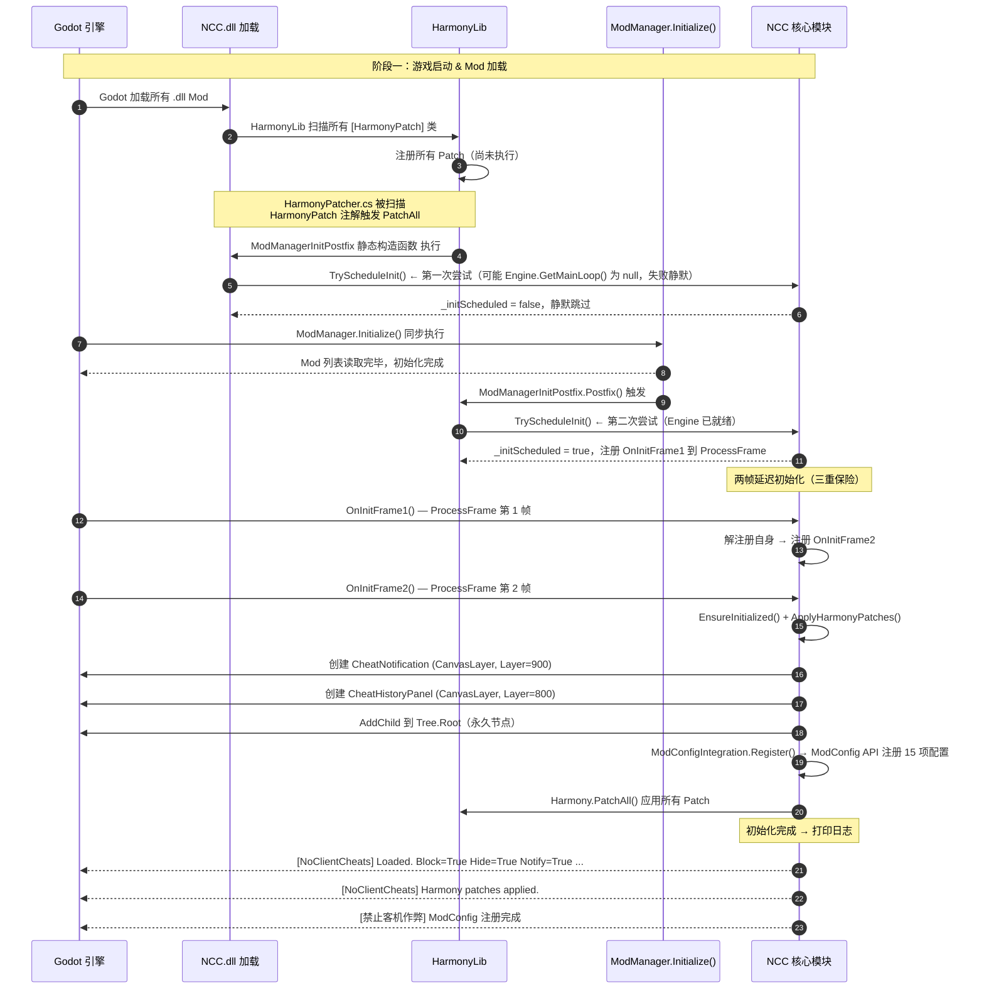
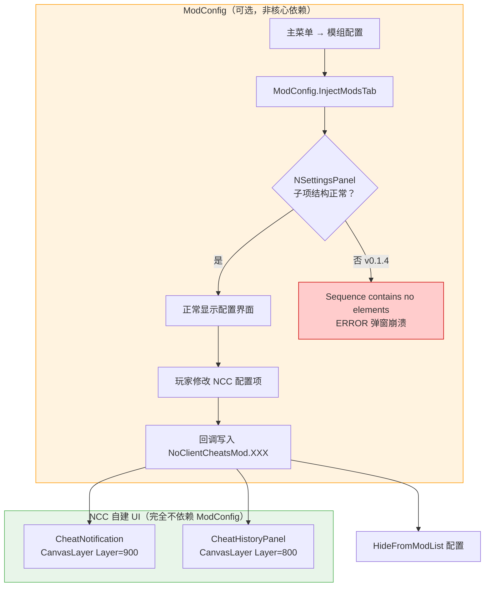
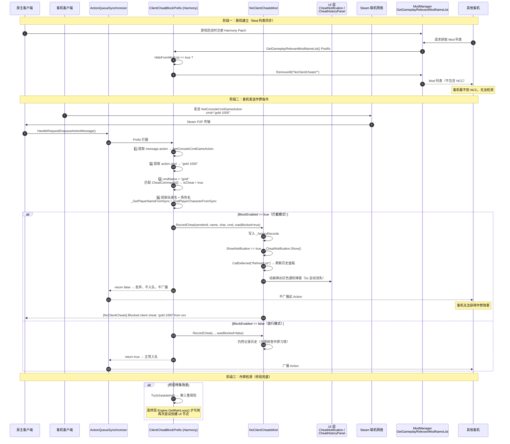

# NCC 工作全流程图

本文档详细说明 **NoClientCheats（NCC）** 从游戏启动到拦截作弊的完整工作流程。

---

## 图 1：游戏启动 → Mod 初始化



---

## 图 2：ModConfig 依赖（可选）



> **核心结论**：作弊拦截、通知弹窗、历史面板均为 NCC 自建 UI，不经过 ModConfig。ModConfig 仅影响「游戏内配置面板」的 UI 稳定性。

---

## 图 3：联机作弊拦截完整流程



---

## 图 4：作弊命令判断逻辑

```mermaid
flowchart TD
    A[提取 action.cmd] --> B{命令为空？}
    B -->|是| Z[return true 放行]
    B -->|否| C[cmdName = 第一个空格前单词]
    C --> D[遍历 CheatCommands[]]

    D -->|"gold"| E{✅ 匹配}
    D -->|"relic"| E
    D -->|"card"| E
    D -->|"potion"| E
    D -->|"damage"| E
    D -->|"heal"| E
    D -->|"power"| E
    D -->|"kill"| E
    D -->|"win"| E
    D -->|"godmode"| E
    D -->|"stars"| E
    D -->|"room"| E
    D -->|"event"| E
    D -->|"fight"| E
    D -->|"act"| E
    D -->|"travel"| E
    D -->|"ancient"| E
    D -->|"afflict"| E
    D -->|"enchant"| E
    D -->|"upgrade"| E
    D -->|"draw"| E
    D -->|"energy"| E
    D -->|"remove_card"| E
    D -->|"其他"| F[return true 放行]

    E --> G{BlockEnabled?}
    G -->|是| H[记录 → 拦截 → 弹通知]
    G -->|否| I[记录 → 放行]

    style E fill:#c8e6c9,stroke:#4caf50
    style F fill:#ffecb3,stroke:#ffc107
    style H fill:#ffcdd2,stroke:#f44336
    style I fill:#fff3e0,stroke:#ff9800
```

---

## 图 5：初始化三重保险机制

```mermaid
flowchart LR
    subgraph P1["保险 1️⃣：静态构造函数"]
        A1[Harmony PatchAll 时] --> A2[ModManagerInitPostfix static ctor]
        A2 --> A3{TryScheduleInit()<br/>Engine.GetMainLoop() == null ?}
        A3 -->|通常为 null| A4[静默跳过]
        A4 -.-> A5[等待保险 2]
    end

    subgraph P2["保险 2️⃣：ModManager.Initialize Postfix"]
        B1[ModManager.Initialize() 完成后] --> B2[Harmony Postfix 触发]
        B2 --> B3{TryScheduleInit()<br/>Engine.GetMainLoop() 已就绪}
        B3 -->|✅ 成功| B4[注册 OnInitFrame1 → 两帧后执行]
        B4 -.-> C3
    end

    subgraph P3["保险 3️⃣：作弊拦截触发时兜底"]
        C1[客机首次发送作弊指令] --> C2[ClientCheatBlockPrefix.TryScheduleInit()]
        C2 --> C3{确保 UI 节点已创建}
        C3 -.->|两帧内| D[EnsureInitialized()]
    end

    subgraph Init["实际初始化"]
        D --> E[ModConfigIntegration.Register()]
        D --> F[ApplyHarmonyPatches()]
        D --> G[创建 CheatNotification 节点]
        D --> H[创建 CheatHistoryPanel 节点]
    end

    P1 --> P3
    P2 --> Init
    P3 --> Init

    style P1 fill:#fff9c4,stroke:#f9a825
    style P2 fill:#fff9c4,stroke:#f9a825
    style P3 fill:#fff9c4,stroke:#f9a825
    style Init fill:#e8f5e9,stroke:#4caf50
```

---

## 图 6：全局模块依赖关系

```mermaid
flowchart BT
    subgraph Entry["入口"]
        Entry["ModManagerInitPostfix.cs<br/>HarmonyPatcher.cs"]
    end

    subgraph Core["NoClientCheatsMod.cs（核心）"]
        CM1["BlockEnabled / HideFromModList /<br/>ShowNotification / HistoryMaxRecords ..."]
        CM2["RecordCheat() — 统一入口"]
        CM3["EnsureInitialized()"]
        CM4["ApplyHarmonyPatches()"]
    end

    subgraph Patches["Harmony Patch"]
        P1["ClientCheatBlockPatch.cs<br/>拦截作弊 Action"]
        P2["ModListFilterPatch.cs<br/>隐藏 Mod 检测"]
    end

    subgraph UI["UI 组件（自建，不依赖 ModConfig）"]
        U1["CheatNotification.cs<br/>红色弹窗，顶部居中"]
        U2["CheatHistoryPanel.cs<br/>左下角面板，F6 呼出"]
    end

    subgraph Util["工具"]
        L["CheatLocHelper.cs<br/>本地化汉化"]
        M["ModConfigIntegration.cs<br///ModConfig API 注册（可选）"]
    end

    Entry --> CM3
    CM3 --> CM4
    CM4 --> P1
    CM4 --> P2
    CM2 --> U1
    CM2 --> U2
    CM2 --> L
    CM3 --> M

    P1 --> CM2
    P2 --> CM1

    style Entry fill:#e3f2fd,stroke:#1565c0
    style Core fill:#e8f5e9,stroke:#4caf50
    style Patches fill:#fce4ec,stroke:#c62828
    style UI fill:#fff3e0,stroke:#ef6c00
    style Util fill:#f3e5f5,stroke:#7b1fa2
```
