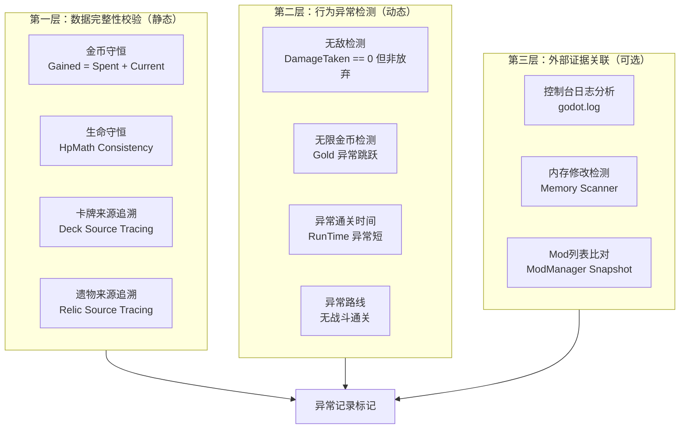

# RunHistoryAnalyzer — 历史记录异常检测 Mod 可行性分析

## 一、项目背景与目标

分析"百科大全 → 历史记录"模块中是否存在异常记录（玩家通过本地修改内存、控制台作弊等手段生成的记录），并为后续开发提供可行性评估。

---

## 二、游戏历史记录原理回顾

### 2.1 存档生成时机

从源码分析可知，`RunHistory` 存档在以下时机生成并保存：

1. **跑图胜利/失败结束时** → `RunHistoryUtilities.CreateRunHistoryEntry()`
2. 保存路径：`{用户存档目录}/saves/history/{Unix时间戳}.run`
3. 加载路径：`SaveManager.Instance.LoadRunHistory(name)`
4. 界面刷新：`NRunHistory.OnSubmenuOpened()` → 从磁盘读取所有 `.run` 文件

### 2.2 存档数据结构

详见上游源码分析报告，核心关键字段：

```json
{
  "schema_version": 8,
  "platform_type": 1,
  "game_mode": "standard",
  "win": false,
  "seed": "XXXXXXXX",
  "start_time": 1742544000,
  "run_time": 3600.0,
  "ascension": 0,
  "players": [...],
  "map_point_history": [[...], [...], [...]]
}
```

### 2.3 关键观测数据

| 数据类别 | 字段 | 用途 |
|---|---|---|
| 生命值 | `CurrentHp`, `MaxHp`, `DamageTaken`, `HpHealed` | 检测非法满血/锁血 |
| 金币 | `GoldGained`, `GoldSpent`, `CurrentGold` | 检测无限金币 |
| 卡组 | `Deck`, `CardsGained`, `CardChoices` | 检测非法卡牌获取 |
| 遗物 | `Relics`, `RelicChoices`, `BoughtRelics` | 检测非法遗物获取 |
| 药水 | `Potions`, `PotionChoices`, `BoughtPotions` | 检测非法药水获取 |
| 路线 | `MapPointHistory` | 检测异常路径（无战斗通关等） |
| 时间 | `RunTime` | 检测异常短时间通关 |
| 放弃 | `WasAbandoned` | 标记中途放弃的跑图 |

---

## 三、作弊手段分类与可检测性分析

### 3.1 控制台指令作弊（Console Cheats）

#### 典型作弊指令（参考 NCC 项目已拦截的指令列表）

| 指令 | 效果 | 可检测性 | 检测方法 |
|---|---|---|---|
| `gold N` | 瞬间获得 N 金币 | **高** | 记录金币变动轨迹，异常跳跃 |
| `relic X` | 获得指定遗物 | **高** | 遗物获取时间戳异常 |
| `card X` | 获得指定卡牌 | **高** | 卡牌获取来源不明（非卡牌选择/奖励） |
| `potion X` | 获得指定药水 | **高** | 药水获取来源不明 |
| `heal N` | 瞬间治疗 N HP | **高** | 生命值变动无对应休息点 |
| `damage N` | 对自己造成 N 伤害 | **中** | 可能是正常自残行为 |
| `power N` | 获得 N 点能量 | **高** | 能量消耗记录异常 |
| `godmode` | 无敌模式 | **高** | 受伤记录全为0 |
| `win` | 强制胜利 | **高** | 与 `win=true` 字段匹配 |
| `remove_card X` | 移除卡牌 | **中** | 卡牌减少记录 |
| `upgrade X` | 升级卡牌 | **高** | `UpgradedCards` 字段 |
| `enchant X` | 附魔卡牌 | **高** | `CardsEnchanted` 字段 |

#### 检测策略

控制台指令通过 `NetConsoleCmdGameAction` 网络消息传输，**在网络层面被 NCC 拦截后不会执行**。因此：

- **联机模式**：NCC 已拦截作弊指令 → 作弊者无法通过控制台作弊
- **单人模式**：控制台完全开放，无人拦截 → **单人模式下控制台作弊完全无法阻止**

**关键结论**：单人模式的历史记录中，检测控制台作弊 **理论上可行，但难度极高**，因为：
1. 控制台指令执行后，会正常写入 `RunHistory` 存档（游戏本身不验证来源）
2. 存档中的 `map_point_history` 不会记录"作弊来源"
3. 需要反向推断：对比正常游戏流程与存档数据，发现矛盾点

---

### 3.2 内存修改作弊（Memory Hacking）

#### 典型内存修改目标

| 目标 | 内存地址/偏移 | 效果 | 可检测性 |
|---|---|---|---|
| 当前生命值 | `Player.CurrentHp` | 改满/改高 | **高** |
| 最大生命值 | `Player.MaxHp` | 修改上限 | **高** |
| 当前金币 | `Player.Gold` | 无限金币 | **高** |
| 能量点数 | `Player.Energy` | 无限能量 | **高** |
| 卡牌数量 | `Player.Deck` | 非法获得卡牌 | **高** |
| 遗物效果 | `Relic.EffectValue` | 修改遗物属性 | **中** |

#### 检测策略

内存修改发生在**游戏运行过程中**，最终结果会写入 `RunHistory` 存档：

1. **基于存档数据一致性校验**：
   - `DamageTaken > 0` 但 `CurrentHp` 未减少 → 疑似无敌
   - `GoldSpent > 0` 但 `CurrentGold` 仍然很高 → 疑似无限金币
   - `DamageTaken` 全为0 但 `win=false` 且非放弃 → 疑似无敌作弊

2. **基于游戏流程合理性校验**：
   - 某节点消耗了金币，但没有对应的商店/事件消费记录
   - 获得了某遗物，但没有该遗物的获取记录（卡牌选择/商店购买/事件奖励）
   - 某章节无任何战斗节点（`MapPointType != Combat`）但角色HP减少了
   - `run_time` 过短但 `Win=true` → 疑似跳过战斗

3. **基于数值边界校验**：
   - `CurrentHp > MaxHp` → 非法（当前生命不能超过最大生命）
   - `CurrentGold > 9999`（正常上限） → 可设定阈值
   - 卡牌数量 > 999 → 异常

---

### 3.3 存档文件直接修改（Save File Editing）

#### 修改目标

直接编辑 `.run` JSON 文件：

| 修改项 | 可检测性 | 检测方法 |
|---|---|---|
| 修改 `win=true` 伪造胜利 | **高** | 对比 `KilledByEncounter`/`KilledByEvent` 必须全为 none |
| 修改 `CurrentGold` 提高金币 | **高** | 反推金币消耗：`GoldSpent + CurrentGold` 应接近 `GoldGained + 初始金币` |
| 修改 `Deck` 添加非法卡牌 | **高** | 卡牌必须全部来自 `CardChoices`（卡牌选择）/`CardsGained`（战斗奖励） |
| 修改 `CurrentHp` 改满HP | **中** | 需要反向推算战斗伤害 |
| 修改 `run_time` 缩短时间 | **高** | 路线长度 × 平均每节点耗时 ≈ 总时间 |
| 修改 `WasAbandoned=true` | **高** | 若 `win=true` 但 `WasAbandoned=true` → 矛盾 |

#### 检测策略

存档直接修改是最容易被检测的一类：

1. **金币守恒定律**：
   ```
   初始金币 + Σ(GoldGained) - Σ(GoldSpent) = CurrentGold
   ```
   若不相等 → 存档被修改

2. **生命守恒定律**：
   ```
   初始MaxHp + Σ(MaxHpGained) - Σ(MaxHpLost) = 最终MaxHp
   最终CurrentHp = 初始CurrentHp - Σ(DamageTaken) + Σ(HpHealed)
   ```
   若不相等 → 存档被修改

3. **卡牌来源可追溯性**：
   - 每张卡必须来自以下来源之一：
     - `CardChoices`：卡牌选择（3选1）
     - `CardsGained`：战斗奖励
     - `BoughtColorless`：商店购买
     - 初始卡组（固定）
   - 若 Deck 中存在无法追溯来源的卡 → 存档被修改

4. **遗物来源可追溯性**：
   - 初始遗物 + `RelicChoices`（选择）+ `BoughtRelics`（购买）+ 事件奖励 = 最终遗物列表

---

### 3.4 Mod 注入作弊（Mod Exploits）

#### 典型方式

1. **修改游戏逻辑的 Mod**：
   - 战斗伤害翻倍 Mod → 影响 `DamageTaken`/`DamageDealt` 记录
   - 金币翻倍 Mod → 影响 `GoldGained` 记录

2. **网络同步 Mod**：
   - 伪造服务器响应，修改 `CurrentHp` 等同步数据

#### 检测策略

- **检测 Mod 名称列表**：`ModManager` 中注册的所有 Mod 可被枚举
- **检测特定 Mod 签名**：通过反射检查 `Assembly` 加载列表
- **局限性**：无法区分"作弊Mod"和"辅助Mod"（如 DamageMeter）

---

### 3.5 存档完整性检测（核心）

#### 游戏版本不匹配

```csharp
if (history.BuildId != 当前游戏BuildId)
    → 标记为"版本不匹配"
```

#### 数据新鲜度检测

```csharp
if (history.SchemaVersion < 8)
    → 标记为"历史数据过旧"
```

---

## 四、可检测性总览矩阵

| 作弊手段 | 单机可检测 | 联机可检测 | 检测难度 | 备注 |
|---|---|---|---|---|
| 控制台作弊（gold/relic/card等） | **理论上可** | NCC已拦截 | ★★★★★ | 需逆向推断，证据链弱 |
| 内存修改（生命/金币） | **可** | **可** | ★★★ | 基于数据一致性校验 |
| 存档文件直接编辑 | **可** | **可** | ★★ | 金币/生命守恒定律 |
| Mod注入作弊 | **部分可** | **部分可** | ★★★★ | 需白名单机制 |
| 网络同步伪造 | N/A | **理论上可** | ★★★★★ | 需服务器端验证 |

---

## 五、检测方案设计

### 5.1 三层检测架构



### 5.2 核心检测算法

#### 算法1：金币守恒检测

```csharp
public class GoldConservationRule : IAnomalyRule
{
    public AnomalyLevel Check(RunHistory history)
    {
        int totalGained = 0;
        int totalSpent = 0;
        int expectedCurrent = 0;
        int actualCurrent = 0;

        // 初始金币（从角色数据获取）
        int initialGold = CharacterModel.StartingGold;

        // 累加所有节点的金币变动
        foreach (var act in history.MapPointHistory)
        foreach (var node in act)
        foreach (var stat in node.PlayerStats)
        {
            totalGained += stat.GoldGained;
            totalSpent += stat.GoldSpent;
            actualCurrent = stat.CurrentGold; // 取最后一次记录
        }

        expectedCurrent = initialGold + totalGained - totalSpent;

        if (Math.Abs(expectedCurrent - actualCurrent) > 1) // 允许1金币误差
        {
            return AnomalyLevel.High;
        }

        return AnomalyLevel.None;
    }
}
```

#### 算法2：卡牌来源追溯

```csharp
public class CardSourceTraceRule : IAnomalyRule
{
    public AnomalyLevel Check(RunHistory history)
    {
        HashSet<string> allAcquiredCards = new HashSet<string>();
        HashSet<string> allSpentCards = new HashSet<string>();

        // 收集所有合法获得来源
        foreach (var act in history.MapPointHistory)
        foreach (var node in act)
        foreach (var stat in node.PlayerStats)
        {
            foreach (var card in stat.CardsGained)
                allAcquiredCards.Add(card.Id.Entry);
            foreach (var choice in stat.CardChoices)
            foreach (var card in choice.Cards)
                allAcquiredCards.Add(card.Id.Entry);
        }

        // 收集所有合法消耗来源
        foreach (var act in history.MapPointHistory)
        foreach (var node in act)
        foreach (var stat in node.PlayerStats)
        {
            foreach (var card in stat.CardsRemoved)
                allSpentCards.Add(card.Id.Entry);
        }

        // 最终卡组 = 初始卡组 + 获得 - 消耗
        var finalDeck = history.Players[0].Deck;
        foreach (var card in finalDeck)
        {
            if (!allAcquiredCards.Contains(card.Id.Entry) && !IsStarterCard(card))
            {
                return AnomalyLevel.High; // 最终卡组中存在无法追溯来源的卡
            }
        }

        return AnomalyLevel.None;
    }
}
```

#### 算法3：无敌检测

```csharp
public class GodModeRule : IAnomalyRule
{
    public AnomalyLevel Check(RunHistory history)
    {
        int totalDamageTaken = 0;
        int totalDamageDealt = 0;
        bool wasAbandoned = history.WasAbandoned;

        foreach (var act in history.MapPointHistory)
        foreach (var node in act)
        {
            // 跳过休息点（可能回血）
            if (node.MapPointType == MapPointType.RestSite)
                continue;

            foreach (var stat in node.PlayerStats)
            {
                totalDamageTaken += stat.DamageTaken;
            }
        }

        // 战斗中受伤为0 但非放弃 且 非胜利 → 疑似无敌作弊
        if (totalDamageTaken == 0 && !wasAbandoned && !history.Win)
        {
            return AnomalyLevel.High;
        }

        // 受伤极低但通关时间正常
        if (totalDamageTaken < 5 && history.RunTime > 1800 && !history.Win)
        {
            return AnomalyLevel.Medium;
        }

        return AnomalyLevel.None;
    }
}
```

---

## 六、技术挑战与局限性

### 6.1 误报问题

1. **游戏机制干扰**：
   - 部分角色/遗物可以恢复生命 → 可能导致 `DamageTaken > 0` 但 `CurrentHp` 变化不大
   - 某些事件会赠送金币 → 金币守恒定律可能需要调整

2. **正常高难度操作**：
   - 高手玩家可能以极低受伤完成跑图 → 不能简单以 `DamageTaken == 0` 定论

3. **游戏版本差异**：
   - 不同版本的游戏数据格式可能有细微差异 → 需要版本适配

### 6.2 证据链不完整

1. **存档不记录来源**：
   - 游戏存档不会记录"这张卡是通过控制台作弊获得的"
   - 只能通过反推和一致性检测来推断

2. **反推的局限性**：
   - 无法区分"内存修改"和"极好的运气"
   - 无法区分"控制台作弊"和"正常游戏"

### 6.3 绕过的可能性

1. **通过 `godmode` 指令作弊后，立即关闭作弊，正常完成游戏**：
   - `DamageTaken` 仍然为0，但游戏记录"正常"
   - 只能通过 `godmode` 指令在游戏日志中留下的痕迹来检测

2. **修改存档文件后，同时修改所有相关字段使其一致**：
   - 理论上可以绕过所有一致性检测
   - 需要外部证据（如 `godot.log` 控制台日志）来辅助

---

## 七、可行性与推荐方案

### 7.1 可行性评估

| 检测目标 | 可行性 | 推荐优先级 | 理由 |
|---|---|---|---|
| 存档文件直接修改（金币/生命） | **高** | P0 | 金币/生命守恒定律，证据链完整 |
| 内存修改（生命值异常） | **高** | P0 | 数据一致性校验，不依赖外部证据 |
| 卡牌来源追溯 | **高** | P1 | 可追溯性设计，证据链完整 |
| 异常通关时间 | **中** | P1 | 需设定合理阈值，误报率较高 |
| 无敌检测 | **中** | P1 | 需结合其他证据，避免误报 |
| 控制台作弊检测 | **低** | P2 | 证据链最弱，依赖日志分析 |
| Mod注入检测 | **低** | P2 | 无法区分作弊Mod和辅助Mod |

### 7.2 推荐实现方案

**推荐方案：基于存档一致性校验的异常检测**

1. **第一阶段（MVP）**：
   - 金币守恒定律检测
   - 生命守恒定律检测
   - `win=true` 与 `KilledBy*` 字段矛盾检测
   - HP异常检测（`CurrentHp > MaxHp`）

2. **第二阶段（增强）**：
   - 卡牌来源追溯检测
   - 遗物来源追溯检测
   - 无敌模式检测（`DamageTaken == 0`）
   - 异常通关时间检测

3. **第三阶段（可选）**：
   - 控制台日志分析（`godot.log`）
   - Mod列表比对
   - 玩家报告机制

### 7.3 输出形式

检测结果可以以下形式呈现：

1. **历史记录界面标记**：
   - 在 `NRunHistory` 界面中，为可疑记录添加**红色感叹号**图标
   - 悬停显示异常原因列表

2. **日志输出**：
   ```csharp
   [RunHistoryAnalyzer] 检测到异常记录 #5:
   - [高] 金币守恒定律不成立：预期=500 实际=1000
   - [中] 异常通关时间：1分30秒通关普通难度
   - [低] 卡牌来源追溯：发现1张无法追溯的卡牌
   ```

3. **（进阶）联机展示**：
   - 在联机模式中，向其他玩家展示某记录的异常标记
   - 需要考虑隐私问题（不能泄露具体作弊类型）

---

## 八、总结

### 8.1 核心结论

1. **单机模式下**：通过存档数据一致性校验，可以检测出**大多数存档直接修改**和**部分内存修改**作弊
2. **控制台作弊**：单机模式下**理论上无法阻止**，但可以通过**异常数据模式**推断
3. **证据链强度**：存档一致性检测 > 行为异常检测 > 外部日志分析
4. **误报率**：基于守恒定律的检测误报率较低；基于行为模式的检测误报率较高

### 8.2 风险提示

- **任何客户端检测都可以被绕过**（客户端检测的本质局限性）
- **真正的反作弊需要服务器端验证**（但游戏当前没有实现）
- 本Mod仅作为**辅助参考工具**，不能作为严格的仲裁依据

### 8.3 下一步行动

1. **确认项目立项**：是否基于此分析继续开发
2. **选择检测方案**：P0/MVP 方案 或 完整方案
3. **技术选型**：使用 SharedConfig 框架构建配置界面
4. **测试数据准备**：收集正常/作弊的跑图存档样本进行验证

---

## 附录：关键源码文件索引

| 用途 | 文件 |
|---|---|
| 历史记录存档类 | `MegaCrit.Sts2.Core.Runs.RunHistory` |
| 玩家历史数据 | `MegaCrit.Sts2.Core.Runs.RunHistoryPlayer` |
| 节点历史条目 | `MegaCrit.Sts2.Core.Runs.History.MapPointHistoryEntry` |
| 玩家节点统计 | `MegaCrit.Sts2.Core.Runs.PlayerMapPointHistoryEntry` |
| 历史记录界面 | `MegaCrit.Sts2.Core.Nodes.Screens.RunHistoryScreen.NRunHistory` |
| 存档管理器 | `MegaCrit.Sts2.Core.Saves.Managers.RunHistorySaveManager` |
| 存档主管理器 | `MegaCrit.Sts2.Core.Saves.SaveManager` |

**所有源文件路径前缀：** `K:\杀戮尖塔mod制作\Tools\sts.dll历史存档\sts2_decompiled20260318\sts2\`
